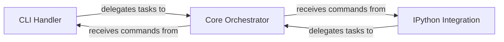

## Details

The `CLI & IPython Orchestrator` subsystem encompasses the user-facing interfaces for the `tuna` project, specifically handling command-line interactions and IPython magic commands. Its core components are found within `tuna.cli.py` and `tuna.magics.py`, which then delegate to the central orchestration logic in `tuna.main.py`. The subsystem is designed with a clear delegation pattern, where both the `CLI Handler` and `IPython Integration` components serve as distinct user-facing entry points, interpreting user input and delegating core application logic to the `Core Orchestrator` for execution. This design ensures a separation of concerns, promoting modularity and reusability of the orchestration layer.

### CLI Handler
This component serves as the primary command-line interface for the `tuna` application. It is responsible for parsing command-line arguments, validating user input, and initiating the appropriate profiling or visualization workflows based on the commands provided by the user.

**Related Classes/Methods**:

- <a href="https://github.com/nschloe/tuna/blob/main/tuna/cli.py#L11-L32" target="_blank" rel="noopener noreferrer">`tuna.cli.main`:11-32</a>
- <a href="https://github.com/nschloe/tuna/blob/main/tuna/cli.py#L35-L71" target="_blank" rel="noopener noreferrer">`tuna.cli._get_parser`:35-71</a>

### IPython Integration
This component provides seamless integration with IPython and Jupyter environments. It enables users to interactively profile and visualize data directly within their notebooks or IPython sessions via the `%tuna` magic command, offering a more dynamic user experience.

**Related Classes/Methods**:

- <a href="https://github.com/nschloe/tuna/blob/main/tuna/magics.py#L59-L69" target="_blank" rel="noopener noreferrer">`tuna.magics.tuna`:59-69</a>

### Core Orchestrator
This is a central component that encapsulates the core logic for initiating and managing the main functionalities of `tuna`, such as reading profile data, rendering visualizations, and starting the web server. It acts as the execution engine, receiving commands from both the CLI and IPython interfaces.

**Related Classes/Methods**:

- <a href="https://github.com/nschloe/tuna/blob/main/tuna/main.py" target="_blank" rel="noopener noreferrer">`tuna.main`</a>
- <a href="https://github.com/nschloe/tuna/blob/main/tuna/main.py#L17-L23" target="_blank" rel="noopener noreferrer">`tuna.main.read`:17-23</a>
- <a href="https://github.com/nschloe/tuna/blob/main/tuna/main.py#L26-L35" target="_blank" rel="noopener noreferrer">`tuna.main.render`:26-35</a>
- <a href="https://github.com/nschloe/tuna/blob/main/tuna/main.py#L43-L79" target="_blank" rel="noopener noreferrer">`tuna.main.start_server`:43-79</a>

### [FAQ](https://github.com/CodeBoarding/GeneratedOnBoardings/tree/main?tab=readme-ov-file#faq)