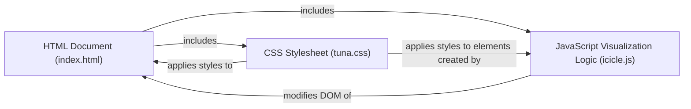

## Details

Analysis of the Frontend Visualization (Client-side) subsystem of the Tuna project.

### HTML Document (index.html)
The foundational structure of the web page, defining the layout and containers for the visualization and other UI elements.

**Related Classes/Methods**:

- <a href="https://github.com/nschloe/tuna/blob/main/tuna/web/index.html" target="_blank" rel="noopener noreferrer">`index.html`</a>

### CSS Stylesheet (tuna.css)
Provides the visual styling for the web application, including layout, typography, colors, and responsiveness, often leveraging Bootstrap's utility classes.

**Related Classes/Methods**:

- <a href="https://github.com/nschloe/tuna/blob/main/tuna/web/static/tuna.css" target="_blank" rel="noopener noreferrer">`tuna.css`</a>

### JavaScript Visualization Logic (icicle.js)
The core client-side application logic responsible for fetching performance data, processing it, and rendering the interactive icicle graph using D3.js. It also handles user interactions such as zooming, hovering, and displaying detailed information.

**Related Classes/Methods**:

- <a href="https://github.com/nschloe/tuna/blob/main/tuna/web/static/icicle.js" target="_blank" rel="noopener noreferrer">`icicle.js`</a>

### [FAQ](https://github.com/CodeBoarding/GeneratedOnBoardings/tree/main?tab=readme-ov-file#faq)