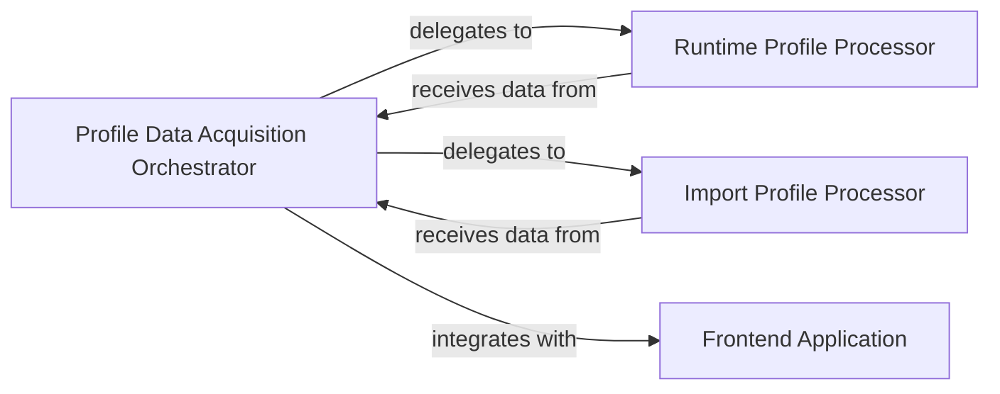

## Details

The `tuna` application's core architecture revolves around the `Profile Data Acquisition Orchestrator`, which acts as the central hub for ingesting and preparing performance profile data. This orchestrator intelligently delegates the parsing of raw profile data to specialized components: the `Import Profile Processor` for import-time specific data and the `Runtime Profile Processor` for general runtime profiles (e.g., cProfile). Once processed, the orchestrated data is then integrated with the `Frontend Application`, a web-based interface responsible for visualizing the performance insights. This design ensures a clear separation of concerns, with dedicated components handling data acquisition, processing, and presentation, facilitating maintainability and scalability.

### Profile Data Acquisition Orchestrator
This component serves as the central coordinator for acquiring and initially processing various types of raw performance profile data (e.g., cProfile, import times). It acts as an abstraction layer, dispatching to specialized profile processors based on the data type. Furthermore, it integrates with the server startup, indicating its role in preparing the acquired and processed data for the web-based visualization frontend.

**Related Classes/Methods**:

- <a href="https://github.com/nschloe/tuna/blob/main/tuna/main.py#L17-L23" target="_blank" rel="noopener noreferrer">`tuna.main.read`:17-23</a>

### Import Profile Processor
This specialized component handles the processing of raw import time performance profile data, typically collected via `PYTHONPROFILEIMPORTTIME`. It parses and structures this data for further analysis.

**Related Classes/Methods**:

- <a href="https://github.com/nschloe/tuna/blob/main/tuna/main.py#L25-L30" target="_blank" rel="noopener noreferrer">`tuna.main.read_import_profile`:25-30</a>

### Runtime Profile Processor [[Expand]](./Runtime_Profile_Processor.md)
This specialized component is responsible for processing raw runtime performance profile data, such as that generated by Python's `cProfile` module. It performs the initial parsing and structuring of this specific data type.

**Related Classes/Methods**:

- <a href="https://github.com/nschloe/tuna/blob/main/tuna/main.py#L32-L37" target="_blank" rel="noopener noreferrer">`tuna.main.read_cprofile`:32-37</a>

### Frontend Application
This component represents the web-based visualization frontend responsible for displaying the processed profile data to the user. It receives processed data from the `Profile Data Acquisition Orchestrator` for rendering.

**Related Classes/Methods**:

- <a href="https://github.com/nschloe/tuna/blob/main/tuna/main.py#L39-L44" target="_blank" rel="noopener noreferrer">`tuna.main.serve`:39-44</a>

### [FAQ](https://github.com/CodeBoarding/GeneratedOnBoardings/tree/main?tab=readme-ov-file#faq)