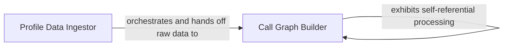

## Details

The `Runtime Profile Processor` subsystem is dedicated to transforming raw runtime performance data into a structured, standardized format suitable for visualization. It acts as the backend data pipeline for performance analysis within the project.

### Profile Data Ingestor
This component serves as the entry point for the `Runtime Profile Processor`. Its primary responsibility is to handle the initial reading and parsing of raw performance profile dumps, such as those generated by `cProfile` or `PYTHONPROFILEIMPORTTIME`. It manages the I/O operations to retrieve the profile data and performs the initial, high-level parsing to prepare the raw data for detailed structuring. It acts as an orchestrator, delegating the complex data transformation to the `Call Graph Builder`.

**Related Classes/Methods**:

- <a href="https://github.com/nschloe/tuna/blob/main/tuna/_runtime_profile.py#L4-L111" target="_blank" rel="noopener noreferrer">`tuna._runtime_profile.read_runtime_profile`:4-111</a>

### Call Graph Builder
This is the core data processing component within the `Runtime Profile Processor`. It takes the raw or partially parsed profile data and recursively transforms it into a rich, standardized, and hierarchical call graph or tree structure. Its responsibilities include parsing individual call stacks, organizing function calls, and calculating essential performance metrics (e.g., self-time, total-time, number of calls) for each node in the call graph. This component is crucial for preparing the data in a format directly consumable by the "Data Visualization Tool" aspect of the project.

**Related Classes/Methods**:

- <a href="https://github.com/nschloe/tuna/blob/main/tuna/_runtime_profile.py#L48-L98" target="_blank" rel="noopener noreferrer">`tuna._runtime_profile.populate`:48-98</a>

### [FAQ](https://github.com/CodeBoarding/GeneratedOnBoardings/tree/main?tab=readme-ov-file#faq)