```mermaid
graph LR
    CLI_IPython_Orchestrator["CLI & IPython Orchestrator"]
    Profile_Data_Acquisition_Layer["Profile Data Acquisition Layer"]
    Runtime_Profile_Processor["Runtime Profile Processor"]
    Import_Profile_Processor["Import Profile Processor"]
    Visualization_Generation_Engine_Backend_["Visualization Generation Engine (Backend)"]
    Local_Web_Server["Local Web Server"]
    Frontend_Visualization_Client_side_["Frontend Visualization (Client-side)"]
    CLI_IPython_Orchestrator -- "initiates" --> Profile_Data_Acquisition_Layer
    CLI_IPython_Orchestrator -- "triggers" --> Local_Web_Server
    Profile_Data_Acquisition_Layer -- "delegates to" --> Runtime_Profile_Processor
    Profile_Data_Acquisition_Layer -- "delegates to" --> Import_Profile_Processor
    Runtime_Profile_Processor -- "provides processed data to" --> Visualization_Generation_Engine_Backend_
    Import_Profile_Processor -- "provides processed data to" --> Visualization_Generation_Engine_Backend_
    Visualization_Generation_Engine_Backend_ -- "provides rendered output to" --> Local_Web_Server
    Local_Web_Server -- "serves web assets to" --> Frontend_Visualization_Client_side_
    Frontend_Visualization_Client_side_ -- "requests data from" --> Local_Web_Server
    Frontend_Visualization_Client_side_ -- "renders data received from" --> Local_Web_Server
    click CLI_IPython_Orchestrator href "https://github.com/CodeBoarding/GeneratedOnBoardings/blob/main/tuna/CLI_IPython_Orchestrator.md" "Details"
    click Profile_Data_Acquisition_Layer href "https://github.com/CodeBoarding/GeneratedOnBoardings/blob/main/tuna/Profile_Data_Acquisition_Layer.md" "Details"
    click Runtime_Profile_Processor href "https://github.com/CodeBoarding/GeneratedOnBoardings/blob/main/tuna/Runtime_Profile_Processor.md" "Details"
    click Frontend_Visualization_Client_side_ href "https://github.com/CodeBoarding/GeneratedOnBoardings/blob/main/tuna/Frontend_Visualization_Client_side_.md" "Details"
```

## Details

The `tuna` architecture is designed around a clear data flow pipeline, starting with user interaction through a `CLI & IPython Orchestrator`. This orchestrator initiates the profiling process, directing raw performance data through a `Profile Data Acquisition Layer` to specialized `Runtime` or `Import Profile Processors`. The processed data then feeds into a `Visualization Generation Engine (Backend)` which prepares the interactive web content. A `Local Web Server` serves this content to the user's browser, where the `Frontend Visualization (Client-side)` renders the interactive performance graphs, completing the data visualization loop. This modular design ensures clear separation of concerns for data acquisition, processing, backend rendering, and client-side presentation, making it ideal for flow graph representation.

### CLI & IPython Orchestrator [[Expand]](./CLI_IPython_Orchestrator.md)
The primary user interface, handling command-line arguments and IPython magic commands. It orchestrates the entire profiling, data processing, and visualization workflow.

**Related Classes/Methods**:

- <a href="https://github.com/nschloe/tuna/blob/main/tuna/cli.py#L11-L32" target="_blank" rel="noopener noreferrer">`tuna.cli.main`:11-32</a>
- <a href="https://github.com/nschloe/tuna/blob/main/tuna/magics.py#L59-L69" target="_blank" rel="noopener noreferrer">`tuna.magics.tuna`:59-69</a>

### Profile Data Acquisition Layer [[Expand]](./Profile_Data_Acquisition_Layer.md)
An abstraction responsible for reading and initially parsing various types of raw performance profile data (e.g., cProfile, import times). It dispatches to specific profile processors.

**Related Classes/Methods**:

- <a href="https://github.com/nschloe/tuna/blob/main/tuna/main.py#L17-L23" target="_blank" rel="noopener noreferrer">`tuna.main.read`:17-23</a>

### Runtime Profile Processor [[Expand]](./Runtime_Profile_Processor.md)
Specializes in parsing, structuring, and enriching runtime performance data (e.g., from `cProfile` dumps) into a standardized format suitable for visualization.

**Related Classes/Methods**:

- <a href="https://github.com/nschloe/tuna/blob/main/tuna/_runtime_profile.py#L4-L111" target="_blank" rel="noopener noreferrer">`tuna._runtime_profile.read_runtime_profile`:4-111</a>

### Import Profile Processor
Focuses on processing and structuring import time performance data, including hierarchical organization and adding visualization-specific attributes.

**Related Classes/Methods**:

- <a href="https://github.com/nschloe/tuna/blob/main/tuna/_import_profile.py#L7-L57" target="_blank" rel="noopener noreferrer">`tuna._import_profile.read_import_profile`:7-57</a>

### Visualization Generation Engine (Backend)
Transforms processed performance data into the final interactive web-based visualization, involving templating HTML and embedding data for the frontend.

**Related Classes/Methods**:

- <a href="https://github.com/nschloe/tuna/blob/main/tuna/main.py#L26-L35" target="_blank" rel="noopener noreferrer">`tuna.main.render`:26-35</a>
- <a href="https://github.com/nschloe/tuna/blob/main/tuna/web/index.html" target="_blank" rel="noopener noreferrer">`tuna/web/index.html`</a>

### Local Web Server
A lightweight HTTP server responsible for hosting and serving the interactive visualization frontend (HTML, CSS, JavaScript) and processed data to the client.

**Related Classes/Methods**:

- <a href="https://github.com/nschloe/tuna/blob/main/tuna/main.py#L43-L79" target="_blank" rel="noopener noreferrer">`tuna.main.start_server`:43-79</a>
- <a href="https://github.com/nschloe/tuna/blob/main/tuna/main.py#L47-L65" target="_blank" rel="noopener noreferrer">`tuna.main.do_GET`:47-65</a>

### Frontend Visualization (Client-side) [[Expand]](./Frontend_Visualization_Client_side_.md)
The interactive web application, primarily built with D3.js, Bootstrap, HTML, CSS, and JavaScript, responsible for rendering the performance data as an icicle graph and providing user interaction.

**Related Classes/Methods**:

- <a href="https://github.com/nschloe/tuna/blob/main/tuna/web/static/icicle.js" target="_blank" rel="noopener noreferrer">`tuna/web/static/icicle.js`</a>
- <a href="https://github.com/nschloe/tuna/blob/main/tuna/web/static/tuna.css" target="_blank" rel="noopener noreferrer">`tuna/web/static/tuna.css`</a>
- <a href="https://github.com/nschloe/tuna/blob/main/tuna/web/index.html" target="_blank" rel="noopener noreferrer">`tuna/web/index.html`</a>

### [FAQ](https://github.com/CodeBoarding/GeneratedOnBoardings/tree/main?tab=readme-ov-file#faq)