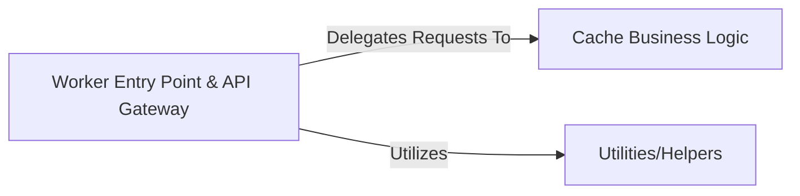

## Details

Abstract Components Overview

### Worker Entry Point & API Gateway
This component serves as the singular entry point for the Cloudflare Worker, encompassing the responsibilities of an API Gateway and a Request Handler. It is responsible for receiving all incoming HTTP requests, performing initial processing such as authentication and validation, and then intelligently routing these requests to the appropriate internal business logic functions based on the request path and method. It effectively consolidates the Worker Entry Point, API Gateway & Request Handler, and Route Handler/API Endpoints roles into a single, cohesive unit, which is typical for serverless function architectures.

**Related Classes/Methods**:

- `src/index.ts` (1:1)

### Cache Business Logic [[Expand]](./Cache_Business_Logic.md)
This component is responsible for managing data caching operations. It abstracts the underlying storage mechanisms (e.g., KV or R2) and provides a unified interface for storing, retrieving, and invalidating cached data. It handles the core logic for interacting with different storage backends, ensuring efficient and reliable data persistence and retrieval for the worker.

**Related Classes/Methods**:

- `src/storage/storage-manager.ts` (1:1)
- `src/storage/kv-storage.ts` (1:1)
- `src/storage/r2-storage.ts` (1:1)

### Utilities/Helpers
This component provides a collection of reusable utility functions and helper modules that support various operations across the Cloudflare Worker. These utilities encapsulate common functionalities, such as date manipulation, data formatting, or other general-purpose tasks, promoting code reusability and maintaining a clean separation of concerns from the core business logic.

**Related Classes/Methods**:

- `src/utils/date.ts` (1:1)

### [FAQ](https://github.com/CodeBoarding/GeneratedOnBoardings/tree/main?tab=readme-ov-file#faq)