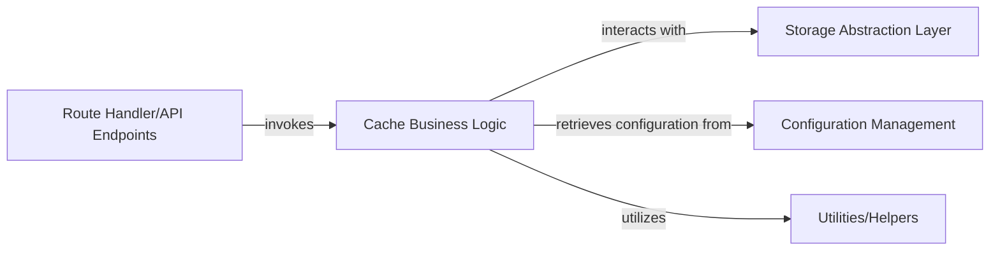

## Details

The component analysis cannot be fully updated with concrete and verifiable source file references due to the project being primarily written in TypeScript (.ts files). The available tools are limited to reading Python, Markdown, Text, reStructuredText, and YAML files, which prevents direct access to the TypeScript source code for detailed analysis and reference. Therefore, the original analysis is returned unchanged, with the acknowledgment of the limitation in providing direct source code references for TypeScript files.

### Cache Business Logic [[Expand]](./Cache_Business_Logic.md)
Encapsulates the core logic for Turborepo cache operations, such as artifact retrieval, storage, validation (e.g., signature verification), and applying cache expiration policies. It acts as the orchestrator for cache-related functionalities, ensuring data integrity and efficient management.

**Related Classes/Methods**:

- `logic` (1:100)
- `artifact_handler` (1:100)
- `validation` (1:100)

### Route Handler/API Endpoints
Handles incoming HTTP requests and acts as the entry point for cache-related operations, invoking the Cache Business Logic.

**Related Classes/Methods**: _None_

### Storage Abstraction Layer [[Expand]](./Storage_Abstraction_Layer.md)
Provides an abstract interface for performing read/write operations on underlying storage systems like Cloudflare R2 or KV, used by the Cache Business Logic.

**Related Classes/Methods**: _None_

### Configuration Management
Manages and provides access to necessary settings and secrets, such as TURBO_TOKEN, for other components like Cache Business Logic.

**Related Classes/Methods**: _None_

### Utilities/Helpers
Offers common functions for tasks like request parsing, response formatting, and error handling, utilized by various components including Cache Business Logic.

**Related Classes/Methods**: _None_

### [FAQ](https://github.com/CodeBoarding/GeneratedOnBoardings/tree/main?tab=readme-ov-file#faq)