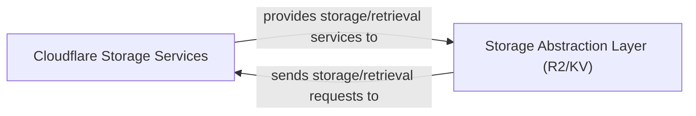

## Details

One paragraph explaining the functionality which is represented by this graph. What the main flow is and what is its purpose.

### Cloudflare Storage Services [[Expand]](./Cloudflare_Storage_Services.md)
External Cloudflare services (R2 and KV) providing scalable and persistent storage for cache artifacts (R2) and metadata (KV). This component represents the critical external infrastructure that the `turborepo-remote-cache-cloudflare` application integrates with to achieve its core caching functionality. As an external service, it does not have source code within the `turborepo-remote-cache-cloudflare` project.

**Related Classes/Methods**: _None_

### Storage Abstraction Layer (R2/KV)
This component acts as an intermediary between the application's caching logic and the specific Cloudflare storage services (R2 for artifacts, KV for metadata). It encapsulates the details of interacting with Cloudflare's R2 and KV APIs, providing a unified interface for storing and retrieving data. Its primary responsibility is to translate generic storage requests into Cloudflare-specific API calls and handle responses, abstracting the underlying storage mechanisms from the rest of the application.

**Related Classes/Methods**: _None_

### [FAQ](https://github.com/CodeBoarding/GeneratedOnBoardings/tree/main?tab=readme-ov-file#faq)