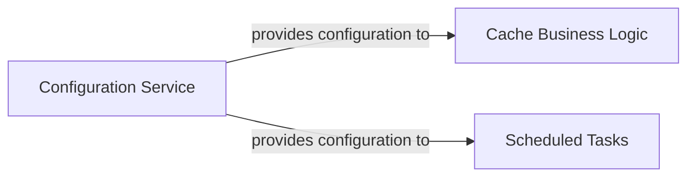

## Details

Abstract Components Overview

### Configuration Service [[Expand]](./Configuration_Service.md)
Centralizes and provides access to application configurations, environment variables, and worker settings to other components. This component ensures that all parts of the application, including business logic and scheduled tasks, can access necessary runtime parameters and secrets in a consistent and secure manner. While not implemented as a single Python class, its functionality is realized through the consumption of external configuration files (e.g., `wrangler.jsonc`, `.dev.vars`) by various Python modules.

**Related Classes/Methods**: _None_

### Cache Business Logic [[Expand]](./Cache_Business_Logic.md)
Manages data caching strategies and interactions, ensuring efficient data retrieval and storage. It is responsible for determining what data to cache, when to invalidate caches, and how to retrieve data from the cache or underlying data sources if not present in the cache. This component relies on the Configuration Service for cache-related settings.

**Related Classes/Methods**: _None_

### Scheduled Tasks
Orchestrates and executes background tasks at predefined intervals or based on specific triggers. This component ensures that routine operations, maintenance, or data processing jobs are performed reliably and on schedule. It depends on the Configuration Service for scheduling parameters and task-specific settings.

**Related Classes/Methods**: _None_

### [FAQ](https://github.com/CodeBoarding/GeneratedOnBoardings/tree/main?tab=readme-ov-file#faq)