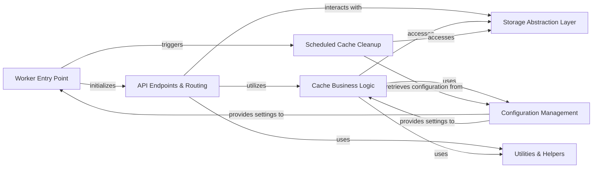

## Details

Abstract Components Overview

### Worker Entry Point
The primary entry point for the Cloudflare Worker. It initializes the application, registers routes, and sets up handlers for incoming HTTP requests and scheduled events (like cron triggers).

**Related Classes/Methods**:

- `src/index.ts` (1:1)

### API Endpoints & Routing
Manages the routing of incoming HTTP requests to appropriate handlers and implements the API logic for cache interactions (e.g., GET, PUT, POST for artifacts). It also handles request parsing and response formatting.

**Related Classes/Methods**:

- `src/routes/` (1:1)
- `src/api/` (1:1)

### Storage Abstraction Layer [[Expand]](./Storage_Abstraction_Layer.md)
Provides a unified interface for interacting with Cloudflare R2 (object storage) and Cloudflare KV (key-value store). It abstracts the underlying storage mechanisms, allowing for flexible data persistence.

**Related Classes/Methods**:

- `src/storage/r2.ts` (1:1)
- `src/storage/kv.ts` (1:1)
- `src/storage/index.ts` (1:1)

### Cache Business Logic [[Expand]](./Cache_Business_Logic.md)
Encapsulates the core logic for managing cache artifacts, including validation, signature verification, applying cache expiration policies, and handling cache hits/misses.

**Related Classes/Methods**:

- `src/logic/cacheManager.ts` (1:1)
- `src/logic/artifactValidator.ts` (1:1)

### Scheduled Cache Cleanup [[Expand]](./Scheduled_Cache_Cleanup.md)
A dedicated component triggered by cron events, responsible for periodically identifying and deleting expired or stale cache artifacts from the storage layer.

**Related Classes/Methods**:

- `src/scheduledTasks/cleanup.ts` (1:1)
- `src/cron/cleanup.ts` (1:1)

### Configuration Management
Centralizes the management of application settings, environment variables (e.g., TURBO_TOKEN), and worker configurations (wrangler.jsonc). It provides a consistent way to access configuration values across the application.

**Related Classes/Methods**:

- `wrangler.jsonc` (1:1)
- `.env files` (1:1)
- `src/config/index.ts` (1:1)

### Utilities & Helpers
A collection of reusable functions and modules for common tasks that are not specific to any single business domain, such as request parsing, response formatting, error handling, and logging.

**Related Classes/Methods**:

- `src/utils/` (1:1)
- `src/helpers/` (1:1)

### [FAQ](https://github.com/CodeBoarding/GeneratedOnBoardings/tree/main?tab=readme-ov-file#faq)