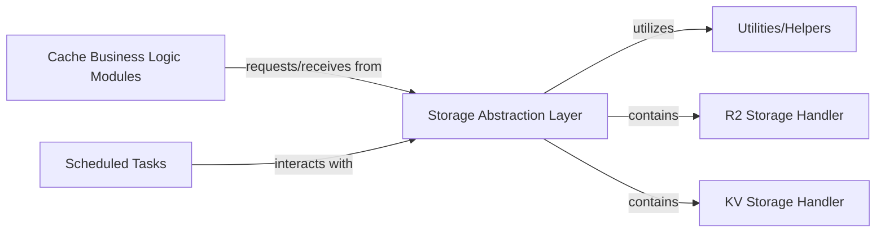

## Details

One paragraph explaining the functionality which is represented by this graph. What the main flow is and what is its purpose.

### Storage Abstraction Layer [[Expand]](./Storage_Abstraction_Layer.md)
Provides a unified interface for interacting with different Cloudflare storage services, abstracting away their specific APIs. This layer ensures that higher-level business logic remains decoupled from the underlying storage implementation details.

**Related Classes/Methods**:

- `src/storage/r2.ts` (1:1)
- `src/storage/kv.ts` (1:1)

### R2 Storage Handler
Manages interactions with Cloudflare R2, specifically designed for storing and retrieving large binary artifacts. It handles operations like put, get, and delete for large data objects.

**Related Classes/Methods**:

- `src/storage/r2.ts` (1:1)

### KV Storage Handler
Manages interactions with Cloudflare KV, used for storing metadata, signatures, smaller configuration data, or indices related to the cached artifacts. It provides fast key-value lookup capabilities.

**Related Classes/Methods**:

- `src/storage/kv.ts` (1:1)

### Cache Business Logic Modules
Contains the core business logic responsible for managing the caching mechanisms, including cache hit/miss determination, cache invalidation, and data retrieval strategies. It interacts with the Storage Abstraction Layer to store and retrieve cached data.

**Related Classes/Methods**: _None_

### Scheduled Tasks
Represents automated processes or background jobs that perform periodic operations, such as cache cleanup, data synchronization, or integrity checks. These tasks interact with the Storage Abstraction Layer to access and manipulate stored data.

**Related Classes/Methods**: _None_

### Utilities/Helpers
Provides common utility functions and helper modules used across different parts of the system, including data serialization/deserialization, cryptographic operations, or common data structure manipulations. The Storage Abstraction Layer may utilize these for its internal operations.

**Related Classes/Methods**: _None_

### [FAQ](https://github.com/CodeBoarding/GeneratedOnBoardings/tree/main?tab=readme-ov-file#faq)