```mermaid
graph LR
    API_Gateway_Request_Handler["API Gateway & Request Handler"]
    Cache_Business_Logic["Cache Business Logic"]
    Storage_Abstraction_Layer["Storage Abstraction Layer"]
    Cloudflare_Storage_Services["Cloudflare Storage Services"]
    Scheduled_Cache_Cleanup["Scheduled Cache Cleanup"]
    Configuration_Service["Configuration Service"]
    API_Gateway_Request_Handler -- "routes to" --> Cache_Business_Logic
    API_Gateway_Request_Handler -- "accesses" --> Configuration_Service
    Cache_Business_Logic -- "interacts with" --> Storage_Abstraction_Layer
    Cache_Business_Logic -- "accesses" --> Configuration_Service
    Storage_Abstraction_Layer -- "communicates with" --> Cloudflare_Storage_Services
    Storage_Abstraction_Layer -- "accesses" --> Configuration_Service
    Scheduled_Cache_Cleanup -- "triggers" --> Cache_Business_Logic
    Scheduled_Cache_Cleanup -- "interacts with" --> Storage_Abstraction_Layer
    Scheduled_Cache_Cleanup -- "accesses" --> Configuration_Service
    Cloudflare_Storage_Services -- "provides data to" --> Storage_Abstraction_Layer
    Configuration_Service -- "provides settings to" --> API_Gateway_Request_Handler
    Configuration_Service -- "provides settings to" --> Cache_Business_Logic
    Configuration_Service -- "provides settings to" --> Storage_Abstraction_Layer
    Configuration_Service -- "provides settings to" --> Scheduled_Cache_Cleanup
    click API_Gateway_Request_Handler href "https://github.com/CodeBoarding/GeneratedOnBoardings/blob/main/turborepo-remote-cache-cloudflare/API_Gateway_Request_Handler.md" "Details"
    click Cache_Business_Logic href "https://github.com/CodeBoarding/GeneratedOnBoardings/blob/main/turborepo-remote-cache-cloudflare/Cache_Business_Logic.md" "Details"
    click Storage_Abstraction_Layer href "https://github.com/CodeBoarding/GeneratedOnBoardings/blob/main/turborepo-remote-cache-cloudflare/Storage_Abstraction_Layer.md" "Details"
    click Cloudflare_Storage_Services href "https://github.com/CodeBoarding/GeneratedOnBoardings/blob/main/turborepo-remote-cache-cloudflare/Cloudflare_Storage_Services.md" "Details"
    click Scheduled_Cache_Cleanup href "https://github.com/CodeBoarding/GeneratedOnBoardings/blob/main/turborepo-remote-cache-cloudflare/Scheduled_Cache_Cleanup.md" "Details"
    click Configuration_Service href "https://github.com/CodeBoarding/GeneratedOnBoardings/blob/main/turborepo-remote-cache-cloudflare/Configuration_Service.md" "Details"
```

## Details

Abstract Components Overview

### API Gateway & Request Handler [[Expand]](./API_Gateway_Request_Handler.md)
The primary entry point for all external HTTP requests, responsible for routing and initial request processing, including authentication.

**Related Classes/Methods**: _None_

### Cache Business Logic [[Expand]](./Cache_Business_Logic.md)
Encapsulates the core logic for Turborepo cache operations, such as artifact retrieval, storage, validation, and signature verification.

**Related Classes/Methods**: _None_

### Storage Abstraction Layer [[Expand]](./Storage_Abstraction_Layer.md)
Provides a unified interface for interacting with different Cloudflare storage services, abstracting away their specific APIs.

**Related Classes/Methods**: _None_

### Cloudflare Storage Services [[Expand]](./Cloudflare_Storage_Services.md)
External Cloudflare services (R2 and KV) providing scalable and persistent storage for cache artifacts and metadata.

**Related Classes/Methods**: _None_

### Scheduled Cache Cleanup [[Expand]](./Scheduled_Cache_Cleanup.md)
A dedicated component responsible for periodic identification and deletion of expired or stale cache artifacts.

**Related Classes/Methods**: _None_

### Configuration Service [[Expand]](./Configuration_Service.md)
Centralizes and provides access to application configurations, environment variables, and worker settings to other components.

**Related Classes/Methods**: _None_

### [FAQ](https://github.com/CodeBoarding/GeneratedOnBoardings/tree/main?tab=readme-ov-file#faq)