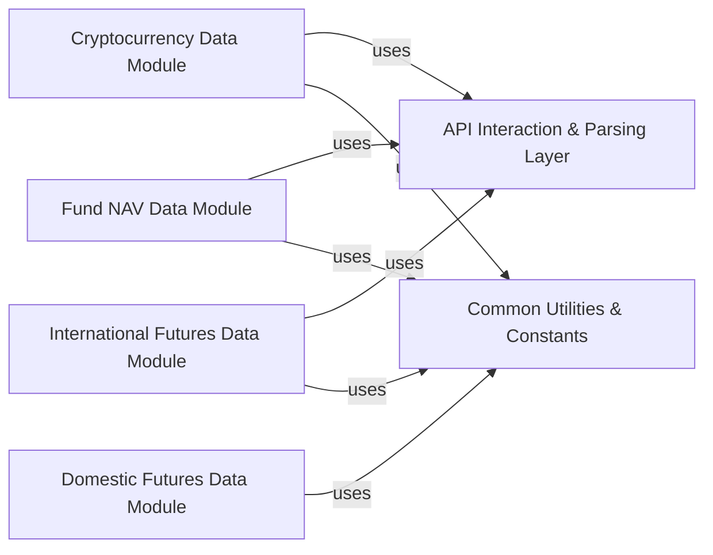

## Component Details

The Alternative Asset Data subsystem is designed to provide comprehensive data retrieval capabilities for various non-traditional financial assets. It is logically decomposed into several specialized modules, each focusing on a specific asset class, supported by foundational layers for API interaction and common utilities.

### Cryptocurrency Data Module
This module is responsible for fetching detailed cryptocurrency market data, including real-time tick data and historical OHLCV (Open, High, Low, Close, Volume) bar data, from various cryptocurrency exchanges.

**Related Classes/Methods**:

- <a href="https://github.com/waditu/tushare/blob/master/tushare/coins/market.py#L85-L149" target="_blank" rel="noopener noreferrer">`tushare.coins.market:coins_tick` (85:149)</a>
- <a href="https://github.com/waditu/tushare/blob/master/tushare/coins/market.py#L151-L180" target="_blank" rel="noopener noreferrer">`tushare.coins.market:coins_bar` (151:180)</a>

### Fund NAV Data Module
This module specializes in retrieving Net Asset Value (NAV) data for different types of funds, such as open-end, closed-end, and graded funds. It supports fetching both current and historical NAV records.

**Related Classes/Methods**:

- <a href="https://github.com/waditu/tushare/blob/master/tushare/fund/nav.py#L24-L75" target="_blank" rel="noopener noreferrer">`tushare.fund.nav:get_nav_open` (24:75)</a>
- <a href="https://github.com/waditu/tushare/blob/master/tushare/fund/nav.py#L192-L232" target="_blank" rel="noopener noreferrer">`tushare.fund.nav:get_nav_history` (192:232)</a>

### Domestic Futures Data Module
This module provides functionalities to access daily trading data for major domestic futures exchanges (e.g., CFFEX, CZCE, SHFE, DCE). It aggregates data from different exchanges into a unified interface.

**Related Classes/Methods**:

- <a href="https://github.com/waditu/tushare/blob/master/tushare/futures/domestic.py#L400-L449" target="_blank" rel="noopener noreferrer">`tushare.futures.domestic:get_future_daily` (400:449)</a>

### International Futures Data Module
This module is dedicated to fetching daily trading data from international futures exchanges, offering a global perspective on futures markets.

**Related Classes/Methods**:

- <a href="https://github.com/waditu/tushare/blob/master/tushare/futures/intlfutures.py#L21-L26" target="_blank" rel="noopener noreferrer">`tushare.futures.intlfutures:get_intlfuture` (21:26)</a>

### API Interaction & Parsing Layer
This foundational component encapsulates the logic for making HTTP requests to external data sources and parsing the raw responses (e.g., JSON, HTML) into structured data (e.g., pandas DataFrames). It handles common network operations, error handling, and initial data transformation.

**Related Classes/Methods**:

- <a href="https://github.com/waditu/tushare/blob/master/tushare/coins/market.py#L251-L260" target="_blank" rel="noopener noreferrer">`tushare.coins.market:_get_data` (251:260)</a>
- <a href="https://github.com/waditu/tushare/blob/master/tushare/fund/nav.py#L280-L306" target="_blank" rel="noopener noreferrer">`tushare.fund.nav:_parse_fund_data` (280:306)</a>
- <a href="https://github.com/waditu/tushare/blob/master/tushare/futures/intlfutures.py#L28-L43" target="_blank" rel="noopener noreferrer">`tushare.futures.intlfutures:_get_data` (28:43)</a>

### Common Utilities & Constants
This component provides a centralized repository for shared constants (e.g., URLs, API keys, column names, data types) and common utility functions (e.g., date conversion, input validation, console output) that are used across various data retrieval modules.

**Related Classes/Methods**:

- `tushare.common.constants:_check_nav_oft_input` (1:1)
- `tushare.common.constants:_write_head` (1:1)
- `tushare.common.constants:convert_date` (1:1)

### [FAQ](https://github.com/CodeBoarding/GeneratedOnBoardings/tree/main?tab=readme-ov-file#faq)