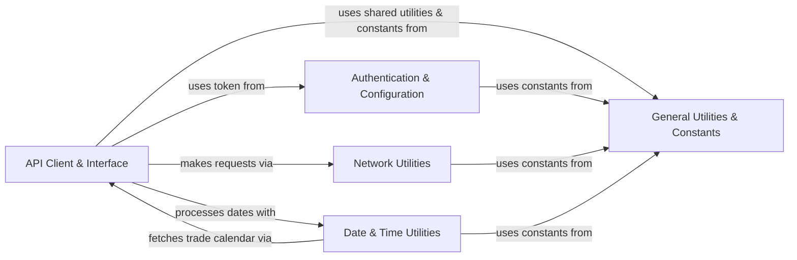

## Component Details

This section provides a detailed overview of the core infrastructure and utility components within the `tushare` library, explaining their purpose, structure, and interactions. These components form the foundational layer, enabling all data fetching, processing, and user interaction within the system.

### API Client & Interface
This component serves as the primary gateway for interacting with the TuShare Pro API. It encompasses the low-level client responsible for constructing and sending HTTP requests, handling API tokens, and parsing JSON responses into Pandas DataFrames. It also includes a higher-level interface that simplifies API calls, providing a more user-friendly abstraction over the raw client. It is fundamental because it is the direct point of contact for all external data retrieval.

**Related Classes/Methods**:

- <a href="https://github.com/waditu/tushare/blob/master/tushare/pro/data_pro.py#L20-L30" target="_blank" rel="noopener noreferrer">`tushare.pro.data_pro.pro_api` (20:30)</a>
- <a href="https://github.com/waditu/tushare/blob/master/tushare/pro/client.py#L16-L50" target="_blank" rel="noopener noreferrer">`tushare.pro.client.DataApi` (16:50)</a>

### Network Utilities
This component is responsible for all fundamental network operations within the library. It handles establishing and maintaining network connections, managing HTTP requests and responses, and potentially error handling related to network communication. It provides the basic building blocks for any component requiring external data access. It is fundamental as it provides the essential communication layer for all external interactions.

**Related Classes/Methods**:

- <a href="https://github.com/waditu/tushare/blob/master/tushare/util/netbase.py#L8-L27" target="_blank" rel="noopener noreferrer">`tushare.util.netbase.Client` (8:27)</a>
- <a href="https://github.com/waditu/tushare/blob/master/tushare/util/conns.py#L49-L50" target="_blank" rel="noopener noreferrer">`tushare.util.conns.get_apis` (49:50)</a>

### Authentication & Configuration
This component manages API authentication and user credentials. Its primary role is to retrieve, validate, and manage the API token required for accessing the TuShare Pro API, ensuring secure and authorized data fetching operations. It is fundamental because without proper authentication, access to the TuShare Pro API is denied.

**Related Classes/Methods**:

- <a href="https://github.com/waditu/tushare/blob/master/tushare/util/upass.py#L22-L30" target="_blank" rel="noopener noreferrer">`tushare.util.upass.get_token` (22:30)</a>

### Date & Time Utilities
This component provides a collection of essential utility functions for date and time manipulation. These functions are crucial for handling time-series financial data, including operations like checking for holidays, parsing various date formats, and generating date ranges or quarter information. It is fundamental for accurate and efficient processing of time-sensitive financial data.

**Related Classes/Methods**:

- <a href="https://github.com/waditu/tushare/blob/master/tushare/util/dateu.py#L26-L28" target="_blank" rel="noopener noreferrer">`tushare.util.dateu.today` (26:28)</a>
- <a href="https://github.com/waditu/tushare/blob/master/tushare/util/dateu.py#L86-L98" target="_blank" rel="noopener noreferrer">`tushare.util.dateu.is_holiday` (86:98)</a>
- <a href="https://github.com/waditu/tushare/blob/master/tushare/util/dateu.py#L71-L74" target="_blank" rel="noopener noreferrer">`tushare.util.dateu.get_quarts` (71:74)</a>

### General Utilities & Constants
This component serves as a repository for general-purpose helper functions and shared constants used across the entire `tushare` library. This includes utilities for data validation, formatting, standardized console output for user interaction and error reporting, and definitions of common constants (e.g., for stock or fund categories). It is fundamental as it promotes code reusability, consistency, and simplifies development by centralizing common functionalities and definitions.

**Related Classes/Methods**:

- <a href="https://github.com/waditu/tushare/blob/master/tushare/util/common.py#L1-L1" target="_blank" rel="noopener noreferrer">`tushare.util.common` (1:1)</a>
- <a href="https://github.com/waditu/tushare/blob/master/tushare/util/vars.py#L1-L1" target="_blank" rel="noopener noreferrer">`tushare.util.vars` (1:1)</a>
- <a href="https://github.com/waditu/tushare/blob/master/tushare/fund/cons.py#L1-L1" target="_blank" rel="noopener noreferrer">`tushare.fund.cons` (1:1)</a>
- <a href="https://github.com/waditu/tushare/blob/master/tushare/stock/cons.py#L1-L1" target="_blank" rel="noopener noreferrer">`tushare.stock.cons` (1:1)</a>

### [FAQ](https://github.com/CodeBoarding/GeneratedOnBoardings/tree/main?tab=readme-ov-file#faq)