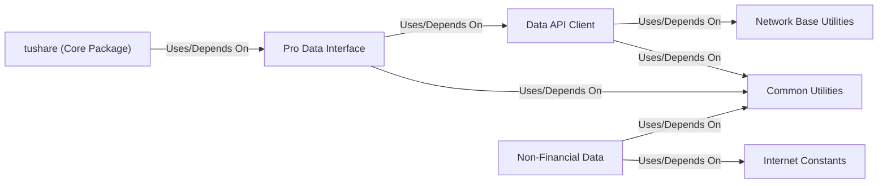

## Component Details

One paragraph explaining the functionality which is represented by this graph. What the main flow is and what is its purpose.

### Data API Client
This is the fundamental component for interacting with the TuShare Pro API. It manages the API token, constructs requests, sends them to the `tushare.pro` HTTP endpoint, and processes the JSON responses into Pandas DataFrames. Its `query` method is the primary interface for fetching data, and the `__getattr__` method allows dynamic invocation of API functions.

**Related Classes/Methods**:

- <a href="https://github.com/waditu/tushare/blob/master/tushare/pro/client.py#L16-L50" target="_blank" rel="noopener noreferrer">`tushare.pro.client.DataApi` (16:50)</a>

### Pro Data Interface
This module provides a higher-level, more user-friendly interface to the `Data API Client`. It encapsulates specific API calls, handles parameters, and offers convenience methods for common data retrieval tasks from the TuShare Pro API. It acts as an abstraction layer over the raw `Data API Client`.

**Related Classes/Methods**:

- <a href="https://github.com/waditu/tushare/blob/master/tushare/pro/data_pro.py#L1-L1" target="_blank" rel="noopener noreferrer">`tushare.pro.data_pro` (1:1)</a>

### Common Utilities
This module contains general-purpose utility functions that are used across different parts of the `tushare` library. These include data validation, formatting, date manipulation, and other helper functions that don't fit into specific data categories.

**Related Classes/Methods**:

- <a href="https://github.com/waditu/tushare/blob/master/tushare/util/common.py#L1-L1" target="_blank" rel="noopener noreferrer">`tushare.util.common` (1:1)</a>
- <a href="https://github.com/waditu/tushare/blob/master/tushare/util/dateu.py#L1-L1" target="_blank" rel="noopener noreferrer">`tushare.util.dateu` (1:1)</a>
- <a href="https://github.com/waditu/tushare/blob/master/tushare/util/formula.py#L1-L1" target="_blank" rel="noopener noreferrer">`tushare.util.formula` (1:1)</a>
- <a href="https://github.com/waditu/tushare/blob/master/tushare/util/upass.py#L1-L1" target="_blank" rel="noopener noreferrer">`tushare.util.upass` (1:1)</a>
- <a href="https://github.com/waditu/tushare/blob/master/tushare/util/vars.py#L1-L1" target="_blank" rel="noopener noreferrer">`tushare.util.vars` (1:1)</a>
- `tushare.util.netutils` (1:1)

### Network Base Utilities
This module is responsible for low-level network operations, handling HTTP requests, responses, and error handling. It provides foundational network communication capabilities, primarily for components like the `Data API Client`.

**Related Classes/Methods**:

- <a href="https://github.com/waditu/tushare/blob/master/tushare/util/netbase.py#L1-L1" target="_blank" rel="noopener noreferrer">`tushare.util.netbase` (1:1)</a>

### Non-Financial Data
This component provides access to various data points not directly related to financial markets, offering general interest or contextual information. It includes modules for retrieving movie box office statistics and news articles from specific external sources like Caixin News. These functionalities often perform direct web scraping using standard Python libraries (`urllib`, `BeautifulSoup`) rather than relying on the `TuShare Pro API Client`.

**Related Classes/Methods**:

- <a href="https://github.com/waditu/tushare/blob/master/tushare/internet/boxoffice.py#L1-L1" target="_blank" rel="noopener noreferrer">`tushare.internet.boxoffice` (1:1)</a>
- <a href="https://github.com/waditu/tushare/blob/master/tushare/internet/caixinnews.py#L1-L1" target="_blank" rel="noopener noreferrer">`tushare.internet.caixinnews` (1:1)</a>
- `tushare.internet.news` (1:1)
- `tushare.internet.store` (1:1)

### tushare (Core Package)
The main `tushare` package, serving as the entry point and orchestrator for various data retrieval functionalities. It integrates and exposes the functionalities provided by other components, particularly the `Pro Data Interface`.

**Related Classes/Methods**:

- `tushare` (1:1)

### Internet Constants
This component provides a collection of constants, including URLs and other configuration parameters, specifically used by modules dealing with internet data. It acts as a centralized repository for frequently used, unchanging values.

**Related Classes/Methods**:

- <a href="https://github.com/waditu/tushare/blob/master/tushare/stock/cons.py#L1-L1" target="_blank" rel="noopener noreferrer">`tushare.stock.cons` (1:1)</a>

### [FAQ](https://github.com/CodeBoarding/GeneratedOnBoardings/tree/main?tab=readme-ov-file#faq)