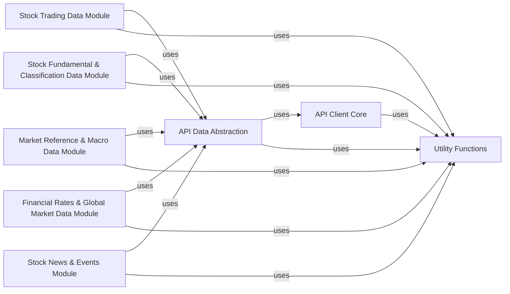

## Component Details

This comprehensive component is dedicated to providing access to a wide array of stock-related financial data. It encompasses functionalities for retrieving historical and real-time trading data, fundamental company financials (e.g., income statements, balance sheets), various stock classifications (industry, concept, area), specialized market lists (e.g., billboard data, restricted share lifting schedules), macroeconomic indicators relevant to the stock market, key financial rates (e.g., SHIBOR, LPR), and global market snapshots. It also includes modules for fetching stock-related news and events.

### API Client Core
This component is the lowest-level interface for interacting with the TuShare Pro API. It manages the API token, constructs HTTP requests, sends them to the `tushare.pro` endpoint, and processes the JSON responses into Pandas DataFrames. Its `query` method is the primary mechanism for fetching raw data.

**Related Classes/Methods**:

- <a href="https://github.com/waditu/tushare/blob/master/tushare/pro/client.py#L1-L1" target="_blank" rel="noopener noreferrer">`tushare/pro/client.py` (1:1)</a>

### API Data Abstraction
This component provides a higher-level, more user-friendly abstraction over the API Client Core. It encapsulates specific API calls, handles parameter validation and formatting, and offers convenience methods for common data retrieval tasks, making the API easier to consume for various data categories.

**Related Classes/Methods**:

- <a href="https://github.com/waditu/tushare/blob/master/tushare/pro/data_pro.py#L1-L1" target="_blank" rel="noopener noreferrer">`tushare/pro/data_pro.py` (1:1)</a>

### Stock Trading Data Module
This component specializes in retrieving various types of stock trading data, including historical daily, weekly, and monthly trading data, real-time quotes, and bar data for different timeframes.

**Related Classes/Methods**:

- <a href="https://github.com/waditu/tushare/blob/master/tushare/stock/trading.py#L1-L1" target="_blank" rel="noopener noreferrer">`tushare/stock/trading.py` (1:1)</a>

### Stock Fundamental & Classification Data Module
This component focuses on fetching fundamental financial information about companies (e.g., basic stock listings, income statements, balance sheets) and various classifications of stocks (industry, concept, area), which are crucial for in-depth company and thematic analysis.

**Related Classes/Methods**:

- <a href="https://github.com/waditu/tushare/blob/master/tushare/stock/fundamental.py#L1-L1" target="_blank" rel="noopener noreferrer">`tushare/stock/fundamental.py` (1:1)</a>
- <a href="https://github.com/waditu/tushare/blob/master/tushare/stock/classifying.py#L1-L1" target="_blank" rel="noopener noreferrer">`tushare/stock/classifying.py` (1:1)</a>

### Market Reference & Macro Data Module
This component handles the retrieval of specialized market lists and reference data (e.g., billboard data, restricted share lifting schedules) and broader macroeconomic indicators (e.g., GDP, CPI) that influence overall market trends and provide context for stock performance.

**Related Classes/Methods**:

- <a href="https://github.com/waditu/tushare/blob/master/tushare/stock/billboard.py#L1-L1" target="_blank" rel="noopener noreferrer">`tushare/stock/billboard.py` (1:1)</a>
- <a href="https://github.com/waditu/tushare/blob/master/tushare/stock/reference.py#L1-L1" target="_blank" rel="noopener noreferrer">`tushare/stock/reference.py` (1:1)</a>
- <a href="https://github.com/waditu/tushare/blob/master/tushare/stock/macro.py#L1-L1" target="_blank" rel="noopener noreferrer">`tushare/stock/macro.py` (1:1)</a>

### Financial Rates & Global Market Data Module
This component provides access to key financial rates, including SHIBOR and LPR, and offers snapshots and real-time data for global markets, providing an international perspective and insights into monetary policy and liquidity.

**Related Classes/Methods**:

- <a href="https://github.com/waditu/tushare/blob/master/tushare/stock/shibor.py#L1-L1" target="_blank" rel="noopener noreferrer">`tushare/stock/shibor.py` (1:1)</a>
- <a href="https://github.com/waditu/tushare/blob/master/tushare/stock/globals.py#L1-L1" target="_blank" rel="noopener noreferrer">`tushare/stock/globals.py` (1:1)</a>

### Stock News & Events Module
This component is dedicated to retrieving stock-related news and events, including the latest financial news and data from stock discussion forums (e.g., Guba Sina), offering qualitative insights into market sentiment and drivers.

**Related Classes/Methods**:

- <a href="https://github.com/waditu/tushare/blob/master/tushare/stock/newsevent.py#L1-L1" target="_blank" rel="noopener noreferrer">`tushare/stock/newsevent.py` (1:1)</a>

### Utility Functions
This component contains general-purpose utility functions that are widely used across different parts of the tushare library. These include data validation, formatting, date handling, network communication, and other helper functions that ensure consistency and efficiency.

**Related Classes/Methods**:

- <a href="https://github.com/waditu/tushare/blob/master/tushare/util/common.py#L1-L1" target="_blank" rel="noopener noreferrer">`tushare/util/common.py` (1:1)</a>
- <a href="https://github.com/waditu/tushare/blob/master/tushare/util/dateu.py#L1-L1" target="_blank" rel="noopener noreferrer">`tushare/util/dateu.py` (1:1)</a>
- <a href="https://github.com/waditu/tushare/blob/master/tushare/util/formula.py#L1-L1" target="_blank" rel="noopener noreferrer">`tushare/util/formula.py` (1:1)</a>
- <a href="https://github.com/waditu/tushare/blob/master/tushare/util/vars.py#L1-L1" target="_blank" rel="noopener noreferrer">`tushare/util/vars.py` (1:1)</a>
- <a href="https://github.com/waditu/tushare/blob/master/tushare/util/upass.py#L1-L1" target="_blank" rel="noopener noreferrer">`tushare/util/upass.py` (1:1)</a>
- <a href="https://github.com/waditu/tushare/blob/master/tushare/util/conns.py#L1-L1" target="_blank" rel="noopener noreferrer">`tushare/util/conns.py` (1:1)</a>
- <a href="https://github.com/waditu/tushare/blob/master/tushare/util/netbase.py#L1-L1" target="_blank" rel="noopener noreferrer">`tushare/util/netbase.py` (1:1)</a>

### [FAQ](https://github.com/CodeBoarding/GeneratedOnBoardings/tree/main?tab=readme-ov-file#faq)