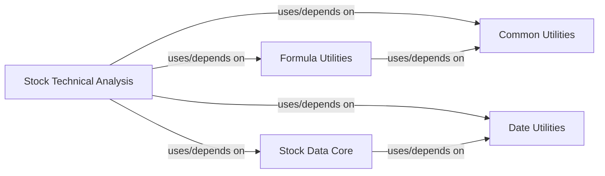

## Component Details

The `Stock Technical Analysis` component is designed to provide comprehensive capabilities for calculating, processing, and visualizing various technical indicators and trendlines essential for stock market analysis. It transforms raw stock data into actionable insights by applying a suite of financial formulas, enabling users to identify patterns and make informed trading decisions.

### Stock Technical Analysis
This is the central component responsible for implementing and exposing functions for various technical indicators (e.g., MACD, KDJ, RSI, Bollinger Bands, DMI) and trendline analysis. It takes raw stock data, applies complex financial algorithms, and often includes plotting capabilities for visual analysis.

**Related Classes/Methods**:

- <a href="https://github.com/waditu/tushare/blob/master/tushare/stock/indictor.py#L1-L1" target="_blank" rel="noopener noreferrer">`tushare.stock.indictor` (1:1)</a>
- <a href="https://github.com/waditu/tushare/blob/master/tushare/stock/trendline.py#L1-L1" target="_blank" rel="noopener noreferrer">`tushare.stock.trendline` (1:1)</a>

### Formula Utilities
This foundational component provides a collection of fundamental mathematical and financial formulas. These utilities are generic and reusable across the `tushare` library, serving as the building blocks for more complex calculations within the `Stock Technical Analysis` component. Examples include Exponential Moving Average (EMA), Simple Moving Average (MA), and other statistical functions.

**Related Classes/Methods**:

- <a href="https://github.com/waditu/tushare/blob/master/tushare/util/formula.py#L1-L1" target="_blank" rel="noopener noreferrer">`tushare.util.formula` (1:1)</a>

### Stock Data Core
This component acts as the primary interface for retrieving and processing raw stock-related data. It provides the essential input (e.g., historical open, high, low, close prices, and volume) that the `Stock Technical Analysis` component requires to perform its calculations.

**Related Classes/Methods**:

- <a href="https://github.com/waditu/tushare/blob/master/tushare/stock/trading.py#L1-L1" target="_blank" rel="noopener noreferrer">`tushare.stock.trading` (1:1)</a>
- <a href="https://github.com/waditu/tushare/blob/master/tushare/stock/fundamental.py#L1-L1" target="_blank" rel="noopener noreferrer">`tushare.stock.fundamental` (1:1)</a>
- <a href="https://github.com/waditu/tushare/blob/master/tushare/stock/reference.py#L1-L1" target="_blank" rel="noopener noreferrer">`tushare.stock.reference` (1:1)</a>
- <a href="https://github.com/waditu/tushare/blob/master/tushare/stock/classifying.py#L1-L1" target="_blank" rel="noopener noreferrer">`tushare.stock.classifying` (1:1)</a>
- <a href="https://github.com/waditu/tushare/blob/master/tushare/stock/billboard.py#L1-L1" target="_blank" rel="noopener noreferrer">`tushare.stock.billboard` (1:1)</a>
- <a href="https://github.com/waditu/tushare/blob/master/tushare/stock/globals.py#L1-L1" target="_blank" rel="noopener noreferrer">`tushare.stock.globals` (1:1)</a>
- <a href="https://github.com/waditu/tushare/blob/master/tushare/stock/macro.py#L1-L1" target="_blank" rel="noopener noreferrer">`tushare.stock.macro` (1:1)</a>
- <a href="https://github.com/waditu/tushare/blob/master/tushare/stock/newsevent.py#L1-L1" target="_blank" rel="noopener noreferrer">`tushare.stock.newsevent` (1:1)</a>
- <a href="https://github.com/waditu/tushare/blob/master/tushare/stock/shibor.py#L1-L1" target="_blank" rel="noopener noreferrer">`tushare.stock.shibor` (1:1)</a>
- <a href="https://github.com/waditu/tushare/blob/master/tushare/stock/cons.py#L1-L1" target="_blank" rel="noopener noreferrer">`tushare.stock.cons` (1:1)</a>
- <a href="https://github.com/waditu/tushare/blob/master/tushare/stock/macro_vars.py#L1-L1" target="_blank" rel="noopener noreferrer">`tushare.stock.macro_vars` (1:1)</a>
- <a href="https://github.com/waditu/tushare/blob/master/tushare/stock/news_vars.py#L1-L1" target="_blank" rel="noopener noreferrer">`tushare.stock.news_vars` (1:1)</a>
- <a href="https://github.com/waditu/tushare/blob/master/tushare/stock/ref_vars.py#L1-L1" target="_blank" rel="noopener noreferrer">`tushare.stock.ref_vars` (1:1)</a>

### Common Utilities
This module encompasses general-purpose utility functions that are widely used across the `tushare` library. For the `Stock Technical Analysis` component, these utilities might include data validation, formatting, and other helper functions that ensure data integrity and consistency.

**Related Classes/Methods**:

- <a href="https://github.com/waditu/tushare/blob/master/tushare/util/common.py#L1-L1" target="_blank" rel="noopener noreferrer">`tushare.util.common` (1:1)</a>
- <a href="https://github.com/waditu/tushare/blob/master/tushare/util/vars.py#L1-L1" target="_blank" rel="noopener noreferrer">`tushare.util.vars` (1:1)</a>

### Date Utilities
This component provides specialized functions for handling and manipulating dates and time-series data. Given that technical analysis heavily relies on time-series stock data, this component is crucial for correctly aligning and processing data points over time.

**Related Classes/Methods**:

- <a href="https://github.com/waditu/tushare/blob/master/tushare/util/dateu.py#L1-L1" target="_blank" rel="noopener noreferrer">`tushare.util.dateu` (1:1)</a>

### [FAQ](https://github.com/CodeBoarding/GeneratedOnBoardings/tree/main?tab=readme-ov-file#faq)