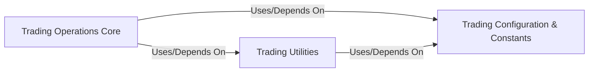

## Component Details

Abstract Components Overview and Relationships for a Trading Operations Subsystem

### Trading Operations Core
This component provides the primary programmatic interface for interacting with trading systems. It encapsulates core functionalities such as user authentication (login), executing trade orders (buy/sell), and querying real-time trading data like current stock positions and historical trade records. It serves as the central hub for all direct market interactions.

**Related Classes/Methods**:

- `TraderAPI.login` (1:1)
- `TraderAPI.buy` (1:1)
- `TraderAPI.position` (1:1)

### Trading Utilities
This component offers a collection of helper functions specifically designed to support the `Trading Operations Core`. Its responsibilities include processing raw data received from the trading system (e.g., parsing JSON responses) and handling specific challenges like CAPTCHA recognition during the login process.

**Related Classes/Methods**:

- <a href="https://github.com/waditu/tushare/blob/master/tushare/trader/utils.py#L27-L35" target="_blank" rel="noopener noreferrer">`utils.get_vcode` (27:35)</a>
- <a href="https://github.com/waditu/tushare/blob/master/tushare/trader/utils.py#L19-L24" target="_blank" rel="noopener noreferrer">`utils.get_jdata` (19:24)</a>

### Trading Configuration & Constants
This component centralizes all static configuration parameters, constants, and predefined values necessary for the `Trading Operations` subsystem. This includes HTTP protocol types, domain names for various trading servers, specific page endpoints, HTTP headers, and column definitions for data structures like position lists and trade records.

**Related Classes/Methods**:

- `vs.AGENT` (1:1)
- `vs.P_TYPE` (1:1)
- `vs.DOMAINS` (1:1)
- `vs.PAGES` (1:1)
- `vs.V_CODE_URL` (1:1)

### [FAQ](https://github.com/CodeBoarding/GeneratedOnBoardings/tree/main?tab=readme-ov-file#faq)