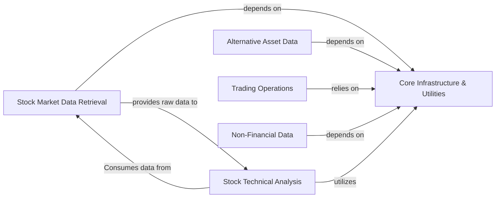

## Component Details

The `tushare` library's architecture is designed around a modular approach, primarily separating core infrastructure from various data retrieval and operational functionalities. The analysis of the Control Flow Graph (CFG) and source code reveals a clear division of responsibilities, with a central communication layer supporting diverse data domains.

### Core Infrastructure & Utilities
This is the foundational layer of the `tushare` library. It is responsible for managing API authentication, establishing and maintaining network connections, and handling the low-level mechanics of sending data requests and receiving responses. Crucially, it also provides essential utility functions for date/time manipulation (e.g., checking holidays, parsing dates) and standardized console output for user interaction and error reporting. It acts as the central gateway and support system for all data fetching and trading operations.

**Related Classes/Methods**:

- <a href="https://github.com/waditu/tushare/blob/master/tushare/pro/data_pro.py#L20-L30" target="_blank" rel="noopener noreferrer">`tushare.pro.data_pro:pro_api` (20:30)</a>
- <a href="https://github.com/waditu/tushare/blob/master/tushare/pro/client.py#L16-L50" target="_blank" rel="noopener noreferrer">`tushare.pro.client:DataApi` (16:50)</a>
- <a href="https://github.com/waditu/tushare/blob/master/tushare/util/conns.py#L49-L50" target="_blank" rel="noopener noreferrer">`tushare.util.conns:get_apis` (49:50)</a>
- <a href="https://github.com/waditu/tushare/blob/master/tushare/util/netbase.py#L8-L27" target="_blank" rel="noopener noreferrer">`tushare.util.netbase:Client` (8:27)</a>
- <a href="https://github.com/waditu/tushare/blob/master/tushare/util/upass.py#L22-L30" target="_blank" rel="noopener noreferrer">`tushare.util.upass:get_token` (22:30)</a>
- <a href="https://github.com/waditu/tushare/blob/master/tushare/util/dateu.py#L26-L28" target="_blank" rel="noopener noreferrer">`tushare.util.dateu:today` (26:28)</a>
- <a href="https://github.com/waditu/tushare/blob/master/tushare/util/dateu.py#L86-L98" target="_blank" rel="noopener noreferrer">`tushare.util.dateu:is_holiday` (86:98)</a>
- <a href="https://github.com/waditu/tushare/blob/master/tushare/util/dateu.py#L71-L74" target="_blank" rel="noopener noreferrer">`tushare.util.dateu:get_quarts` (71:74)</a>
- <a href="https://github.com/waditu/tushare/blob/master/tushare/stock/cons.py#L0-L0" target="_blank" rel="noopener noreferrer">`tushare.stock.cons` (0:0)</a>
- <a href="https://github.com/waditu/tushare/blob/master/tushare/fund/cons.py#L0-L0" target="_blank" rel="noopener noreferrer">`tushare.fund.cons` (0:0)</a>

### Stock Market Data Retrieval
This comprehensive component is dedicated to providing access to a wide array of stock-related financial data. It encompasses functionalities for retrieving historical and real-time trading data, fundamental company financials (e.g., income statements, balance sheets), various stock classifications (industry, concept, area), specialized market lists (e.g., billboard data, restricted share lifting schedules), macroeconomic indicators relevant to the stock market, key financial rates (e.g., SHIBOR, LPR), and global market snapshots. It also includes modules for fetching stock-related news and events.

**Related Classes/Methods**:

- <a href="https://github.com/waditu/tushare/blob/master/tushare/stock/trading.py#L31-L99" target="_blank" rel="noopener noreferrer">`tushare.stock.trading:get_hist_data` (31:99)</a>
- <a href="https://github.com/waditu/tushare/blob/master/tushare/stock/trading.py#L323-L393" target="_blank" rel="noopener noreferrer">`tushare.stock.trading:get_realtime_quotes` (323:393)</a>
- <a href="https://github.com/waditu/tushare/blob/master/tushare/stock/trading.py#L396-L508" target="_blank" rel="noopener noreferrer">`tushare.stock.trading:get_h_data` (396:508)</a>
- <a href="https://github.com/waditu/tushare/blob/master/tushare/stock/trading.py#L899-L1036" target="_blank" rel="noopener noreferrer">`tushare.stock.trading:bar` (899:1036)</a>
- <a href="https://github.com/waditu/tushare/blob/master/tushare/stock/fundamental.py#L21-L58" target="_blank" rel="noopener noreferrer">`tushare.stock.fundamental:get_stock_basics` (21:58)</a>
- <a href="https://github.com/waditu/tushare/blob/master/tushare/stock/fundamental.py#L61-L91" target="_blank" rel="noopener noreferrer">`tushare.stock.fundamental:get_report_data` (61:91)</a>
- <a href="https://github.com/waditu/tushare/blob/master/tushare/stock/classifying.py#L76-L88" target="_blank" rel="noopener noreferrer">`tushare.stock.classifying:concetps` (76:88)</a>
- <a href="https://github.com/waditu/tushare/blob/master/tushare/stock/classifying.py#L117-L131" target="_blank" rel="noopener noreferrer">`tushare.stock.classifying:get_area_classified` (117:131)</a>
- <a href="https://github.com/waditu/tushare/blob/master/tushare/stock/billboard.py#L27-L94" target="_blank" rel="noopener noreferrer">`tushare.stock.billboard:top_list` (27:94)</a>
- <a href="https://github.com/waditu/tushare/blob/master/tushare/stock/billboard.py#L97-L128" target="_blank" rel="noopener noreferrer">`tushare.stock.billboard:cap_tops` (97:128)</a>
- <a href="https://github.com/waditu/tushare/blob/master/tushare/stock/reference.py#L27-L73" target="_blank" rel="noopener noreferrer">`tushare.stock.reference:profit_data` (27:73)</a>
- <a href="https://github.com/waditu/tushare/blob/master/tushare/stock/reference.py#L537-L572" target="_blank" rel="noopener noreferrer">`tushare.stock.reference:sh_margins` (537:572)</a>
- <a href="https://github.com/waditu/tushare/blob/master/tushare/stock/macro.py#L22-L54" target="_blank" rel="noopener noreferrer">`tushare.stock.macro:get_gdp_year` (22:54)</a>
- <a href="https://github.com/waditu/tushare/blob/master/tushare/stock/macro.py#L178-L200" target="_blank" rel="noopener noreferrer">`tushare.stock.macro:get_cpi` (178:200)</a>
- <a href="https://github.com/waditu/tushare/blob/master/tushare/stock/shibor.py#L15-L52" target="_blank" rel="noopener noreferrer">`tushare.stock.shibor:shibor_data` (15:52)</a>
- <a href="https://github.com/waditu/tushare/blob/master/tushare/stock/shibor.py#L137-L167" target="_blank" rel="noopener noreferrer">`tushare.stock.shibor:lpr_data` (137:167)</a>
- <a href="https://github.com/waditu/tushare/blob/master/tushare/stock/globals.py#L18-L55" target="_blank" rel="noopener noreferrer">`tushare.stock.globals:global_realtime` (18:55)</a>
- <a href="https://github.com/waditu/tushare/blob/master/tushare/stock/newsevent.py#L25-L67" target="_blank" rel="noopener noreferrer">`tushare.stock.newsevent:get_latest_news` (25:67)</a>
- <a href="https://github.com/waditu/tushare/blob/master/tushare/stock/newsevent.py#L150-L191" target="_blank" rel="noopener noreferrer">`tushare.stock.newsevent:guba_sina` (150:191)</a>

### Stock Technical Analysis
This component focuses on the calculation, processing, and visualization of various technical indicators commonly used in stock market analysis. It takes raw stock data and applies financial formulas to generate insights such as MACD, KDJ, RSI, Bollinger Bands, and DMI. It also includes functions for plotting these indicators to aid in visual analysis.

**Related Classes/Methods**:

- <a href="https://github.com/waditu/tushare/blob/master/tushare/stock/indictor.py#L778-L998" target="_blank" rel="noopener noreferrer">`tushare.stock.indictor:plot_all` (778:998)</a>
- <a href="https://github.com/waditu/tushare/blob/master/tushare/stock/trendline.py#L71-L88" target="_blank" rel="noopener noreferrer">`tushare.stock.trendline:macd` (71:88)</a>
- <a href="https://github.com/waditu/tushare/blob/master/tushare/util/formula.py#L79-L87" target="_blank" rel="noopener noreferrer">`tushare.util.formula:MACD` (79:87)</a>

### Alternative Asset Data
This specialized component provides data retrieval functionalities for financial assets beyond traditional stocks. It includes interfaces to fetch detailed cryptocurrency market data (tick-level, historical bar data, market snapshots), net asset values (NAV) for various types of funds (open-end, closed-end, graded), and daily trading data for both major domestic and international futures exchanges.

**Related Classes/Methods**:

- <a href="https://github.com/waditu/tushare/blob/master/tushare/coins/market.py#L85-L149" target="_blank" rel="noopener noreferrer">`tushare.coins.market:coins_tick` (85:149)</a>
- <a href="https://github.com/waditu/tushare/blob/master/tushare/coins/market.py#L151-L180" target="_blank" rel="noopener noreferrer">`tushare.coins.market:coins_bar` (151:180)</a>
- <a href="https://github.com/waditu/tushare/blob/master/tushare/coins/market.py#L251-L260" target="_blank" rel="noopener noreferrer">`tushare.coins.market:_get_data` (251:260)</a>
- <a href="https://github.com/waditu/tushare/blob/master/tushare/fund/nav.py#L24-L75" target="_blank" rel="noopener noreferrer">`tushare.fund.nav:get_nav_open` (24:75)</a>
- <a href="https://github.com/waditu/tushare/blob/master/tushare/fund/nav.py#L192-L232" target="_blank" rel="noopener noreferrer">`tushare.fund.nav:get_nav_history` (192:232)</a>
- <a href="https://github.com/waditu/tushare/blob/master/tushare/fund/nav.py#L280-L306" target="_blank" rel="noopener noreferrer">`tushare.fund.nav:_parse_fund_data` (280:306)</a>
- <a href="https://github.com/waditu/tushare/blob/master/tushare/futures/domestic.py#L400-L449" target="_blank" rel="noopener noreferrer">`tushare.futures.domestic:get_future_daily` (400:449)</a>
- <a href="https://github.com/waditu/tushare/blob/master/tushare/futures/intlfutures.py#L21-L26" target="_blank" rel="noopener noreferrer">`tushare.futures.intlfutures:get_intlfuture` (21:26)</a>

### Trading Operations
This component offers a programmatic interface for interacting with trading systems, enabling automated or semi-automated trading functionalities. It provides methods for user login, sending buy/sell orders, querying current stock positions, retrieving lists of pending orders (entrusts), and viewing executed trades. This component acts as the bridge between the data retrieval capabilities and actual market interaction.

**Related Classes/Methods**:

- <a href="https://github.com/waditu/tushare/blob/master/tushare/trader/trader.py#L43-L52" target="_blank" rel="noopener noreferrer">`tushare.trader.trader:TraderAPI.login` (43:52)</a>
- <a href="https://github.com/waditu/tushare/blob/master/tushare/trader/trader.py#L105-L118" target="_blank" rel="noopener noreferrer">`tushare.trader.trader:TraderAPI.buy` (105:118)</a>
- <a href="https://github.com/waditu/tushare/blob/master/tushare/trader/trader.py#L175-L188" target="_blank" rel="noopener noreferrer">`tushare.trader.trader:TraderAPI.position` (175:188)</a>
- <a href="https://github.com/waditu/tushare/blob/master/tushare/trader/utils.py#L0-L0" target="_blank" rel="noopener noreferrer">`tushare.trader.utils` (0:0)</a>
- <a href="https://github.com/waditu/tushare/blob/master/tushare/trader/vars.py#L0-L0" target="_blank" rel="noopener noreferrer">`tushare.trader.vars` (0:0)</a>

### Non-Financial Data
This component provides access to various data points that are not directly related to financial markets but can be of general interest or provide contextual information. Examples include movie box office statistics and news articles from specific external sources like Caixin News.

**Related Classes/Methods**:

- <a href="https://github.com/waditu/tushare/blob/master/tushare/internet/boxoffice.py#L18-L54" target="_blank" rel="noopener noreferrer">`tushare.internet.boxoffice:realtime_boxoffice` (18:54)</a>
- <a href="https://github.com/waditu/tushare/blob/master/tushare/internet/caixinnews.py#L68-L99" target="_blank" rel="noopener noreferrer">`tushare.internet.caixinnews:query_news` (68:99)</a>

### [FAQ](https://github.com/CodeBoarding/GeneratedOnBoardings/tree/main?tab=readme-ov-file#faq)