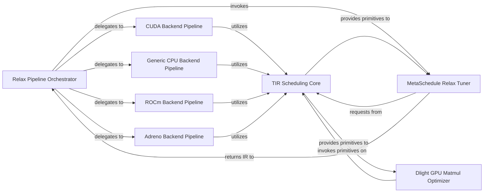

## Details

The TVM Relax subsystem orchestrates the high-level compilation and optimization of Relax IR. The Relax Pipeline Orchestrator serves as the central control, defining and executing a sequence of optimization passes. This orchestrator can delegate to various hardware-specific backend pipelines, such as CUDA Backend Pipeline, Generic CPU Backend Pipeline, ROCm Backend Pipeline, and Adreno Backend Pipeline, each tailored for their respective targets. For performance optimization, the Relax Pipeline Orchestrator can invoke the MetaSchedule Relax Tuner, which automates the search for optimal schedules by interacting with the TIR Scheduling Core. The TIR Scheduling Core provides the fundamental primitives for low-level manipulation of Tensor IR, which is also directly utilized by specialized optimizers like the Dlight GPU Matmul Optimizer and implicitly by the backend pipelines for their transformations.

### Relax Pipeline Orchestrator
Defines and executes the high-level compilation and optimization flow for Relax IR. It orchestrates a sequence of passes, including graph-level transformations and delegation to hardware-specific backends.

**Related Classes/Methods**:

- <a href="https://github.com/apache/tvm/blob/main/python/tvm/relax/pipeline.py#L158-L189" target="_blank" rel="noopener noreferrer">`python.tvm.relax.pipeline._pipeline`:158-189</a>

### TIR Scheduling Core
Provides the fundamental primitives and methods for fine-grained manipulation and optimization of Tensor IR (TIR). It serves as a low-level toolkit for applying transformations and scheduling operations.

**Related Classes/Methods**:

### MetaSchedule Relax Tuner
Integrates the MetaSchedule auto-tuning framework with Relax. It extracts tunable tasks from Relax programs and initiates a search for optimal schedules, leveraging the TIR Scheduling Core for low-level schedule generation.

**Related Classes/Methods**:

- <a href="https://github.com/apache/tvm/blob/main/python/tvm/meta_schedule/relax_integration.py#L160-L269" target="_blank" rel="noopener noreferrer">`python.tvm.meta_schedule.relax_integration.tune_relax`:160-269</a>

### Dlight GPU Matmul Optimizer
A specialized, automated optimization pass within the Dlight framework, specifically designed to apply heuristic-driven transformations for matrix multiplication on NVIDIA GPUs. It operates on TIR.

**Related Classes/Methods**:

### CUDA Backend Pipeline
Defines and executes optimization passes tailored for CUDA hardware targets.

**Related Classes/Methods**:

- <a href="https://github.com/apache/tvm/blob/main/python/tvm/relax/backend/cuda/pipeline.py#L76-L86" target="_blank" rel="noopener noreferrer">`python.tvm.relax.backend.cuda.pipeline._pipeline`:76-86</a>

### Generic CPU Backend Pipeline
Defines and executes optimization passes tailored for generic CPU hardware targets.

**Related Classes/Methods**:

- <a href="https://github.com/apache/tvm/blob/main/python/tvm/relax/backend/cpu_generic/pipeline.py#L64-L74" target="_blank" rel="noopener noreferrer">`python.tvm.relax.backend.cpu_generic.pipeline._pipeline`:64-74</a>

### ROCm Backend Pipeline
Defines and executes optimization passes tailored for ROCm hardware targets.

**Related Classes/Methods**:

- <a href="https://github.com/apache/tvm/blob/main/python/tvm/relax/backend/rocm/pipeline.py#L75-L85" target="_blank" rel="noopener noreferrer">`python.tvm.relax.backend.rocm.pipeline._pipeline`:75-85</a>

### Adreno Backend Pipeline
Defines and executes optimization passes tailored for Adreno hardware targets.

**Related Classes/Methods**:

- <a href="https://github.com/apache/tvm/blob/main/python/tvm/relax/backend/adreno/pipeline.py#L63-L73" target="_blank" rel="noopener noreferrer">`python.tvm.relax.backend.adreno.pipeline._pipeline`:63-73</a>

### [FAQ](https://github.com/CodeBoarding/GeneratedOnBoardings/tree/main?tab=readme-ov-file#faq)