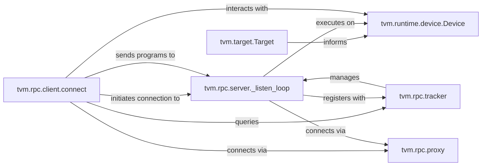

## Details

The `Hardware Abstraction & Deployment` subsystem in TVM provides a unified interface for defining and managing diverse hardware targets and facilitates remote execution and deployment of TVM programs via an RPC system.

### tvm.target.Target
Defines the characteristics and features of a compilation target (e.g., CPU, GPU, DSP, specific hardware configurations). It encapsulates compilation options and target-specific attributes, providing a unified interface for target definition at compile-time.

**Related Classes/Methods**:

- <a href="https://github.com/apache/tvm/blob/main/python/tvm/target/target.py" target="_blank" rel="noopener noreferrer">`tvm.target.Target`</a>

### tvm.runtime.device.Device
Manages runtime interaction with physical hardware devices. It allows querying device-specific attributes and capabilities, allocating memory, and executing compiled functions on the actual hardware.

**Related Classes/Methods**:

- <a href="https://github.com/apache/tvm/blob/main/python/tvm/runtime/device.py#L29-L334" target="_blank" rel="noopener noreferrer">`tvm.runtime.device.Device`:29-334</a>

### tvm.rpc.client.connect
The primary entry point for establishing a client connection to a remote TVM RPC server or tracker. It enables remote execution of TVM programs, file system operations, and interaction with remote Device contexts.

**Related Classes/Methods**:

- <a href="https://github.com/apache/tvm/blob/main/python/tvm/rpc/client.py#L481-L549" target="_blank" rel="noopener noreferrer">`tvm.rpc.client.connect`:481-549</a>

### tvm.rpc.server._listen_loop
The core loop of the TVM RPC server, responsible for listening for incoming client connections, dispatching them for processing, and executing received TVM programs on its local hardware.

**Related Classes/Methods**:

- <a href="https://github.com/apache/tvm/blob/main/python/tvm/rpc/server.py#L179-L279" target="_blank" rel="noopener noreferrer">`tvm.rpc.server._listen_loop`:179-279</a>

### tvm.rpc.tracker
Acts as a central registry for RPC workers (servers). Clients can query the tracker to find available devices, and it manages worker registration and scheduling.

**Related Classes/Methods**:

- <a href="https://github.com/apache/tvm/blob/main/python/tvm/rpc/tracker.py" target="_blank" rel="noopener noreferrer">`tvm.rpc.tracker`</a>

### tvm.rpc.proxy
Serves as an intermediary for RPC connections, especially useful for traversing network boundaries (e.g., NAT). It handles connection pairing and data forwarding between clients and servers.

**Related Classes/Methods**:

- <a href="https://github.com/apache/tvm/blob/main/python/tvm/rpc/proxy.py" target="_blank" rel="noopener noreferrer">`tvm.rpc.proxy`</a>

### [FAQ](https://github.com/CodeBoarding/GeneratedOnBoardings/tree/main?tab=readme-ov-file#faq)