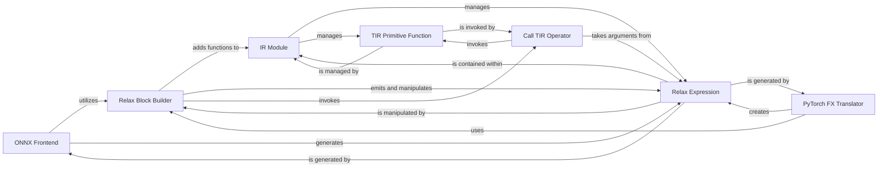

## Details

The TVM Relax subsystem facilitates the high-level representation and manipulation of computational graphs. Frontend components like the `ONNX Frontend` and `PyTorch FX Translator` ingest external model formats, translating them into `Relax Expression`s. These expressions, the fundamental building blocks of the Relax IR, are then managed within the `IR Module`, which serves as the central container for all IR functions. The `Relax Block Builder` provides an imperative API for constructing and manipulating these `Relax Expression`s and adding them to the `IR Module`. For low-level tensor computations, the `Call TIR Operator` acts as a bridge, allowing Relax functions to invoke `TIR Primitive Function`s, which represent the core of TVM's compute abstraction. This interconnected system enables a flexible and efficient compilation pipeline from high-level model descriptions to optimized low-level code.

### ONNX Frontend
Acts as a frontend adapter, ingesting ONNX models, parsing their computational graphs, and translating ONNX operators and data into equivalent Relax expressions and functions.

**Related Classes/Methods**:

- <a href="https://github.com/apache/tvm/blob/main/python/tvm/relax/frontend/onnx/onnx_frontend.py" target="_blank" rel="noopener noreferrer">`tvm.relax.frontend.onnx.onnx_frontend`</a>

### PyTorch FX Translator
Serves as another frontend adapter, specifically translating PyTorch FX computational graphs into Relax IR, mapping PyTorch operations to Relax equivalents.

**Related Classes/Methods**:

- <a href="https://github.com/apache/tvm/blob/main/python/tvm/relax/frontend/torch/fx_translator.py" target="_blank" rel="noopener noreferrer">`tvm.relax.frontend.torch.fx_translator`</a>

### IR Module
The primary container for all TVM IR functions (Relax functions and TIR PrimFuncs), managing their collection and providing a unified view of the compiled model throughout the compilation stages.

**Related Classes/Methods**:

- <a href="https://github.com/apache/tvm/blob/main/python/tvm/ir/module.py#L33-L312" target="_blank" rel="noopener noreferrer">`tvm.ir.module.IRModule`:33-312</a>

### Relax Block Builder
Provides an imperative, Python-based API for constructing Relax functions and binding blocks, acting as the primary tool for programmatically building and manipulating Relax IR.

**Related Classes/Methods**:

- <a href="https://github.com/apache/tvm/blob/main/python/tvm/relax/block_builder.py#L103-L799" target="_blank" rel="noopener noreferrer">`tvm.relax.block_builder.BlockBuilder`:103-799</a>

### Call TIR Operator
A core Relax operator that enables calling a TensorIR (TIR) PrimFunc from within a Relax function, serving as the bridge between the high-level Relax graph and the low-level TIR computations.

**Related Classes/Methods**:

- <a href="https://github.com/apache/tvm/blob/main/python/tvm/relax/op/base.py#L93-L132" target="_blank" rel="noopener noreferrer">`tvm.relax.op.base.call_tir`:93-132</a>

### Relax Expression
Represents the fundamental building blocks of the Relax IR, including variables, constants, function calls, and control flow constructs. It is the core data structure for the high-level computational graph.

**Related Classes/Methods**:

- <a href="https://github.com/apache/tvm/blob/main/python/tvm/relax/expr.py" target="_blank" rel="noopener noreferrer">`tvm.relax.expr`</a>

### TIR Primitive Function
Represents a primitive function in TensorIR, which describes low-level tensor computations. These functions are the targets of `call_tir` from Relax and are the core of TVM's compute abstraction.

**Related Classes/Methods**:

- <a href="https://github.com/apache/tvm/blob/main/python/tvm/tir/function.py#L36-L174" target="_blank" rel="noopener noreferrer">`tvm.tir.function.PrimFunc`:36-174</a>

### [FAQ](https://github.com/CodeBoarding/GeneratedOnBoardings/tree/main?tab=readme-ov-file#faq)