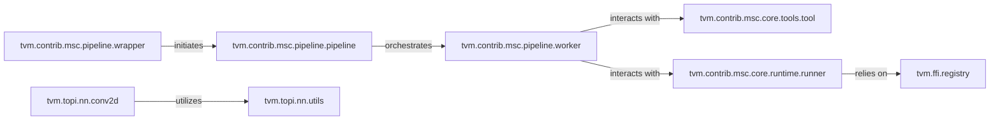

## Details

The Python Control Plane & Extensions subsystem serves as the primary user-facing interface and orchestration layer, enabling Python to control the entire TVM compilation process via Foreign Function Interface (FFI). It also includes advanced model scaling optimizations (MSC) and a library of optimized tensor operators (TOPI).

### tvm.ffi.registry
Serves as the core Foreign Function Interface (FFI) bridge, enabling seamless invocation of C++ functions from Python and vice-versa. It is fundamental to the "Python as Control Plane" architectural bias, allowing Python to orchestrate the C++ backend.

**Related Classes/Methods**:

- <a href="https://github.com/apache/tvm/blob/main/python/tvm/ffi/registry.py" target="_blank" rel="noopener noreferrer">`tvm.ffi.registry`</a>

### tvm.contrib.msc.pipeline.pipeline
The central orchestrator for the entire Model Scaling Optimization (MSC) framework. It defines and executes the multi-stage model optimization and compilation process, embodying the "Compilation Flow Emphasis" pattern. It manages the flow from model parsing to final summary.

**Related Classes/Methods**:

- <a href="https://github.com/apache/tvm/blob/main/python/tvm/contrib/msc/pipeline/pipeline.py" target="_blank" rel="noopener noreferrer">`tvm.contrib.msc.pipeline.pipeline`</a>

### tvm.contrib.msc.pipeline.wrapper
Provides a simplified, user-friendly Pythonic interface to the complex MSC pipeline, abstracting away internal complexities for end-users. This component enhances the "Python as Control Plane" by making the optimization pipeline accessible.

**Related Classes/Methods**:

- <a href="https://github.com/apache/tvm/blob/main/python/tvm/contrib/msc/pipeline/wrapper.py" target="_blank" rel="noopener noreferrer">`tvm.contrib.msc.pipeline.wrapper`</a>

### tvm.contrib.msc.pipeline.worker
Executes specific tasks and applies various optimization and analysis tools within the MSC pipeline stages. It acts as a delegated processing unit for the main pipeline orchestrator, supporting the modularity of the optimization flow.

**Related Classes/Methods**:

- <a href="https://github.com/apache/tvm/blob/main/python/tvm/contrib/msc/pipeline/worker.py" target="_blank" rel="noopener noreferrer">`tvm.contrib.msc.pipeline.worker`</a>

### tvm.contrib.msc.core.tools.tool
Defines a standardized interface and common functionalities for all MSC optimization and analysis tools (e.g., quantization, pruning). This promotes extensibility and aligns with the "Plugin/Extension" architectural pattern.

**Related Classes/Methods**:

- <a href="https://github.com/apache/tvm/blob/main/python/tvm/contrib/msc/core/tools/tool.py" target="_blank" rel="noopener noreferrer">`tvm.contrib.msc.core.tools.tool`</a>

### tvm.contrib.msc.core.runtime.runner
Manages the lifecycle of models at runtime, including building, executing, and exporting compiled models. This component highlights the distinction between "Runtime vs. Compile-time" within the MSC framework.

**Related Classes/Methods**:

- <a href="https://github.com/apache/tvm/blob/main/python/tvm/contrib/msc/core/runtime/runner.py" target="_blank" rel="noopener noreferrer">`tvm.contrib.msc.core.runtime.runner`</a>

### tvm.topi.nn.conv2d
Implements a highly optimized 2D convolution operation, a fundamental building block in deep learning. It showcases how Python extensions (TOPI) provide performance-critical tensor operations, contributing to the "Extensibility for Hardware Backends" by offering optimized primitives.

**Related Classes/Methods**:

- <a href="https://github.com/apache/tvm/blob/main/python/tvm/topi/nn/conv2d.py" target="_blank" rel="noopener noreferrer">`tvm.topi.nn.conv2d`</a>

### tvm.topi.nn.utils
Provides a collection of common utility functions used across various neural network operators within TOPI, supporting efficient tensor operations and promoting code reuse within the extension library.

**Related Classes/Methods**:

- <a href="https://github.com/apache/tvm/blob/main/python/tvm/topi/nn/utils.py" target="_blank" rel="noopener noreferrer">`tvm.topi.nn.utils`</a>

### [FAQ](https://github.com/CodeBoarding/GeneratedOnBoardings/tree/main?tab=readme-ov-file#faq)