```mermaid
graph LR
    Model_Frontend_IR_Management["Model Frontend & IR Management"]
    Compiler_Optimization_Scheduling["Compiler Optimization & Scheduling"]
    Code_Generation_Runtime["Code Generation & Runtime"]
    Hardware_Abstraction_Deployment["Hardware Abstraction & Deployment"]
    Python_Control_Plane_Extensions["Python Control Plane & Extensions"]
    Model_Frontend_IR_Management -- "passes ingested models as IRs for optimization to" --> Compiler_Optimization_Scheduling
    Compiler_Optimization_Scheduling -- "provides optimized IRs for target-specific code generation to" --> Code_Generation_Runtime
    Code_Generation_Runtime -- "deploys and executes compiled modules on" --> Hardware_Abstraction_Deployment
    Hardware_Abstraction_Deployment -- "exchanges hardware configurations and device contexts with" --> Code_Generation_Runtime
    Code_Generation_Runtime -- "facilitates remote execution and deployment via RPC with" --> Hardware_Abstraction_Deployment
    Python_Control_Plane_Extensions -- "uses APIs to load and define models in" --> Model_Frontend_IR_Management
    Python_Control_Plane_Extensions -- "uses APIs to apply optimization passes and configure tuning in" --> Compiler_Optimization_Scheduling
    click Model_Frontend_IR_Management href "https://github.com/CodeBoarding/GeneratedOnBoardings/blob/main/tvm/Model_Frontend_IR_Management.md" "Details"
    click Compiler_Optimization_Scheduling href "https://github.com/CodeBoarding/GeneratedOnBoardings/blob/main/tvm/Compiler_Optimization_Scheduling.md" "Details"
    click Code_Generation_Runtime href "https://github.com/CodeBoarding/GeneratedOnBoardings/blob/main/tvm/Code_Generation_Runtime.md" "Details"
    click Hardware_Abstraction_Deployment href "https://github.com/CodeBoarding/GeneratedOnBoardings/blob/main/tvm/Hardware_Abstraction_Deployment.md" "Details"
    click Python_Control_Plane_Extensions href "https://github.com/CodeBoarding/GeneratedOnBoardings/blob/main/tvm/Python_Control_Plane_Extensions.md" "Details"
```

## Details

The TVM architecture is structured as a modular compilation stack, enabling efficient deployment of deep learning models across diverse hardware. The `Python Control Plane & Extensions` acts as the orchestrator, guiding models from ingestion through optimization to final execution. Models are initially processed by the `Model Frontend & IR Management` component, which converts them into TVM's internal intermediate representations (IRs). These IRs then flow to the `Compiler Optimization & Scheduling` component for extensive transformations and performance tuning. Subsequently, the optimized IRs are passed to the `Code Generation & Runtime` component, which compiles them into target-specific executables. Finally, the `Hardware Abstraction & Deployment` component provides the necessary interfaces and runtime environment for executing these compiled modules on various devices, including remote execution capabilities. This clear, unidirectional flow from frontend to backend, controlled by the Python layer, ensures a robust and extensible compilation framework.

### Model Frontend & IR Management [[Expand]](./Model_Frontend_IR_Management.md)
The initial stage for ingesting deep learning models from various frameworks (e.g., PyTorch, ONNX) and converting them into TVM's internal Relax and TensorIR. It also provides tools for building and manipulating these IRs.

**Related Classes/Methods**:

- <a href="https://github.com/apache/tvm/blob/main/python/tvm/relax/frontend/onnx/onnx_frontend.py#L3897-L3985" target="_blank" rel="noopener noreferrer">`tvm.relax.frontend.onnx.onnx_frontend.from_onnx`:3897-3985</a>
- <a href="https://github.com/apache/tvm/blob/main/python/tvm/relax/frontend/torch/fx_translator.py#L1121-L1228" target="_blank" rel="noopener noreferrer">`tvm.relax.frontend.torch.fx_translator.from_fx`:1121-1228</a>
- <a href="https://github.com/apache/tvm/blob/main/python/tvm/ir/module.py#L33-L312" target="_blank" rel="noopener noreferrer">`tvm.ir.module.IRModule`:33-312</a>
- <a href="https://github.com/apache/tvm/blob/main/python/tvm/relax/block_builder.py#L207-L262" target="_blank" rel="noopener noreferrer">`tvm.relax.block_builder.function`:207-262</a>
- <a href="https://github.com/apache/tvm/blob/main/python/tvm/relax/op/base.py#L93-L132" target="_blank" rel="noopener noreferrer">`tvm.relax.op.base.call_tir`:93-132</a>

### Compiler Optimization & Scheduling [[Expand]](./Compiler_Optimization_Scheduling.md)
Applies a wide array of transformations and optimizations to the IRs, including graph-level optimizations, hardware-specific scheduling, and automated performance tuning (MetaSchedule, Dlight) to prepare models for efficient execution.

**Related Classes/Methods**:

- <a href="https://github.com/apache/tvm/blob/main/python/tvm/relax/pipeline.py#L158-L189" target="_blank" rel="noopener noreferrer">`tvm.relax.pipeline._pipeline`:158-189</a>
- <a href="https://github.com/apache/tvm/blob/main/python/tvm/tir/schedule/schedule.py#L125-L181" target="_blank" rel="noopener noreferrer">`tvm.tir.schedule.schedule.__init__`:125-181</a>
- <a href="https://github.com/apache/tvm/blob/main/python/tvm/relax/backend/cuda/pipeline.py#L76-L86" target="_blank" rel="noopener noreferrer">`tvm.relax.backend.cuda.pipeline._pipeline`:76-86</a>
- <a href="https://github.com/apache/tvm/blob/main/python/tvm/meta_schedule/relax_integration.py#L160-L269" target="_blank" rel="noopener noreferrer">`tvm.meta_schedule.relax_integration.tune_relax`:160-269</a>
- <a href="https://github.com/apache/tvm/blob/main/python/tvm/dlight/gpu/matmul.py#L964-L1124" target="_blank" rel="noopener noreferrer">`tvm.dlight.gpu.matmul.apply`:964-1124</a>

### Code Generation & Runtime [[Expand]](./Code_Generation_Runtime.md)
Responsible for converting the optimized IR into executable code for specific hardware targets and providing the runtime environment for executing these compiled modules, managing memory, and device contexts.

**Related Classes/Methods**:

- <a href="https://github.com/apache/tvm/blob/main/python/tvm/driver/build_module.py#L71-L111" target="_blank" rel="noopener noreferrer">`tvm.driver.build_module.compile`:71-111</a>
- <a href="https://github.com/apache/tvm/blob/main/python/tvm/runtime/module.py#L137-L303" target="_blank" rel="noopener noreferrer">`tvm.runtime.module.export_library`:137-303</a>
- <a href="https://github.com/apache/tvm/blob/main/python/tvm/runtime/vm.py#L45-L91" target="_blank" rel="noopener noreferrer">`tvm.runtime.vm.__init__`:45-91</a>

### Hardware Abstraction & Deployment [[Expand]](./Hardware_Abstraction_Deployment.md)
Provides a unified interface for defining and managing diverse hardware targets (CPUs, GPUs, DSPs) and their features. It also encompasses the RPC system for remote execution and deployment of TVM programs.

**Related Classes/Methods**:

- <a href="https://github.com/apache/tvm/blob/main/python/tvm/target/target.py" target="_blank" rel="noopener noreferrer">`tvm.target.Target`</a>
- <a href="https://github.com/apache/tvm/blob/main/python/tvm/runtime/device.py#L29-L334" target="_blank" rel="noopener noreferrer">`tvm.runtime.device.Device`:29-334</a>
- <a href="https://github.com/apache/tvm/blob/main/python/tvm/rpc/client.py#L481-L549" target="_blank" rel="noopener noreferrer">`tvm.rpc.client.connect`:481-549</a>
- <a href="https://github.com/apache/tvm/blob/main/python/tvm/rpc/server.py#L179-L279" target="_blank" rel="noopener noreferrer">`tvm.rpc.server._listen_loop`:179-279</a>

### Python Control Plane & Extensions [[Expand]](./Python_Control_Plane_Extensions.md)
Serves as the primary user-facing interface and orchestration layer, enabling Python to control the entire TVM compilation process via Foreign Function Interface (FFI). It also includes advanced model scaling optimizations (MSC) and a library of optimized tensor operators (TOPI).

**Related Classes/Methods**:

- <a href="https://github.com/apache/tvm/blob/main/python/tvm/ffi/registry.py#L63-L95" target="_blank" rel="noopener noreferrer">`tvm.ffi.registry.register_func`:63-95</a>
- <a href="https://github.com/apache/tvm/blob/main/python/tvm/contrib/msc/pipeline/pipeline.py#L150-L175" target="_blank" rel="noopener noreferrer">`tvm.contrib.msc.pipeline.pipeline.run_pipe`:150-175</a>
- <a href="https://github.com/apache/tvm/blob/main/python/tvm/topi/nn/conv2d.py#L60-L98" target="_blank" rel="noopener noreferrer">`tvm.topi.nn.conv2d.conv2d`:60-98</a>

### [FAQ](https://github.com/CodeBoarding/GeneratedOnBoardings/tree/main?tab=readme-ov-file#faq)