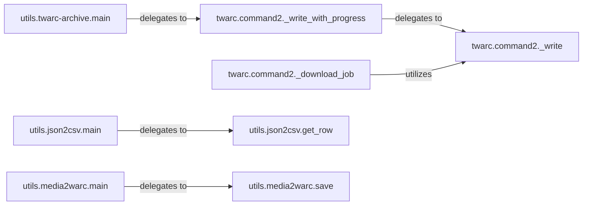

## Details

The `Archiving & Persistence` subsystem is responsible for the long-term storage, formatting, and management of collected data within the `twarc` project. It acts as the backend for saving processed information, ensuring data integrity and accessibility for future analysis or compliance.

### twarc.command2._write
Serves as the foundational data sink, providing the core mechanism for writing data streams to various outputs, such as standard output or files. It is a low-level utility for direct data persistence.

**Related Classes/Methods**:

- <a href="https://github.com/DocNow/twarc/blob/main/twarc/command2.py#L2980-L2982" target="_blank" rel="noopener noreferrer">`twarc.command2._write`:2980-2982</a>

### twarc.command2._write_with_progress
Extends the basic `_write` functionality by incorporating progress reporting, which is crucial for enhancing user experience during large data operations in the CLI.

**Related Classes/Methods**:

- <a href="https://github.com/DocNow/twarc/blob/main/twarc/command2.py#L2985-L3005" target="_blank" rel="noopener noreferrer">`twarc.command2._write_with_progress`:2985-3005</a>

### twarc.command2._download_job
A specialized component dedicated to handling the persistence of compliance job data by downloading and saving it, often leveraging the core writing mechanisms.

**Related Classes/Methods**:

- <a href="https://github.com/DocNow/twarc/blob/main/twarc/command2.py#L2854-L2886" target="_blank" rel="noopener noreferrer">`twarc.command2._download_job`:2854-2886</a>

### utils.json2csv.main
Manages the conversion of raw JSON data (typically collected tweet data) into a structured CSV format, making the data more accessible for analysis in spreadsheet applications.

**Related Classes/Methods**:

- <a href="https://github.com/DocNow/twarc/blob/main/utils/json2csv.py#L26-L92" target="_blank" rel="noopener noreferrer">`utils.json2csv.main`:26-92</a>

### utils.json2csv.get_row
A helper component responsible for the extraction and formatting of individual data rows from JSON objects, preparing them for CSV output.

**Related Classes/Methods**:

- <a href="https://github.com/DocNow/twarc/blob/main/utils/json2csv.py#L107-L112" target="_blank" rel="noopener noreferrer">`utils.json2csv.get_row`:107-112</a>

### utils.media2warc.main
Orchestrates the entire process of identifying, fetching, and packaging media assets (e.g., images, videos linked in tweets) into WARC (Web ARChive) files for long-term preservation.

**Related Classes/Methods**:

- <a href="https://github.com/DocNow/twarc/blob/main/utils/media2warc.py#L201-L263" target="_blank" rel="noopener noreferrer">`utils.media2warc.main`:201-263</a>

### utils.media2warc.save
Handles the concrete task of saving fetched media resources into the designated WARC archive, ensuring proper archival format.

**Related Classes/Methods**:

- <a href="https://github.com/DocNow/twarc/blob/main/utils/media2warc.py#L128-L134" target="_blank" rel="noopener noreferrer">`utils.media2warc.save`:128-134</a>

### utils.twarc-archive.main
Acts as a central utility for managing and interacting with `twarc` archives, including operations such as creating, merging, or validating archives.

**Related Classes/Methods**:

- <a href="https://github.com/DocNow/twarc/blob/main/utils/twarc-archive.py#L46-L180" target="_blank" rel="noopener noreferrer">`utils.twarc-archive.main`:46-180</a>

### [FAQ](https://github.com/CodeBoarding/GeneratedOnBoardings/tree/main?tab=readme-ov-file#faq)