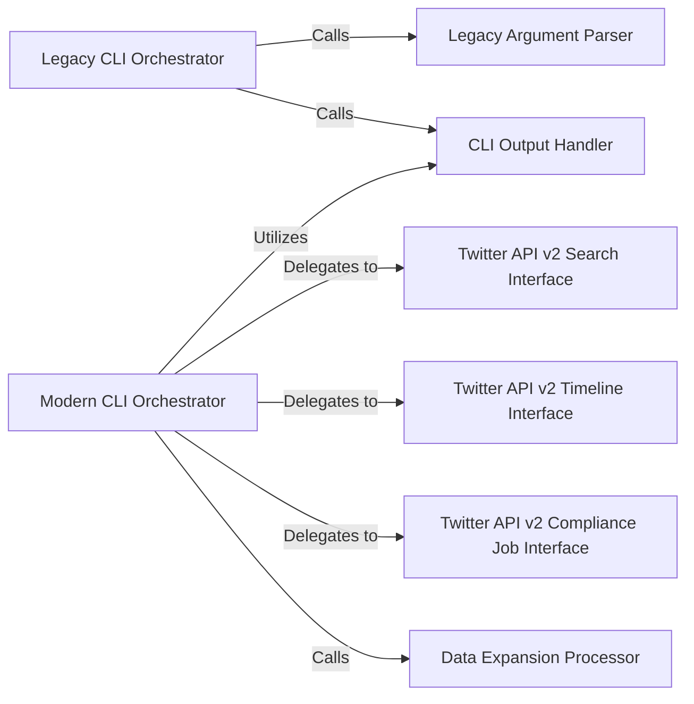

## Details

The Twarc CLI subsystem is structured around two primary orchestrators: the `Legacy CLI Orchestrator` and the `Modern CLI Orchestrator`. The `Legacy CLI Orchestrator` handles older commands, relying on the `Legacy Argument Parser` for input and the `CLI Output Handler` for results. The `Modern CLI Orchestrator` manages Twitter API v2 interactions, delegating specific data retrieval tasks to specialized interfaces such as `Twitter API v2 Search Interface`, `Twitter API v2 Timeline Interface`, and `Twitter API v2 Compliance Job Interface`. Both orchestrators ultimately utilize the `CLI Output Handler` for presenting information to the user. Additionally, the `Modern CLI Orchestrator` integrates with the `Data Expansion Processor` to enrich retrieved data before output. This design clearly separates concerns between argument parsing, API interaction, data processing, and output management, ensuring a modular and maintainable command-line application.

### Legacy CLI Orchestrator
Serves as the primary entry point for the legacy Twarc CLI. Its responsibility is to initialize the argument parser, orchestrate the execution of legacy commands, and manage output file path numbering.

**Related Classes/Methods**:

- <a href="https://github.com/DocNow/twarc/blob/main/twarc/command.py#L56-L342" target="_blank" rel="noopener noreferrer">`twarc.command.main`:56-342</a>

### Modern CLI Orchestrator
Acts as the central orchestrator for the modern Twarc CLI (Twitter API v2). It encapsulates various commands, delegates to specific API interaction functions (e.g., search, timeline), and manages the overall workflow for modern data collection.

**Related Classes/Methods**:

- <a href="https://github.com/DocNow/twarc/blob/main/twarc/command2.py" target="_blank" rel="noopener noreferrer">`twarc.command2`</a>

### Legacy Argument Parser
Dedicated to defining and parsing command-line arguments specifically for the legacy CLI commands, ensuring that user input is correctly interpreted.

**Related Classes/Methods**:

- <a href="https://github.com/DocNow/twarc/blob/main/twarc/command.py#L345-L510" target="_blank" rel="noopener noreferrer">`twarc.command.get_argparser`:345-510</a>

### CLI Output Handler
Manages the writing of processed data to standard output or specified files for the modern CLI, including providing visual progress indicators. This component also implicitly covers file path numbering for legacy output via twarc.command.numbered_filepath as a general output concern.

**Related Classes/Methods**:

- <a href="https://github.com/DocNow/twarc/blob/main/twarc/command2.py#L2980-L2982" target="_blank" rel="noopener noreferrer">`twarc.command2._write`:2980-2982</a>
- <a href="https://github.com/DocNow/twarc/blob/main/twarc/command2.py#L2985-L3005" target="_blank" rel="noopener noreferrer">`twarc.command2._write_with_progress`:2985-3005</a>
- <a href="https://github.com/DocNow/twarc/blob/main/twarc/command.py#L513-L515" target="_blank" rel="noopener noreferrer">`twarc.command.numbered_filepath`:513-515</a>

### Twitter API v2 Search Interface
Encapsulates the core logic for executing Twitter API v2 search queries, acting as the direct interface between the modern CLI orchestrator and the underlying Twitter API Client.

**Related Classes/Methods**:

- <a href="https://github.com/DocNow/twarc/blob/main/twarc/command2.py#L225-L297" target="_blank" rel="noopener noreferrer">`twarc.command2._search`:225-297</a>

### Twitter API v2 Timeline Interface
Manages the retrieval of user timelines from the Twitter API v2, serving as another direct interface between the modern CLI orchestrator and the Twitter API Client.

**Related Classes/Methods**:

- <a href="https://github.com/DocNow/twarc/blob/main/twarc/command2.py#L1527-L1566" target="_blank" rel="noopener noreferrer">`twarc.command2._timeline_tweets`:1527-1566</a>

### Twitter API v2 Compliance Job Interface
Responsible for retrieving details about compliance jobs via the Twitter API v2, delegated by the modern CLI orchestrator.

**Related Classes/Methods**:

- <a href="https://github.com/DocNow/twarc/blob/main/twarc/command2.py#L2724-L2739" target="_blank" rel="noopener noreferrer">`twarc.command2._get_job`:2724-2739</a>

### Data Expansion Processor
Processes and expands data received from the Twitter API v2, often used to enrich tweet objects with related information before output, acting as a data transformation step within the CLI's workflow.

**Related Classes/Methods**:

- <a href="https://github.com/DocNow/twarc/blob/main/twarc/command2.py#L576-L597" target="_blank" rel="noopener noreferrer">`twarc.command2._process_expansions_shortcuts`:576-597</a>

### [FAQ](https://github.com/CodeBoarding/GeneratedOnBoardings/tree/main?tab=readme-ov-file#faq)