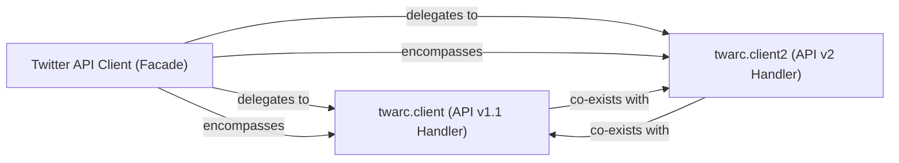

## Details

The Twitter API Client subsystem is primarily defined by the `twarc.client` and `twarc.client2` modules. These modules encapsulate all logic related to interacting with the Twitter API, serving as the core interface for data retrieval within the `twarc` library.

### Twitter API Client (Facade)
This is a conceptual, overarching component that provides a unified, high-level interface for all Twitter API interactions. It abstracts away the complexities and version differences between Twitter API v1.1 and v2, allowing other parts of the `twarc` library to interact with the Twitter API seamlessly without needing to know the underlying API version specifics. It manages the overall authentication and configuration context for API calls.

**Related Classes/Methods**:

- <a href="https://github.com/DocNow/twarc/blob/main/twarc/client.py#L1-L9999" target="_blank" rel="noopener noreferrer">`twarc.client`:1-9999</a>
- <a href="https://github.com/DocNow/twarc/blob/main/twarc/client2.py#L1-L9999" target="_blank" rel="noopener noreferrer">`twarc.client2`:1-9999</a>

### twarc.client (API v1.1 Handler)
This component is specifically responsible for managing all interactions with the Twitter API v1.1. It handles authentication mechanisms (e.g., `validate_keys`, `get_keys`), applies default configurations, and executes specific API v1.1 endpoint calls such as `search`, `timeline`, `user_lookup`, `filter`, `sample`, and `hydrate`. It also provides the underlying HTTP `connect`, `get`, and `post` methods for v1.1 requests.

**Related Classes/Methods**:

- <a href="https://github.com/DocNow/twarc/blob/main/twarc/client.py#L1-L9999" target="_blank" rel="noopener noreferrer">`twarc.client`:1-9999</a>
- <a href="https://github.com/DocNow/twarc/blob/main/twarc/client.py#L1-L9999" target="_blank" rel="noopener noreferrer">`twarc.client:validate_keys`:1-9999</a>
- <a href="https://github.com/DocNow/twarc/blob/main/twarc/client.py#L1-L9999" target="_blank" rel="noopener noreferrer">`twarc.client:get_keys`:1-9999</a>
- <a href="https://github.com/DocNow/twarc/blob/main/twarc/client.py#L1-L9999" target="_blank" rel="noopener noreferrer">`twarc.client:search`:1-9999</a>
- <a href="https://github.com/DocNow/twarc/blob/main/twarc/client.py#L1-L9999" target="_blank" rel="noopener noreferrer">`twarc.client:timeline`:1-9999</a>
- <a href="https://github.com/DocNow/twarc/blob/main/twarc/client.py#L1-L9999" target="_blank" rel="noopener noreferrer">`twarc.client:user_lookup`:1-9999</a>
- <a href="https://github.com/DocNow/twarc/blob/main/twarc/client.py#L1-L9999" target="_blank" rel="noopener noreferrer">`twarc.client:filter`:1-9999</a>
- <a href="https://github.com/DocNow/twarc/blob/main/twarc/client.py#L1-L9999" target="_blank" rel="noopener noreferrer">`twarc.client:sample`:1-9999</a>
- <a href="https://github.com/DocNow/twarc/blob/main/twarc/client.py#L1-L9999" target="_blank" rel="noopener noreferrer">`twarc.client:hydrate`:1-9999</a>
- <a href="https://github.com/DocNow/twarc/blob/main/twarc/client.py#L1-L9999" target="_blank" rel="noopener noreferrer">`twarc.client:connect`:1-9999</a>
- <a href="https://github.com/DocNow/twarc/blob/main/twarc/client.py#L1-L9999" target="_blank" rel="noopener noreferrer">`twarc.client:get`:1-9999</a>
- <a href="https://github.com/DocNow/twarc/blob/main/twarc/client.py#L1-L9999" target="_blank" rel="noopener noreferrer">`twarc.client:post`:1-9999</a>

### twarc.client2 (API v2 Handler)
This component is dedicated to managing interactions with the Twitter API v2. It handles authentication and configuration tailored for API v2 and provides methods for newer functionalities like `search_recent`, `search_all`, `stream`, `tweet_lookup`, `user_lookup`, and compliance jobs. Similar to `twarc.client`, it includes its own `connect`, `get`, and `post` methods for handling HTTP requests specific to API v2.

**Related Classes/Methods**:

- <a href="https://github.com/DocNow/twarc/blob/main/twarc/client2.py#L1-L9999" target="_blank" rel="noopener noreferrer">`twarc.client2`:1-9999</a>
- <a href="https://github.com/DocNow/twarc/blob/main/twarc/client2.py#L1-L9999" target="_blank" rel="noopener noreferrer">`twarc.client2:search_recent`:1-9999</a>
- <a href="https://github.com/DocNow/twarc/blob/main/twarc/client2.py#L1-L9999" target="_blank" rel="noopener noreferrer">`twarc.client2:search_all`:1-9999</a>
- <a href="https://github.com/DocNow/twarc/blob/main/twarc/client2.py#L1-L9999" target="_blank" rel="noopener noreferrer">`twarc.client2:stream`:1-9999</a>
- <a href="https://github.com/DocNow/twarc/blob/main/twarc/client2.py#L1-L9999" target="_blank" rel="noopener noreferrer">`twarc.client2:tweet_lookup`:1-9999</a>
- <a href="https://github.com/DocNow/twarc/blob/main/twarc/client2.py#L1-L9999" target="_blank" rel="noopener noreferrer">`twarc.client2:user_lookup`:1-9999</a>
- <a href="https://github.com/DocNow/twarc/blob/main/twarc/client2.py#L1-L9999" target="_blank" rel="noopener noreferrer">`twarc.client2:connect`:1-9999</a>
- <a href="https://github.com/DocNow/twarc/blob/main/twarc/client2.py#L1-L9999" target="_blank" rel="noopener noreferrer">`twarc.client2:get`:1-9999</a>
- <a href="https://github.com/DocNow/twarc/blob/main/twarc/client2.py#L1-L9999" target="_blank" rel="noopener noreferrer">`twarc.client2:post`:1-9999</a>

### [FAQ](https://github.com/CodeBoarding/GeneratedOnBoardings/tree/main?tab=readme-ov-file#faq)