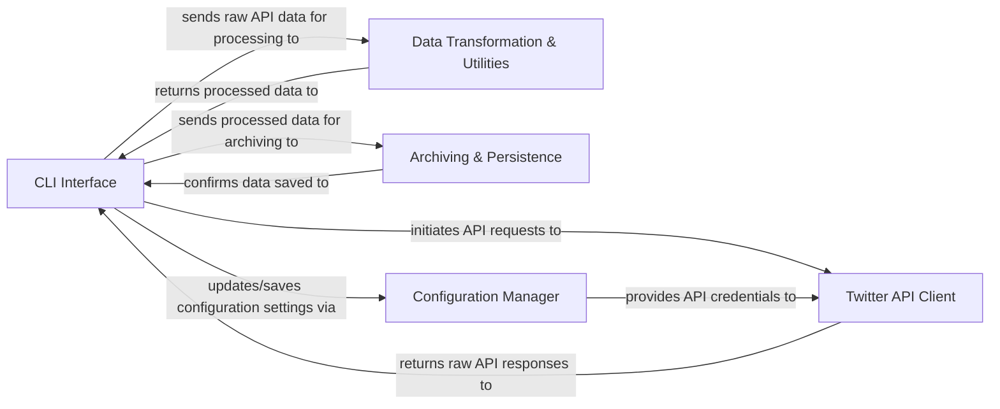

## Details

The `twarc` project is structured around a clear command-line interface that orchestrates interactions with the Twitter API, processes retrieved data, and manages its persistence. The `CLI Interface` acts as the central control, parsing user commands and coordinating workflows. It leverages the `Twitter API Client` for all external communication with Twitter, handling authentication and data retrieval. Raw data from the API is then passed to the `Data Transformation & Utilities` component for processing, such as expanding fields or converting formats. Finally, the `CLI Interface` is responsible for the `Archiving & Persistence` of this processed data, saving it to long-term storage. A dedicated `Configuration Manager` ensures that API keys and operational settings are consistently loaded and managed across the application.

### CLI Interface [[Expand]](./CLI_Interface.md)
The primary user-facing component, responsible for command parsing, workflow orchestration, and managing input/output, including the initiation of data archiving.

**Related Classes/Methods**:

- <a href="https://github.com/DocNow/twarc/blob/main/twarc/command.py" target="_blank" rel="noopener noreferrer">`twarc.command`</a>
- <a href="https://github.com/DocNow/twarc/blob/main/twarc/command2.py" target="_blank" rel="noopener noreferrer">`twarc.command2`</a>

### Twitter API Client [[Expand]](./Twitter_API_Client.md)
Handles all interactions with the Twitter API, including authentication, request construction, and response handling.

**Related Classes/Methods**:

- <a href="https://github.com/DocNow/twarc/blob/main/twarc/client.py" target="_blank" rel="noopener noreferrer">`twarc.client`</a>
- <a href="https://github.com/DocNow/twarc/blob/main/twarc/client2.py" target="_blank" rel="noopener noreferrer">`twarc.client2`</a>

### Data Transformation & Utilities
Processes and transforms raw Twitter data (e.g., JSON flattening, format conversion, data expansion).

**Related Classes/Methods**:

- <a href="https://github.com/DocNow/twarc/blob/main/twarc/expansions.py" target="_blank" rel="noopener noreferrer">`twarc.expansions`</a>
- <a href="https://github.com/DocNow/twarc/blob/main/twarc/json2csv.py" target="_blank" rel="noopener noreferrer">`twarc.json2csv`</a>

### Archiving & Persistence [[Expand]](./Archiving_Persistence.md)
Manages the long-term storage and archiving of collected data, orchestrated by the CLI Interface. This component represents the functionality of saving processed data.

**Related Classes/Methods**: _None_

### Configuration Manager
Loads, saves, and provides application configuration, primarily API keys and operational settings.

**Related Classes/Methods**:

- <a href="https://github.com/DocNow/twarc/blob/main/twarc/config.py" target="_blank" rel="noopener noreferrer">`twarc.config`</a>

### [FAQ](https://github.com/CodeBoarding/GeneratedOnBoardings/tree/main?tab=readme-ov-file#faq)