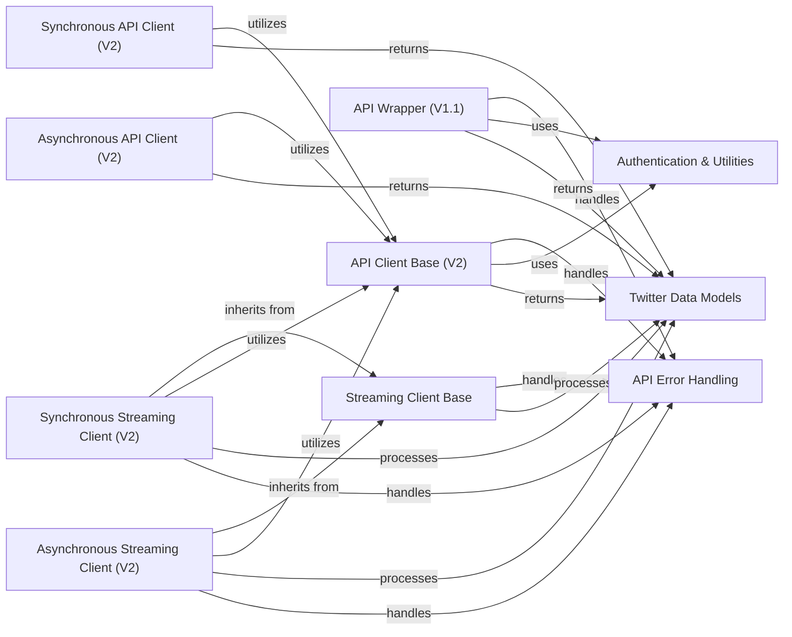

## Component Details

This subsystem provides comprehensive interfaces for interacting with the Twitter API, encompassing both v1.1 and v2, with support for synchronous, asynchronous, and streaming operations. It handles the underlying HTTP request and response mechanisms, manages authentication, processes API responses into structured data models, and provides robust error handling. The core functionality is built upon base client classes that manage the fundamental communication, while specialized clients extend these bases to offer specific API functionalities and streaming capabilities.

### API Client Base (V2)
Provides the fundamental request handling and response processing for Twitter API v2, serving as the base for both synchronous and asynchronous clients.

**Related Classes/Methods**:

- `tweepy.tweepy.client.BaseClient` (full file reference)
- `tweepy.tweepy.client.BaseClient:request` (full file reference)
- `tweepy.tweepy.client.BaseClient:_make_request` (full file reference)
- `tweepy.tweepy.client.BaseClient:_construct_response` (full file reference)
- `tweepy.tweepy.client.BaseClient:_process_includes` (full file reference)
- `tweepy.tweepy.client.BaseClient:_process_params` (full file reference)
- `tweepy.tweepy.asynchronous.client.AsyncBaseClient` (full file reference)
- `tweepy.tweepy.asynchronous.client.AsyncBaseClient:request` (full file reference)
- `tweepy.tweepy.asynchronous.client.AsyncBaseClient:_make_request` (full file reference)

### Synchronous API Client (V2)
Offers a synchronous interface for interacting with Twitter API v2 endpoints, covering various functionalities like tweet management, user interactions, and list operations.

**Related Classes/Methods**:

- `tweepy.tweepy.client.Client` (full file reference)
- `tweepy.tweepy.client.Client:_get_authenticating_user_id` (full file reference)
- `tweepy.tweepy.client.Client:_get_oauth_2_authenticating_user_id` (full file reference)
- `tweepy.tweepy.client.Client:remove_bookmark` (full file reference)
- `tweepy.tweepy.client.Client:get_bookmarks` (full file reference)
- `tweepy.tweepy.client.Client:bookmark` (full file reference)
- `tweepy.tweepy.client.Client:hide_reply` (full file reference)
- `tweepy.tweepy.client.Client:unhide_reply` (full file reference)
- `tweepy.tweepy.client.Client:unlike` (full file reference)
- `tweepy.tweepy.client.Client:get_liking_users` (full file reference)
- `tweepy.tweepy.client.Client:get_liked_tweets` (full file reference)
- `tweepy.tweepy.client.Client:like` (full file reference)
- `tweepy.tweepy.client.Client:delete_tweet` (full file reference)
- `tweepy.tweepy.client.Client:create_tweet` (full file reference)
- `tweepy.tweepy.client.Client:get_quote_tweets` (full file reference)
- `tweepy.tweepy.client.Client:unretweet` (full file reference)
- `tweepy.tweepy.client.Client:get_retweeters` (full file reference)
- `tweepy.tweepy.client.Client:retweet` (full file reference)
- `tweepy.tweepy.client.Client:search_all_tweets` (full file reference)
- `tweepy.tweepy.client.Client:search_recent_tweets` (full file reference)
- `tweepy.tweepy.client.Client:get_users_mentions` (full file reference)
- `tweepy.tweepy.client.Client:get_home_timeline` (full file reference)
- `tweepy.tweepy.client.Client:get_users_tweets` (full file reference)
- `tweepy.tweepy.client.Client:get_all_tweets_count` (full file reference)
- `tweepy.tweepy.client.Client:get_recent_tweets_count` (full file reference)
- `tweepy.tweepy.client.Client:get_tweet` (full file reference)
- `tweepy.tweepy.client.Client:get_tweets` (full file reference)
- `tweepy.tweepy.client.Client:get_blocked` (full file reference)
- `tweepy.tweepy.client.Client:unfollow_user` (full file reference)
- `tweepy.tweepy.client.Client:unfollow` (full file reference)
- `tweepy.tweepy.client.Client:get_users_followers` (full file reference)
- `tweepy.tweepy.client.Client:get_users_following` (full file reference)
- `tweepy.tweepy.client.Client:follow_user` (full file reference)
- `tweepy.tweepy.client.Client:follow` (full file reference)
- `tweepy.tweepy.client.Client:unmute` (full file reference)
- `tweepy.tweepy.client.Client:get_muted` (full file reference)
- `tweepy.tweepy.client.Client:mute` (full file reference)
- `tweepy.tweepy.client.Client:get_user` (full file reference)
- `tweepy.tweepy.client.Client:get_users` (full file reference)
- `tweepy.tweepy.client.Client:get_me` (full file reference)
- `tweepy.tweepy.client.Client:search_spaces` (full file reference)
- `tweepy.tweepy.client.Client:get_spaces` (full file reference)
- `tweepy.tweepy.client.Client:get_space` (full file reference)
- `tweepy.tweepy.client.Client:get_space_buyers` (full file reference)
- `tweepy.tweepy.client.Client:get_space_tweets` (full file reference)
- `tweepy.tweepy.client.Client:get_direct_message_events` (full file reference)
- `tweepy.tweepy.client.Client:create_direct_message` (full file reference)
- `tweepy.tweepy.client.Client:create_direct_message_conversation` (full file reference)
- `tweepy.tweepy.client.Client:get_list_tweets` (full file reference)
- `tweepy.tweepy.client.Client:unfollow_list` (full file reference)
- `tweepy.tweepy.client.Client:get_list_followers` (full file reference)
- `tweepy.tweepy.client.Client:get_followed_lists` (full file reference)
- `tweepy.tweepy.client.Client:follow_list` (full file reference)
- `tweepy.tweepy.client.Client:get_list` (full file reference)
- `tweepy.tweepy.client.Client:get_owned_lists` (full file reference)
- `tweepy.tweepy.client.Client:remove_list_member` (full file reference)
- `tweepy.tweepy.client.Client:get_list_members` (full file reference)
- `tweepy.tweepy.client.Client:get_list_memberships` (full file reference)
- `tweepy.tweepy.client.Client:add_list_member` (full file reference)
- `tweepy.tweepy.client.Client:delete_list` (full file reference)
- `tweepy.tweepy.client.Client:update_list` (full file reference)
- `tweepy.tweepy.client.Client:create_list` (full file reference)
- `tweepy.tweepy.client.Client:unpin_list` (full file reference)
- `tweepy.tweepy.client.Client:get_pinned_lists` (full file reference)
- `tweepy.tweepy.client.Client:pin_list` (full file reference)
- `tweepy.tweepy.client.Client:get_compliance_jobs` (full file reference)
- `tweepy.tweepy.client.Client:get_compliance_job` (full file reference)
- `tweepy.tweepy.client.Client:create_compliance_job` (full file reference)

### Asynchronous API Client (V2)
Provides an asynchronous interface for Twitter API v2, mirroring the synchronous client's capabilities with non-blocking operations.

**Related Classes/Methods**:

- `tweepy.tweepy.asynchronous.client.AsyncClient` (full file reference)
- `tweepy.tweepy.asynchronous.client.AsyncClient:_get_authenticating_user_id` (full file reference)
- `tweepy.tweepy.asynchronous.client.AsyncClient:_get_oauth_2_authenticating_user_id` (full file reference)
- `tweepy.tweepy.asynchronous.client.AsyncClient:remove_bookmark` (full file reference)
- `tweepy.tweepy.asynchronous.client.AsyncClient:get_bookmarks` (full file reference)
- `tweepy.tweepy.asynchronous.client.AsyncClient:bookmark` (full file reference)
- `tweepy.tweepy.asynchronous.client.AsyncClient:hide_reply` (full file reference)
- `tweepy.tweepy.asynchronous.client.AsyncClient:unhide_reply` (full file reference)
- `tweepy.tweepy.asynchronous.client.AsyncClient:unlike` (full file reference)
- `tweepy.tweepy.asynchronous.client.AsyncClient:get_liking_users` (full file reference)
- `tweepy.tweepy.asynchronous.client.AsyncClient:get_liked_tweets` (full file reference)
- `tweepy.tweepy.asynchronous.client.AsyncClient:like` (full file reference)
- `tweepy.tweepy.asynchronous.client.AsyncClient:delete_tweet` (full file reference)
- `tweepy.tweepy.asynchronous.client.AsyncClient:create_tweet` (full file reference)
- `tweepy.tweepy.asynchronous.client.AsyncClient:get_quote_tweets` (full file reference)
- `tweepy.tweepy.asynchronous.client.AsyncClient:unretweet` (full file reference)
- `tweepy.tweepy.asynchronous.client.AsyncClient:get_retweeters` (full file reference)
- `tweepy.tweepy.asynchronous.client.AsyncClient:retweet` (full file reference)
- `tweepy.tweepy.asynchronous.client.AsyncClient:search_all_tweets` (full file reference)
- `tweepy.tweepy.asynchronous.client.AsyncClient:search_recent_tweets` (full file reference)
- `tweepy.tweepy.asynchronous.client.AsyncClient:get_users_mentions` (full file reference)
- `tweepy.tweepy.asynchronous.client.AsyncClient:get_home_timeline` (full file reference)
- `tweepy.tweepy.asynchronous.client.AsyncClient:get_users_tweets` (full file reference)
- `tweepy.tweepy.asynchronous.client.AsyncClient:get_all_tweets_count` (full file reference)
- `tweepy.tweepy.asynchronous.client.AsyncClient:get_recent_tweets_count` (full file reference)
- `tweepy.tweepy.asynchronous.client.AsyncClient:get_tweet` (full file reference)
- `tweepy.tweepy.asynchronous.client.AsyncClient:get_tweets` (full file reference)
- `tweepy.tweepy.asynchronous.client.AsyncClient:get_blocked` (full file reference)
- `tweepy.tweepy.asynchronous.client.AsyncClient:unfollow_user` (full file reference)
- `tweepy.tweepy.asynchronous.client.AsyncClient:get_users_followers` (full file reference)
- `tweepy.tweepy.asynchronous.client.AsyncClient:get_users_following` (full file reference)
- `tweepy.tweepy.asynchronous.client.AsyncClient:follow_user` (full file reference)
- `tweepy.tweepy.asynchronous.client.AsyncClient:unmute` (full file reference)
- `tweepy.tweepy.asynchronous.client.AsyncClient:get_muted` (full file reference)
- `tweepy.tweepy.asynchronous.client.AsyncClient:mute` (full file reference)
- `tweepy.tweepy.asynchronous.client.AsyncClient:get_user` (full file reference)
- `tweepy.tweepy.asynchronous.client.AsyncClient:get_users` (full file reference)
- `tweepy.tweepy.asynchronous.client.AsyncClient:get_me` (full file reference)
- `tweepy.tweepy.asynchronous.client.AsyncClient:search_spaces` (full file reference)
- `tweepy.tweepy.asynchronous.client.AsyncClient:get_spaces` (full file reference)
- `tweepy.tweepy.asynchronous.client.AsyncClient:get_space` (full file reference)
- `tweepy.tweepy.asynchronous.client.AsyncClient:get_space_buyers` (full file reference)
- `tweepy.tweepy.asynchronous.client.AsyncClient:get_space_tweets` (full file reference)
- `tweepy.tweepy.asynchronous.client.AsyncClient:get_direct_message_events` (full file reference)
- `tweepy.tweepy.asynchronous.client.AsyncClient:create_direct_message` (full file reference)
- `tweepy.tweepy.asynchronous.client.AsyncClient:create_direct_message_conversation` (full file reference)
- `tweepy.tweepy.asynchronous.client.AsyncClient:get_list_tweets` (full file reference)
- `tweepy.tweepy.asynchronous.client.AsyncClient:unfollow_list` (full file reference)
- `tweepy.tweepy.asynchronous.client.AsyncClient:get_list_followers` (full file reference)
- `tweepy.tweepy.asynchronous.client.AsyncClient:get_followed_lists` (full file reference)
- `tweepy.tweepy.asynchronous.client.AsyncClient:follow_list` (full file reference)
- `tweepy.tweepy.asynchronous.client.AsyncClient:get_list` (full file reference)
- `tweepy.tweepy.asynchronous.client.AsyncClient:get_owned_lists` (full file reference)
- `tweepy.tweepy.asynchronous.client.AsyncClient:remove_list_member` (full file reference)
- `tweepy.tweepy.asynchronous.client.AsyncClient:get_list_members` (full file reference)
- `tweepy.tweepy.asynchronous.client.AsyncClient:get_list_memberships` (full file reference)
- `tweepy.tweepy.asynchronous.client.AsyncClient:add_list_member` (full file reference)
- `tweepy.tweepy.asynchronous.client.AsyncClient:delete_list` (full file reference)
- `tweepy.tweepy.asynchronous.client.AsyncClient:update_list` (full file reference)
- `tweepy.tweepy.asynchronous.client.AsyncClient:create_list` (full file reference)
- `tweepy.tweepy.asynchronous.client.AsyncClient:unpin_list` (full file reference)
- `tweepy.tweepy.asynchronous.client.AsyncClient:get_pinned_lists` (full file reference)
- `tweepy.tweepy.asynchronous.client.AsyncClient:pin_list` (full file reference)
- `tweepy.tweepy.asynchronous.client.AsyncClient:get_compliance_jobs` (full file reference)
- `tweepy.tweepy.asynchronous.client.AsyncClient:get_compliance_job` (full file reference)
- `tweepy.tweepy.asynchronous.client.AsyncClient:create_compliance_job` (full file reference)

### API Wrapper (V1.1)
A high-level synchronous wrapper for Twitter API v1.1, simplifying common operations and media uploads.

**Related Classes/Methods**:

- `tweepy.tweepy.api.API` (full file reference)
- `tweepy.tweepy.api.API:__init__` (full file reference)
- `tweepy.tweepy.api.API:request` (full file reference)
- `tweepy.tweepy.api.API:home_timeline` (full file reference)
- `tweepy.tweepy.api.API:mentions_timeline` (full file reference)
- `tweepy.tweepy.api.API:user_timeline` (full file reference)
- `tweepy.tweepy.api.API:get_favorites` (full file reference)
- `tweepy.tweepy.api.API:lookup_statuses` (full file reference)
- `tweepy.tweepy.api.API:get_oembed` (full file reference)
- `tweepy.tweepy.api.API:get_retweeter_ids` (full file reference)
- `tweepy.tweepy.api.API:get_retweets` (full file reference)
- `tweepy.tweepy.api.API:get_retweets_of_me` (full file reference)
- `tweepy.tweepy.api.API:get_status` (full file reference)
- `tweepy.tweepy.api.API:create_favorite` (full file reference)
- `tweepy.tweepy.api.API:destroy_favorite` (full file reference)
- `tweepy.tweepy.api.API:destroy_status` (full file reference)
- `tweepy.tweepy.api.API:retweet` (full file reference)
- `tweepy.tweepy.api.API:unretweet` (full file reference)
- `tweepy.tweepy.api.API:update_status` (full file reference)
- `tweepy.tweepy.api.API:update_status_with_media` (full file reference)
- `tweepy.tweepy.api.API:search_tweets` (full file reference)
- `tweepy.tweepy.api.API:get_lists` (full file reference)
- `tweepy.tweepy.api.API:get_list_members` (full file reference)
- `tweepy.tweepy.api.API:get_list_member` (full file reference)
- `tweepy.tweepy.api.API:get_list_memberships` (full file reference)
- `tweepy.tweepy.api.API:get_list_ownerships` (full file reference)
- `tweepy.tweepy.api.API:get_list` (full file reference)
- `tweepy.tweepy.api.API:list_timeline` (full file reference)
- `tweepy.tweepy.api.API:get_list_subscribers` (full file reference)
- `tweepy.tweepy.api.API:get_list_subscriber` (full file reference)
- `tweepy.tweepy.api.API:get_list_subscriptions` (full file reference)
- `tweepy.tweepy.api.API:create_list` (full file reference)
- `tweepy.tweepy.api.API:destroy_list` (full file reference)
- `tweepy.tweepy.api.API:add_list_member` (full file reference)
- `tweepy.tweepy.api.API:add_list_members` (full file reference)
- `tweepy.tweepy.api.API:remove_list_member` (full file reference)
- `tweepy.tweepy.api.API:remove_list_members` (full file reference)
- `tweepy.tweepy.api.API:subscribe_list` (full file reference)
- `tweepy.tweepy.api.API:unsubscribe_list` (full file reference)
- `tweepy.tweepy.api.API:update_list` (full file reference)
- `tweepy.tweepy.api.API:get_follower_ids` (full file reference)
- `tweepy.tweepy.api.API:get_followers` (full file reference)
- `tweepy.tweepy.api.API:get_friend_ids` (full file reference)
- `tweepy.tweepy.api.API:get_friends` (full file reference)
- `tweepy.tweepy.api.API:incoming_friendships` (full file reference)
- `tweepy.tweepy.api.API:lookup_friendships` (full file reference)
- `tweepy.tweepy.api.API:no_retweets_friendships` (full file reference)
- `tweepy.tweepy.api.API:outgoing_friendships` (full file reference)
- `tweepy.tweepy.api.API:get_friendship` (full file reference)
- `tweepy.tweepy.api.API:lookup_users` (full file reference)
- `tweepy.tweepy.api.API:search_users` (full file reference)
- `tweepy.tweepy.api.API:get_user` (full file reference)
- `tweepy.tweepy.api.API:create_friendship` (full file reference)
- `tweepy.tweepy.api.API:destroy_friendship` (full file reference)
- `tweepy.tweepy.api.API:update_friendship` (full file reference)
- `tweepy.tweepy.api.API:get_settings` (full file reference)
- `tweepy.tweepy.api.API:verify_credentials` (full file reference)
- `tweepy.tweepy.api.API:get_saved_searches` (full file reference)
- `tweepy.tweepy.api.API:get_saved_search` (full file reference)
- `tweepy.tweepy.api.API:get_profile_banner` (full file reference)
- `tweepy.tweepy.api.API:remove_profile_banner` (full file reference)
- `tweepy.tweepy.api.API:set_settings` (full file reference)
- `tweepy.tweepy.api.API:update_profile` (full file reference)
- `tweepy.tweepy.api.API:update_profile_banner` (full file reference)
- `tweepy.tweepy.api.API:update_profile_image` (full file reference)
- `tweepy.tweepy.api.API:create_saved_search` (full file reference)
- `tweepy.tweepy.api.API:destroy_saved_search` (full file reference)
- `tweepy.tweepy.api.API:get_blocked_ids` (full file reference)
- `tweepy.tweepy.api.API:get_blocks` (full file reference)
- `tweepy.tweepy.api.API:get_muted_ids` (full file reference)
- `tweepy.tweepy.api.API:get_mutes` (full file reference)
- `tweepy.tweepy.api.API:create_block` (full file reference)
- `tweepy.tweepy.api.API:destroy_block` (full file reference)
- `tweepy.tweepy.api.API:create_mute` (full file reference)
- `tweepy.tweepy.api.API:destroy_mute` (full file reference)
- `tweepy.tweepy.api.API:report_spam` (full file reference)
- `tweepy.tweepy.api.API:delete_direct_message` (full file reference)
- `tweepy.tweepy.api.API:get_direct_messages` (full file reference)
- `tweepy.tweepy.api.API:get_direct_message` (full file reference)
- `tweepy.tweepy.api.API:send_direct_message` (full file reference)
- `tweepy.tweepy.api.API:indicate_direct_message_typing` (full file reference)
- `tweepy.tweepy.api.API:mark_direct_message_read` (full file reference)
- `tweepy.tweepy.api.API:get_media_upload_status` (full file reference)
- `tweepy.tweepy.api.API:create_media_metadata` (full file reference)
- `tweepy.tweepy.api.API:media_upload` (full file reference)
- `tweepy.tweepy.api.API:simple_upload` (full file reference)
- `tweepy.tweepy.api.API:chunked_upload` (full file reference)
- `tweepy.tweepy.api.API:chunked_upload_append` (full file reference)
- `tweepy.tweepy.api.API:chunked_upload_finalize` (full file reference)
- `tweepy.tweepy.api.API:chunked_upload_init` (full file reference)
- `tweepy.tweepy.api.API:available_trends` (full file reference)
- `tweepy.tweepy.api.API:closest_trends` (full file reference)
- `tweepy.tweepy.api.API:get_place_trends` (full file reference)
- `tweepy.tweepy.api.API:geo_id` (full file reference)
- `tweepy.tweepy.api.API:reverse_geocode` (full file reference)
- `tweepy.tweepy.api.API:search_geo` (full file reference)
- `tweepy.tweepy.api.API:supported_languages` (full file reference)
- `tweepy.tweepy.api.API:rate_limit_status` (full file reference)

### Streaming Client Base
Manages the core connection and event handling for Twitter's streaming API, providing a foundation for both synchronous and asynchronous streaming clients.

**Related Classes/Methods**:

- <a href="https://github.com/tweepy/tweepy/blob/master/tweepy/streaming.py#L33-L215" target="_blank" rel="noopener noreferrer">`tweepy.tweepy.streaming.BaseStream` (33:215)</a>
- <a href="https://github.com/tweepy/tweepy/blob/master/tweepy/streaming.py#L52-L158" target="_blank" rel="noopener noreferrer">`tweepy.tweepy.streaming.BaseStream:_connect` (52:158)</a>
- <a href="https://github.com/tweepy/tweepy/blob/master/tweepy/streaming.py#L180-L183" target="_blank" rel="noopener noreferrer">`tweepy.tweepy.streaming.BaseStream.on_connect` (180:183)</a>
- <a href="https://github.com/tweepy/tweepy/blob/master/tweepy/streaming.py#L203-L205" target="_blank" rel="noopener noreferrer">`tweepy.tweepy.streaming.BaseStream.on_keep_alive` (203:205)</a>
- <a href="https://github.com/tweepy/tweepy/blob/master/tweepy/streaming.py#L170-L178" target="_blank" rel="noopener noreferrer">`tweepy.tweepy.streaming.BaseStream.on_closed` (170:178)</a>
- <a href="https://github.com/tweepy/tweepy/blob/master/tweepy/streaming.py#L207-L215" target="_blank" rel="noopener noreferrer">`tweepy.tweepy.streaming.BaseStream.on_request_error` (207:215)</a>
- <a href="https://github.com/tweepy/tweepy/blob/master/tweepy/streaming.py#L185-L187" target="_blank" rel="noopener noreferrer">`tweepy.tweepy.streaming.BaseStream.on_connection_error` (185:187)</a>
- <a href="https://github.com/tweepy/tweepy/blob/master/tweepy/streaming.py#L193-L201" target="_blank" rel="noopener noreferrer">`tweepy.tweepy.streaming.BaseStream.on_exception` (193:201)</a>
- <a href="https://github.com/tweepy/tweepy/blob/master/tweepy/streaming.py#L189-L191" target="_blank" rel="noopener noreferrer">`tweepy.tweepy.streaming.BaseStream.on_disconnect` (189:191)</a>
- <a href="https://github.com/tweepy/tweepy/blob/master/tweepy/asynchronous/streaming.py#L24-L204" target="_blank" rel="noopener noreferrer">`tweepy.tweepy.asynchronous.streaming.AsyncBaseStream` (24:204)</a>
- <a href="https://github.com/tweepy/tweepy/blob/master/tweepy/asynchronous/streaming.py#L38-L135" target="_blank" rel="noopener noreferrer">`tweepy.tweepy.asynchronous.streaming.AsyncBaseStream:_connect` (38:135)</a>
- <a href="https://github.com/tweepy/tweepy/blob/master/tweepy/asynchronous/streaming.py#L154-L159" target="_blank" rel="noopener noreferrer">`tweepy.tweepy.asynchronous.streaming.AsyncBaseStream.on_connect` (154:159)</a>
- <a href="https://github.com/tweepy/tweepy/blob/master/tweepy/asynchronous/streaming.py#L187-L192" target="_blank" rel="noopener noreferrer">`tweepy.tweepy.asynchronous.streaming.AsyncBaseStream.on_keep_alive` (187:192)</a>
- <a href="https://github.com/tweepy/tweepy/blob/master/tweepy/asynchronous/streaming.py#L142-L152" target="_blank" rel="noopener noreferrer">`tweepy.tweepy.asynchronous.streaming.AsyncBaseStream.on_closed` (142:152)</a>
- <a href="https://github.com/tweepy/tweepy/blob/master/tweepy/asynchronous/streaming.py#L194-L204" target="_blank" rel="noopener noreferrer">`tweepy.tweepy.asynchronous.streaming.AsyncBaseStream.on_request_error` (194:204)</a>
- <a href="https://github.com/tweepy/tweepy/blob/master/tweepy/asynchronous/streaming.py#L161-L166" target="_blank" rel="noopener noreferrer">`tweepy.tweepy.asynchronous.streaming.AsyncBaseStream.on_connection_error` (161:166)</a>
- <a href="https://github.com/tweepy/tweepy/blob/master/tweepy/asynchronous/streaming.py#L175-L185" target="_blank" rel="noopener noreferrer">`tweepy.tweepy.asynchronous.streaming.AsyncBaseStream.on_exception` (175:185)</a>
- <a href="https://github.com/tweepy/tweepy/blob/master/tweepy/asynchronous/streaming.py#L168-L173" target="_blank" rel="noopener noreferrer">`tweepy.tweepy.asynchronous.streaming.AsyncBaseStream.on_disconnect` (168:173)</a>

### Synchronous Streaming Client (V2)
Provides synchronous access to Twitter's streaming API v2, allowing real-time data consumption and rule management.

**Related Classes/Methods**:

- <a href="https://github.com/tweepy/tweepy/blob/master/tweepy/streaming.py#L218-L654" target="_blank" rel="noopener noreferrer">`tweepy.tweepy.streaming.StreamingClient` (218:654)</a>
- <a href="https://github.com/tweepy/tweepy/blob/master/tweepy/streaming.py#L263-L273" target="_blank" rel="noopener noreferrer">`tweepy.tweepy.streaming.StreamingClient:__init__` (263:273)</a>
- <a href="https://github.com/tweepy/tweepy/blob/master/tweepy/streaming.py#L275-L278" target="_blank" rel="noopener noreferrer">`tweepy.tweepy.streaming.StreamingClient:_connect` (275:278)</a>
- <a href="https://github.com/tweepy/tweepy/blob/master/tweepy/streaming.py#L280-L300" target="_blank" rel="noopener noreferrer">`tweepy.tweepy.streaming.StreamingClient:_process_data` (280:300)</a>
- <a href="https://github.com/tweepy/tweepy/blob/master/tweepy/streaming.py#L302-L336" target="_blank" rel="noopener noreferrer">`tweepy.tweepy.streaming.StreamingClient:add_rules` (302:336)</a>
- <a href="https://github.com/tweepy/tweepy/blob/master/tweepy/streaming.py#L338-L373" target="_blank" rel="noopener noreferrer">`tweepy.tweepy.streaming.StreamingClient:delete_rules` (338:373)</a>
- <a href="https://github.com/tweepy/tweepy/blob/master/tweepy/streaming.py#L375-L458" target="_blank" rel="noopener noreferrer">`tweepy.tweepy.streaming.StreamingClient:filter` (375:458)</a>
- <a href="https://github.com/tweepy/tweepy/blob/master/tweepy/streaming.py#L460-L483" target="_blank" rel="noopener noreferrer">`tweepy.tweepy.streaming.StreamingClient:get_rules` (460:483)</a>
- <a href="https://github.com/tweepy/tweepy/blob/master/tweepy/streaming.py#L485-L564" target="_blank" rel="noopener noreferrer">`tweepy.tweepy.streaming.StreamingClient:sample` (485:564)</a>
- <a href="https://github.com/tweepy/tweepy/blob/master/tweepy/streaming.py#L566-L604" target="_blank" rel="noopener noreferrer">`tweepy.tweepy.streaming.StreamingClient:on_data` (566:604)</a>
- <a href="https://github.com/tweepy/tweepy/blob/master/tweepy/streaming.py#L606-L614" target="_blank" rel="noopener noreferrer">`tweepy.tweepy.streaming.StreamingClient.on_tweet` (606:614)</a>
- <a href="https://github.com/tweepy/tweepy/blob/master/tweepy/streaming.py#L616-L624" target="_blank" rel="noopener noreferrer">`tweepy.tweepy.streaming.StreamingClient.on_includes` (616:624)</a>
- <a href="https://github.com/tweepy/tweepy/blob/master/tweepy/streaming.py#L626-L634" target="_blank" rel="noopener noreferrer">`tweepy.tweepy.streaming.StreamingClient.on_errors` (626:634)</a>
- <a href="https://github.com/tweepy/tweepy/blob/master/tweepy/streaming.py#L636-L644" target="_blank" rel="noopener noreferrer">`tweepy.tweepy.streaming.StreamingClient.on_matching_rules` (636:644)</a>
- <a href="https://github.com/tweepy/tweepy/blob/master/tweepy/streaming.py#L646-L654" target="_blank" rel="noopener noreferrer">`tweepy.tweepy.streaming.StreamingClient.on_response` (646:654)</a>

### Asynchronous Streaming Client (V2)
Offers asynchronous access to Twitter's streaming API v2, enabling non-blocking real-time data processing and rule management.

**Related Classes/Methods**:

- <a href="https://github.com/tweepy/tweepy/blob/master/tweepy/asynchronous/streaming.py#L207-L641" target="_blank" rel="noopener noreferrer">`tweepy.tweepy.asynchronous.streaming.AsyncStreamingClient` (207:641)</a>
- <a href="https://github.com/tweepy/tweepy/blob/master/tweepy/asynchronous/streaming.py#L237-L246" target="_blank" rel="noopener noreferrer">`tweepy.tweepy.asynchronous.streaming.AsyncStreamingClient:__init__` (237:246)</a>
- <a href="https://github.com/tweepy/tweepy/blob/master/tweepy/asynchronous/streaming.py#L248-L251" target="_blank" rel="noopener noreferrer">`tweepy.tweepy.asynchronous.streaming.AsyncStreamingClient:_connect` (248:251)</a>
- <a href="https://github.com/tweepy/tweepy/blob/master/tweepy/asynchronous/streaming.py#L253-L273" target="_blank" rel="noopener noreferrer">`tweepy.tweepy.asynchronous.streaming.AsyncStreamingClient:_process_data` (253:273)</a>
- <a href="https://github.com/tweepy/tweepy/blob/master/tweepy/asynchronous/streaming.py#L275-L311" target="_blank" rel="noopener noreferrer">`tweepy.tweepy.asynchronous.streaming.AsyncStreamingClient:add_rules` (275:311)</a>
- <a href="https://github.com/tweepy/tweepy/blob/master/tweepy/asynchronous/streaming.py#L313-L350" target="_blank" rel="noopener noreferrer">`tweepy.tweepy.asynchronous.streaming.AsyncStreamingClient:delete_rules` (313:350)</a>
- <a href="https://github.com/tweepy/tweepy/blob/master/tweepy/asynchronous/streaming.py#L352-L433" target="_blank" rel="noopener noreferrer">`tweepy.tweepy.asynchronous.streaming.AsyncStreamingClient:filter` (352:433)</a>
- <a href="https://github.com/tweepy/tweepy/blob/master/tweepy/asynchronous/streaming.py#L435-L460" target="_blank" rel="noopener noreferrer">`tweepy.tweepy.asynchronous.streaming.AsyncStreamingClient:get_rules` (435:460)</a>
- <a href="https://github.com/tweepy/tweepy/blob/master/tweepy/asynchronous/streaming.py#L462-L539" target="_blank" rel="noopener noreferrer">`tweepy.tweepy.asynchronous.streaming.AsyncStreamingClient:sample` (462:539)</a>
- <a href="https://github.com/tweepy/tweepy/blob/master/tweepy/asynchronous/streaming.py#L541-L581" target="_blank" rel="noopener noreferrer">`tweepy.tweepy.asynchronous.streaming.AsyncStreamingClient:on_data` (541:581)</a>
- <a href="https://github.com/tweepy/tweepy/blob/master/tweepy/asynchronous/streaming.py#L583-L593" target="_blank" rel="noopener noreferrer">`tweepy.tweepy.asynchronous.streaming.AsyncStreamingClient.on_tweet` (583:593)</a>
- <a href="https://github.com/tweepy/tweepy/blob/master/tweepy/asynchronous/streaming.py#L595-L605" target="_blank" rel="noopener noreferrer">`tweepy.tweepy.asynchronous.streaming.AsyncStreamingClient.on_includes` (595:605)</a>
- <a href="https://github.com/tweepy/tweepy/blob/master/tweepy/asynchronous/streaming.py#L607-L617" target="_blank" rel="noopener noreferrer">`tweepy.tweepy.asynchronous.streaming.AsyncStreamingClient.on_errors` (607:617)</a>
- <a href="https://github.com/tweepy/tweepy/blob/master/tweepy/asynchronous/streaming.py#L619-L629" target="_blank" rel="noopener noreferrer">`tweepy.tweepy.asynchronous.streaming.AsyncStreamingClient.on_matching_rules` (619:629)</a>
- <a href="https://github.com/tweepy/tweepy/blob/master/tweepy/asynchronous/streaming.py#L631-L641" target="_blank" rel="noopener noreferrer">`tweepy.tweepy.asynchronous.streaming.AsyncStreamingClient.on_response` (631:641)</a>

### Twitter Data Models
Defines the Python object representations for various Twitter entities, facilitating structured data handling.

**Related Classes/Methods**:

- <a href="https://github.com/tweepy/tweepy/blob/master/tweepy/media.py#L26-L127" target="_blank" rel="noopener noreferrer">`tweepy.media.Media` (26:127)</a>
- <a href="https://github.com/tweepy/tweepy/blob/master/tweepy/place.py#L21-L82" target="_blank" rel="noopener noreferrer">`tweepy.place.Place` (21:82)</a>
- <a href="https://github.com/tweepy/tweepy/blob/master/tweepy/poll.py#L19-L76" target="_blank" rel="noopener noreferrer">`tweepy.poll.Poll` (19:76)</a>
- <a href="https://github.com/tweepy/tweepy/blob/master/tweepy/tweet.py#L42-L233" target="_blank" rel="noopener noreferrer">`tweepy.tweet.Tweet` (42:233)</a>
- <a href="https://github.com/tweepy/tweepy/blob/master/tweepy/user.py#L29-L140" target="_blank" rel="noopener noreferrer">`tweepy.user.User` (29:140)</a>
- <a href="https://github.com/tweepy/tweepy/blob/master/tweepy/direct_message_event.py#L26-L158" target="_blank" rel="noopener noreferrer">`tweepy.direct_message_event.DirectMessageEvent` (26:158)</a>
- <a href="https://github.com/tweepy/tweepy/blob/master/tweepy/list.py#L22-L90" target="_blank" rel="noopener noreferrer">`tweepy.list.List` (22:90)</a>
- <a href="https://github.com/tweepy/tweepy/blob/master/tweepy/space.py#L35-L167" target="_blank" rel="noopener noreferrer">`tweepy.space.Space` (35:167)</a>
- `tweepy.tweepy.client.Response` (full file reference)
- `tweepy.tweepy.streaming.StreamResponse` (full file reference)

### API Error Handling
Encapsulates the various exception types raised due to Twitter API errors, providing specific error contexts.

**Related Classes/Methods**:

- <a href="https://github.com/tweepy/tweepy/blob/master/tweepy/errors.py#L95-L102" target="_blank" rel="noopener noreferrer">`tweepy.errors.BadRequest` (95:102)</a>
- <a href="https://github.com/tweepy/tweepy/blob/master/tweepy/errors.py#L105-L112" target="_blank" rel="noopener noreferrer">`tweepy.errors.Unauthorized` (105:112)</a>
- <a href="https://github.com/tweepy/tweepy/blob/master/tweepy/errors.py#L115-L122" target="_blank" rel="noopener noreferrer">`tweepy.errors.Forbidden` (115:122)</a>
- <a href="https://github.com/tweepy/tweepy/blob/master/tweepy/errors.py#L125-L132" target="_blank" rel="noopener noreferrer">`tweepy.errors.NotFound` (125:132)</a>
- <a href="https://github.com/tweepy/tweepy/blob/master/tweepy/errors.py#L135-L142" target="_blank" rel="noopener noreferrer">`tweepy.errors.TooManyRequests` (135:142)</a>
- <a href="https://github.com/tweepy/tweepy/blob/master/tweepy/errors.py#L145-L152" target="_blank" rel="noopener noreferrer">`tweepy.errors.TwitterServerError` (145:152)</a>
- <a href="https://github.com/tweepy/tweepy/blob/master/tweepy/errors.py#L16-L92" target="_blank" rel="noopener noreferrer">`tweepy.errors.HTTPException` (16:92)</a>
- <a href="https://github.com/tweepy/tweepy/blob/master/tweepy/errors.py#L8-L13" target="_blank" rel="noopener noreferrer">`tweepy.errors.TweepyException` (8:13)</a>

### Authentication & Utilities
Manages authentication mechanisms and provides general utility functions for data formatting and parsing.

**Related Classes/Methods**:

- <a href="https://github.com/tweepy/tweepy/blob/master/tweepy/auth.py#L21-L108" target="_blank" rel="noopener noreferrer">`tweepy.auth.OAuth1UserHandler` (21:108)</a>
- <a href="https://github.com/tweepy/tweepy/blob/master/tweepy/auth.py#L47-L52" target="_blank" rel="noopener noreferrer">`tweepy.auth.OAuth1UserHandler.apply_auth` (47:52)</a>
- <a href="https://github.com/tweepy/tweepy/blob/master/tweepy/utils.py#L8-L10" target="_blank" rel="noopener noreferrer">`tweepy.utils.list_to_csv` (8:10)</a>
- <a href="https://github.com/tweepy/tweepy/blob/master/tweepy/parsers.py#L56-L92" target="_blank" rel="noopener noreferrer">`tweepy.parsers.ModelParser` (56:92)</a>
- `tweepy.pagination` (full file reference)

### [FAQ](https://github.com/CodeBoarding/GeneratedOnBoardings/tree/main?tab=readme-ov-file#faq)