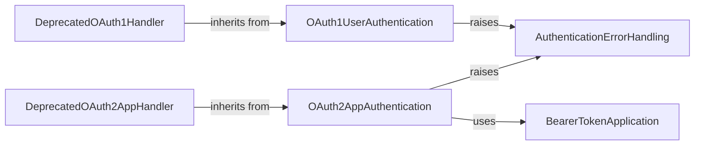

## Component Details

This graph provides an overview of the 'Authentication & Configuration' subsystem within the Tweepy library, detailing its core components responsible for managing various authentication protocols like OAuth 1.0a and OAuth 2.0 for secure interaction with the Twitter API, along with error handling and deprecated authentication mechanisms.

### OAuth1UserAuthentication
This component handles the OAuth 1.0a user context authentication flow, including obtaining request tokens, generating authorization URLs, and fetching access tokens.

**Related Classes/Methods**:

- <a href="https://github.com/tweepy/tweepy/blob/master/tweepy/auth.py#L21-L108" target="_blank" rel="noopener noreferrer">`tweepy.tweepy.auth.OAuth1UserHandler` (21:108)</a>
- <a href="https://github.com/tweepy/tweepy/blob/master/tweepy/auth.py#L57-L64" target="_blank" rel="noopener noreferrer">`tweepy.tweepy.auth.OAuth1UserHandler:_get_request_token` (57:64)</a>
- <a href="https://github.com/tweepy/tweepy/blob/master/tweepy/auth.py#L66-L81" target="_blank" rel="noopener noreferrer">`tweepy.tweepy.auth.OAuth1UserHandler:get_authorization_url` (66:81)</a>
- <a href="https://github.com/tweepy/tweepy/blob/master/tweepy/auth.py#L83-L100" target="_blank" rel="noopener noreferrer">`tweepy.tweepy.auth.OAuth1UserHandler:get_access_token` (83:100)</a>
- <a href="https://github.com/tweepy/tweepy/blob/master/tweepy/auth.py#L54-L55" target="_blank" rel="noopener noreferrer">`tweepy.tweepy.auth.OAuth1UserHandler._get_oauth_url` (54:55)</a>

### OAuth2AppAuthentication
This component manages the OAuth 2.0 Bearer Token (App-Only) authentication, responsible for acquiring the bearer token using consumer keys and secrets.

**Related Classes/Methods**:

- <a href="https://github.com/tweepy/tweepy/blob/master/tweepy/auth.py#L128-L154" target="_blank" rel="noopener noreferrer">`tweepy.tweepy.auth.OAuth2AppHandler` (128:154)</a>
- <a href="https://github.com/tweepy/tweepy/blob/master/tweepy/auth.py#L136-L151" target="_blank" rel="noopener noreferrer">`tweepy.tweepy.auth.OAuth2AppHandler:__init__` (136:151)</a>
- <a href="https://github.com/tweepy/tweepy/blob/master/tweepy/auth.py#L153-L154" target="_blank" rel="noopener noreferrer">`tweepy.tweepy.auth.OAuth2AppHandler:apply_auth` (153:154)</a>

### AuthenticationErrorHandling
This component provides a base exception for handling various errors that can occur during the authentication process within the Tweepy library.

**Related Classes/Methods**:

- <a href="https://github.com/tweepy/tweepy/blob/master/tweepy/errors.py#L8-L13" target="_blank" rel="noopener noreferrer">`tweepy.errors.TweepyException` (8:13)</a>

### BearerTokenApplication
This component is responsible for applying the OAuth 2.0 Bearer Token to HTTP requests for app-only authentication.

**Related Classes/Methods**:

- <a href="https://github.com/tweepy/tweepy/blob/master/tweepy/auth.py#L172-L186" target="_blank" rel="noopener noreferrer">`tweepy.tweepy.auth.OAuth2BearerHandler` (172:186)</a>

### DeprecatedOAuth1Handler
This component is a deprecated alias for OAuth1UserHandler, maintained for backward compatibility.

**Related Classes/Methods**:

- <a href="https://github.com/tweepy/tweepy/blob/master/tweepy/auth.py#L111-L125" target="_blank" rel="noopener noreferrer">`tweepy.tweepy.auth.OAuthHandler` (111:125)</a>
- <a href="https://github.com/tweepy/tweepy/blob/master/tweepy/auth.py#L118-L125" target="_blank" rel="noopener noreferrer">`tweepy.tweepy.auth.OAuthHandler:__init__` (118:125)</a>

### DeprecatedOAuth2AppHandler
This component is a deprecated alias for OAuth2AppHandler, maintained for backward compatibility.

**Related Classes/Methods**:

- <a href="https://github.com/tweepy/tweepy/blob/master/tweepy/auth.py#L157-L169" target="_blank" rel="noopener noreferrer">`tweepy.tweepy.auth.AppAuthHandler` (157:169)</a>
- <a href="https://github.com/tweepy/tweepy/blob/master/tweepy/auth.py#L164-L169" target="_blank" rel="noopener noreferrer">`tweepy.tweepy.auth.AppAuthHandler:__init__` (164:169)</a>

### [FAQ](https://github.com/CodeBoarding/GeneratedOnBoardings/tree/main?tab=readme-ov-file#faq)