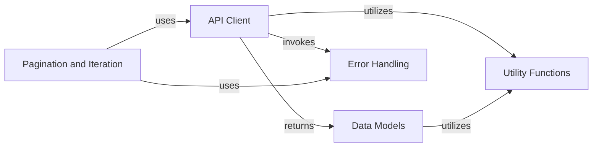

## Component Details

This graph illustrates the core components of the Tweepy library, designed for interacting with the Twitter API. The `API Client` serves as the central interface, handling requests, authentication, and response parsing. It returns structured data represented by `Data Models` and relies on `Utility Functions` for common data manipulations. For efficient retrieval of large datasets, the `Pagination and Iteration` component works in conjunction with the `API Client`. Robustness is ensured by the `Error Handling` component, which is invoked by both the `API Client` and `Pagination and Iteration` to manage API-related exceptions.

### API Client
This component is responsible for making requests to the Twitter API, handling authentication, rate limiting, and parsing responses. It serves as the primary interface for interacting with the Twitter platform.

**Related Classes/Methods**:

- `tweepy.api.API` (full file reference)
- `tweepy.client.Client` (full file reference)
- `tweepy.asynchronous.client.AsyncClient` (full file reference)
- <a href="https://github.com/tweepy/tweepy/blob/master/tweepy/auth.py#L111-L125" target="_blank" rel="noopener noreferrer">`tweepy.auth.OAuthHandler` (111:125)</a>
- <a href="https://github.com/tweepy/tweepy/blob/master/tweepy/auth.py#L157-L169" target="_blank" rel="noopener noreferrer">`tweepy.auth.AppAuthHandler` (157:169)</a>
- <a href="https://github.com/tweepy/tweepy/blob/master/tweepy/parsers.py#L31-L53" target="_blank" rel="noopener noreferrer">`tweepy.parsers.JSONParser` (31:53)</a>
- <a href="https://github.com/tweepy/tweepy/blob/master/tweepy/parsers.py#L56-L92" target="_blank" rel="noopener noreferrer">`tweepy.parsers.ModelParser` (56:92)</a>
- <a href="https://github.com/tweepy/tweepy/blob/master/tweepy/parsers.py#L22-L28" target="_blank" rel="noopener noreferrer">`tweepy.parsers.RawParser` (22:28)</a>

### Data Models
This component defines the Python classes that represent various Twitter entities such as Tweets, Users, Lists, Polls, Direct Messages, and Spaces. These classes encapsulate the data returned by the Twitter API.

**Related Classes/Methods**:

- <a href="https://github.com/tweepy/tweepy/blob/master/tweepy/list.py#L22-L90" target="_blank" rel="noopener noreferrer">`tweepy.list.List` (22:90)</a>
- <a href="https://github.com/tweepy/tweepy/blob/master/tweepy/poll.py#L19-L76" target="_blank" rel="noopener noreferrer">`tweepy.poll.Poll` (19:76)</a>
- <a href="https://github.com/tweepy/tweepy/blob/master/tweepy/tweet.py#L42-L233" target="_blank" rel="noopener noreferrer">`tweepy.tweet.Tweet` (42:233)</a>
- <a href="https://github.com/tweepy/tweepy/blob/master/tweepy/tweet.py#L236-L268" target="_blank" rel="noopener noreferrer">`tweepy.tweet.ReferencedTweet` (236:268)</a>
- <a href="https://github.com/tweepy/tweepy/blob/master/tweepy/direct_message_event.py#L26-L158" target="_blank" rel="noopener noreferrer">`tweepy.direct_message_event.DirectMessageEvent` (26:158)</a>
- <a href="https://github.com/tweepy/tweepy/blob/master/tweepy/space.py#L35-L167" target="_blank" rel="noopener noreferrer">`tweepy.space.Space` (35:167)</a>
- <a href="https://github.com/tweepy/tweepy/blob/master/tweepy/user.py#L29-L140" target="_blank" rel="noopener noreferrer">`tweepy.user.User` (29:140)</a>
- <a href="https://github.com/tweepy/tweepy/blob/master/tweepy/media.py#L26-L127" target="_blank" rel="noopener noreferrer">`tweepy.media.Media` (26:127)</a>
- <a href="https://github.com/tweepy/tweepy/blob/master/tweepy/place.py#L21-L82" target="_blank" rel="noopener noreferrer">`tweepy.place.Place` (21:82)</a>
- <a href="https://github.com/tweepy/tweepy/blob/master/tweepy/models.py#L10-L53" target="_blank" rel="noopener noreferrer">`tweepy.models.Model` (10:53)</a>
- <a href="https://github.com/tweepy/tweepy/blob/master/tweepy/mixins.py#L25-L47" target="_blank" rel="noopener noreferrer">`tweepy.mixins.DataMapping` (25:47)</a>
- <a href="https://github.com/tweepy/tweepy/blob/master/tweepy/mixins.py#L18-L22" target="_blank" rel="noopener noreferrer">`tweepy.mixins.HashableID` (18:22)</a>

### Utility Functions
This component provides a collection of helper functions used across the Tweepy library for common tasks like parsing datetime strings and converting lists to CSV format.

**Related Classes/Methods**:

- <a href="https://github.com/tweepy/tweepy/blob/master/tweepy/utils.py#L13-L16" target="_blank" rel="noopener noreferrer">`tweepy.utils.parse_datetime` (13:16)</a>
- <a href="https://github.com/tweepy/tweepy/blob/master/tweepy/utils.py#L8-L10" target="_blank" rel="noopener noreferrer">`tweepy.utils.list_to_csv` (8:10)</a>

### Pagination and Iteration
This component handles the logic for iterating over paginated API responses, providing both synchronous and asynchronous mechanisms to retrieve data in chunks or as a flattened stream.

**Related Classes/Methods**:

- <a href="https://github.com/tweepy/tweepy/blob/master/tweepy/pagination.py#L12-L83" target="_blank" rel="noopener noreferrer">`tweepy.pagination.Paginator` (12:83)</a>
- <a href="https://github.com/tweepy/tweepy/blob/master/tweepy/pagination.py#L86-L144" target="_blank" rel="noopener noreferrer">`tweepy.pagination.PaginationIterator` (86:144)</a>
- <a href="https://github.com/tweepy/tweepy/blob/master/tweepy/asynchronous/pagination.py#L12-L85" target="_blank" rel="noopener noreferrer">`tweepy.asynchronous.pagination.AsyncPaginator` (12:85)</a>
- <a href="https://github.com/tweepy/tweepy/blob/master/tweepy/asynchronous/pagination.py#L88-L148" target="_blank" rel="noopener noreferrer">`tweepy.asynchronous.pagination.AsyncPaginationIterator` (88:148)</a>
- <a href="https://github.com/tweepy/tweepy/blob/master/tweepy/cursor.py#L11-L74" target="_blank" rel="noopener noreferrer">`tweepy.cursor.Cursor` (11:74)</a>
- <a href="https://github.com/tweepy/tweepy/blob/master/tweepy/cursor.py#L98-L126" target="_blank" rel="noopener noreferrer">`tweepy.cursor.CursorIterator` (98:126)</a>
- <a href="https://github.com/tweepy/tweepy/blob/master/tweepy/cursor.py#L129-L148" target="_blank" rel="noopener noreferrer">`tweepy.cursor.DMCursorIterator` (129:148)</a>
- <a href="https://github.com/tweepy/tweepy/blob/master/tweepy/cursor.py#L151-L211" target="_blank" rel="noopener noreferrer">`tweepy.cursor.IdIterator` (151:211)</a>
- <a href="https://github.com/tweepy/tweepy/blob/master/tweepy/cursor.py#L250-L269" target="_blank" rel="noopener noreferrer">`tweepy.cursor.NextIterator` (250:269)</a>
- <a href="https://github.com/tweepy/tweepy/blob/master/tweepy/cursor.py#L214-L247" target="_blank" rel="noopener noreferrer">`tweepy.cursor.PageIterator` (214:247)</a>
- <a href="https://github.com/tweepy/tweepy/blob/master/tweepy/cursor.py#L272-L305" target="_blank" rel="noopener noreferrer">`tweepy.cursor.ItemIterator` (272:305)</a>

### Error Handling
This component defines custom exception classes that are raised when specific errors occur during API interactions, allowing for structured error management within the Tweepy library.

**Related Classes/Methods**:

- <a href="https://github.com/tweepy/tweepy/blob/master/tweepy/errors.py#L8-L13" target="_blank" rel="noopener noreferrer">`tweepy.errors.TweepyException` (8:13)</a>
- <a href="https://github.com/tweepy/tweepy/blob/master/tweepy/errors.py#L16-L92" target="_blank" rel="noopener noreferrer">`tweepy.errors.HTTPException` (16:92)</a>
- <a href="https://github.com/tweepy/tweepy/blob/master/tweepy/errors.py#L95-L102" target="_blank" rel="noopener noreferrer">`tweepy.errors.BadRequest` (95:102)</a>
- <a href="https://github.com/tweepy/tweepy/blob/master/tweepy/errors.py#L105-L112" target="_blank" rel="noopener noreferrer">`tweepy.errors.Unauthorized` (105:112)</a>
- <a href="https://github.com/tweepy/tweepy/blob/master/tweepy/errors.py#L115-L122" target="_blank" rel="noopener noreferrer">`tweepy.errors.Forbidden` (115:122)</a>
- <a href="https://github.com/tweepy/tweepy/blob/master/tweepy/errors.py#L125-L132" target="_blank" rel="noopener noreferrer">`tweepy.errors.NotFound` (125:132)</a>
- <a href="https://github.com/tweepy/tweepy/blob/master/tweepy/errors.py#L135-L142" target="_blank" rel="noopener noreferrer">`tweepy.errors.TooManyRequests` (135:142)</a>
- <a href="https://github.com/tweepy/tweepy/blob/master/tweepy/errors.py#L145-L152" target="_blank" rel="noopener noreferrer">`tweepy.errors.TwitterServerError` (145:152)</a>

### [FAQ](https://github.com/CodeBoarding/GeneratedOnBoardings/tree/main?tab=readme-ov-file#faq)