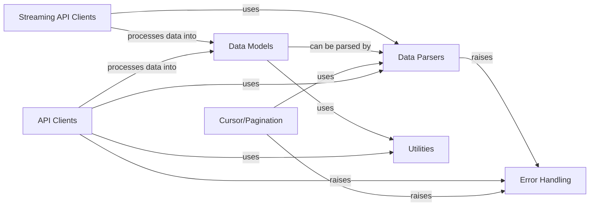

## Component Details

This system defines Python classes for representing Twitter API data structures (Tweets, Users, etc.) and handles the transformation of raw JSON responses into these structured objects. It also includes components for interacting with Twitter's REST and Streaming APIs, managing pagination for large datasets, and providing robust error handling mechanisms. The core flow involves API clients fetching raw data, which is then parsed into structured data models for consumption by the application.

### Data Models
Defines Python classes for Twitter API data structures such as Tweets, Users, Lists, and generic models, providing a structured representation of the data.

**Related Classes/Methods**:

- <a href="https://github.com/tweepy/tweepy/blob/master/tweepy/list.py#L22-L90" target="_blank" rel="noopener noreferrer">`tweepy.tweepy.list.List` (22:90)</a>
- <a href="https://github.com/tweepy/tweepy/blob/master/tweepy/models.py#L10-L53" target="_blank" rel="noopener noreferrer">`tweepy.tweepy.models.Model` (10:53)</a>
- <a href="https://github.com/tweepy/tweepy/blob/master/tweepy/models.py#L56-L81" target="_blank" rel="noopener noreferrer">`tweepy.tweepy.models.ResultSet` (56:81)</a>
- <a href="https://github.com/tweepy/tweepy/blob/master/tweepy/tweet.py#L42-L233" target="_blank" rel="noopener noreferrer">`tweepy.tweepy.tweet.Tweet` (42:233)</a>
- <a href="https://github.com/tweepy/tweepy/blob/master/tweepy/user.py#L29-L140" target="_blank" rel="noopener noreferrer">`tweepy.tweepy.user.User` (29:140)</a>
- <a href="https://github.com/tweepy/tweepy/blob/master/tweepy/models.py#L315-L365" target="_blank" rel="noopener noreferrer">`tweepy.tweepy.models.Status` (315:365)</a>
- <a href="https://github.com/tweepy/tweepy/blob/master/tweepy/media.py#L26-L127" target="_blank" rel="noopener noreferrer">`tweepy.media.Media` (26:127)</a>
- <a href="https://github.com/tweepy/tweepy/blob/master/tweepy/place.py#L21-L82" target="_blank" rel="noopener noreferrer">`tweepy.place.Place` (21:82)</a>
- <a href="https://github.com/tweepy/tweepy/blob/master/tweepy/poll.py#L19-L76" target="_blank" rel="noopener noreferrer">`tweepy.poll.Poll` (19:76)</a>
- <a href="https://github.com/tweepy/tweepy/blob/master/tweepy/tweet.py#L236-L268" target="_blank" rel="noopener noreferrer">`tweepy.tweepy.tweet.ReferencedTweet` (236:268)</a>

### Data Parsers
Responsible for converting raw JSON responses from the Twitter API into structured Python objects, specifically instances of the Data Models.

**Related Classes/Methods**:

- <a href="https://github.com/tweepy/tweepy/blob/master/tweepy/parsers.py#L31-L53" target="_blank" rel="noopener noreferrer">`tweepy.tweepy.parsers.JSONParser` (31:53)</a>
- <a href="https://github.com/tweepy/tweepy/blob/master/tweepy/parsers.py#L56-L92" target="_blank" rel="noopener noreferrer">`tweepy.tweepy.parsers.ModelParser` (56:92)</a>
- <a href="https://github.com/tweepy/tweepy/blob/master/tweepy/parsers.py#L22-L28" target="_blank" rel="noopener noreferrer">`tweepy.parsers.RawParser` (22:28)</a>

### API Clients
Provides methods for interacting with the Twitter REST API, handling authentication, request building, and response processing.

**Related Classes/Methods**:

- `tweepy.api.API` (full file reference)
- `tweepy.client.Client` (full file reference)
- `tweepy.asynchronous.client.AsyncClient` (full file reference)

### Streaming API Clients
Manages connections to Twitter's streaming API, handling incoming data, processing included entities, and dispatching events to user-defined callbacks.

**Related Classes/Methods**:

- <a href="https://github.com/tweepy/tweepy/blob/master/tweepy/streaming.py#L218-L654" target="_blank" rel="noopener noreferrer">`tweepy.tweepy.streaming.StreamingClient` (218:654)</a>
- <a href="https://github.com/tweepy/tweepy/blob/master/tweepy/asynchronous/streaming.py#L207-L641" target="_blank" rel="noopener noreferrer">`tweepy.tweepy.asynchronous.streaming.AsyncStreamingClient` (207:641)</a>
- `tweepy.tweepy.client.BaseClient` (full file reference)
- `tweepy.tweepy.streaming.StreamResponse` (full file reference)

### Utilities
Provides helper functions used across the library, primarily for data conversion, such as parsing datetime strings.

**Related Classes/Methods**:

- <a href="https://github.com/tweepy/tweepy/blob/master/tweepy/utils.py#L13-L16" target="_blank" rel="noopener noreferrer">`tweepy.utils.parse_datetime` (13:16)</a>

### Error Handling
Defines custom exception classes specific to Tweepy, used to signal various errors encountered during API interactions or data processing.

**Related Classes/Methods**:

- <a href="https://github.com/tweepy/tweepy/blob/master/tweepy/errors.py#L8-L13" target="_blank" rel="noopener noreferrer">`tweepy.errors.TweepyException` (8:13)</a>

### Cursor/Pagination
Facilitates iteration over paginated API responses, allowing users to easily retrieve large sets of data without manually managing max_id or since_id.

**Related Classes/Methods**:

- <a href="https://github.com/tweepy/tweepy/blob/master/tweepy/cursor.py#L151-L211" target="_blank" rel="noopener noreferrer">`tweepy.tweepy.cursor.IdIterator` (151:211)</a>

### [FAQ](https://github.com/CodeBoarding/GeneratedOnBoardings/tree/main?tab=readme-ov-file#faq)