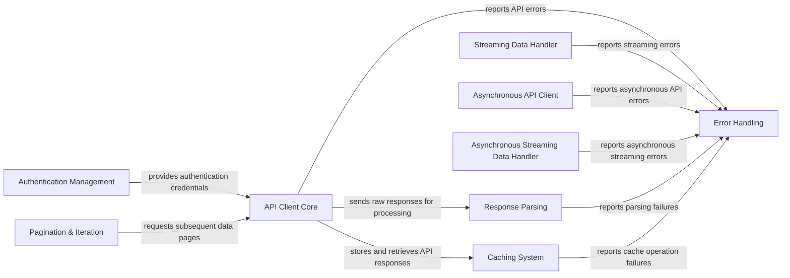

## Component Details

This graph illustrates the core components of the Tweepy library, focusing on how they interact to manage authentication, handle API requests (both synchronous and asynchronous), process streaming data, paginate results, parse responses, implement caching strategies, and manage errors. The main flow involves authentication providing credentials to API clients, which then make requests, handle responses through parsing and caching, and report any issues to the error handling system. Streaming components operate similarly for real-time data, and pagination components leverage the API client for fetching successive data pages.

### Authentication Management
This component is responsible for handling various OAuth authentication flows (OAuth 1.0a, OAuth 2.0 App-Only, OAuth 2.0 Bearer Token, and OAuth 2.0 Authorization Code Flow with PKCE) to securely interact with the Twitter API. It manages consumer keys, secrets, access tokens, and authorization URLs, providing the necessary credentials for API requests.

**Related Classes/Methods**:

- <a href="https://github.com/tweepy/tweepy/blob/master/tweepy/auth.py#L21-L108" target="_blank" rel="noopener noreferrer">`tweepy.tweepy.auth.OAuth1UserHandler` (21:108)</a>
- <a href="https://github.com/tweepy/tweepy/blob/master/tweepy/auth.py#L57-L64" target="_blank" rel="noopener noreferrer">`tweepy.tweepy.auth.OAuth1UserHandler:_get_request_token` (57:64)</a>
- <a href="https://github.com/tweepy/tweepy/blob/master/tweepy/auth.py#L66-L81" target="_blank" rel="noopener noreferrer">`tweepy.tweepy.auth.OAuth1UserHandler:get_authorization_url` (66:81)</a>
- <a href="https://github.com/tweepy/tweepy/blob/master/tweepy/auth.py#L83-L100" target="_blank" rel="noopener noreferrer">`tweepy.tweepy.auth.OAuth1UserHandler:get_access_token` (83:100)</a>
- <a href="https://github.com/tweepy/tweepy/blob/master/tweepy/auth.py#L128-L154" target="_blank" rel="noopener noreferrer">`tweepy.tweepy.auth.OAuth2AppHandler` (128:154)</a>
- <a href="https://github.com/tweepy/tweepy/blob/master/tweepy/auth.py#L172-L186" target="_blank" rel="noopener noreferrer">`tweepy.tweepy.auth.OAuth2BearerHandler` (172:186)</a>
- <a href="https://github.com/tweepy/tweepy/blob/master/tweepy/auth.py#L189-L223" target="_blank" rel="noopener noreferrer">`tweepy.tweepy.auth.OAuth2UserHandler` (189:223)</a>

### API Client Core
This component manages synchronous HTTP requests to the Twitter API. It handles the underlying network communication, applies authentication, and processes raw responses before they are passed to parsers or error handlers. It is central to all synchronous API interactions.

**Related Classes/Methods**:

- `tweepy.tweepy.client.BaseClient:request` (full file reference)
- `tweepy.tweepy.api.API:request` (full file reference)

### Asynchronous API Client
This component provides asynchronous capabilities for making HTTP requests to the Twitter API. It mirrors the functionality of the synchronous API Client Core but uses asynchronous programming patterns, allowing for non-blocking operations and improved concurrency.

**Related Classes/Methods**:

- `tweepy.tweepy.asynchronous.client.AsyncBaseClient:request` (full file reference)

### Streaming Data Handler
This component is dedicated to managing synchronous connections to Twitter's streaming API endpoints. It allows applications to receive real-time data streams (e.g., filtered tweets or samples) and handles the continuous flow of incoming data.

**Related Classes/Methods**:

- <a href="https://github.com/tweepy/tweepy/blob/master/tweepy/streaming.py#L375-L458" target="_blank" rel="noopener noreferrer">`tweepy.tweepy.streaming.StreamingClient:filter` (375:458)</a>
- <a href="https://github.com/tweepy/tweepy/blob/master/tweepy/streaming.py#L485-L564" target="_blank" rel="noopener noreferrer">`tweepy.tweepy.streaming.StreamingClient:sample` (485:564)</a>

### Asynchronous Streaming Data Handler
This component provides asynchronous capabilities for connecting to and managing Twitter's streaming API. It enables non-blocking consumption of real-time data streams, similar to its synchronous counterpart but designed for asynchronous environments.

**Related Classes/Methods**:

- <a href="https://github.com/tweepy/tweepy/blob/master/tweepy/asynchronous/streaming.py#L352-L433" target="_blank" rel="noopener noreferrer">`tweepy.tweepy.asynchronous.streaming.AsyncStreamingClient:filter` (352:433)</a>
- <a href="https://github.com/tweepy/tweepy/blob/master/tweepy/asynchronous/streaming.py#L462-L539" target="_blank" rel="noopener noreferrer">`tweepy.tweepy.asynchronous.streaming.AsyncStreamingClient:sample` (462:539)</a>

### Pagination & Iteration
This component provides an abstraction layer for iterating over paginated results from the Twitter API. It manages the logic for fetching subsequent pages of data, allowing developers to easily traverse large datasets without manually handling pagination tokens.

**Related Classes/Methods**:

- <a href="https://github.com/tweepy/tweepy/blob/master/tweepy/cursor.py#L25-L40" target="_blank" rel="noopener noreferrer">`tweepy.tweepy.cursor.Cursor:__init__` (25:40)</a>
- <a href="https://github.com/tweepy/tweepy/blob/master/tweepy/cursor.py#L119-L126" target="_blank" rel="noopener noreferrer">`tweepy.tweepy.cursor.CursorIterator:prev` (119:126)</a>
- <a href="https://github.com/tweepy/tweepy/blob/master/tweepy/cursor.py#L147-L148" target="_blank" rel="noopener noreferrer">`tweepy.tweepy.cursor.DMCursorIterator:prev` (147:148)</a>
- <a href="https://github.com/tweepy/tweepy/blob/master/tweepy/cursor.py#L243-L247" target="_blank" rel="noopener noreferrer">`tweepy.tweepy.cursor.PageIterator:prev` (243:247)</a>
- <a href="https://github.com/tweepy/tweepy/blob/master/tweepy/cursor.py#L268-L269" target="_blank" rel="noopener noreferrer">`tweepy.tweepy.cursor.NextIterator:prev` (268:269)</a>
- <a href="https://github.com/tweepy/tweepy/blob/master/tweepy/cursor.py#L294-L305" target="_blank" rel="noopener noreferrer">`tweepy.tweepy.cursor.ItemIterator:prev` (294:305)</a>

### Response Parsing
This component is responsible for transforming raw JSON responses received from the Twitter API into structured Python objects or models. It ensures that the data is correctly interpreted and made available in a usable format for the application.

**Related Classes/Methods**:

- <a href="https://github.com/tweepy/tweepy/blob/master/tweepy/parsers.py#L35-L53" target="_blank" rel="noopener noreferrer">`tweepy.tweepy.parsers.JSONParser:parse` (35:53)</a>
- <a href="https://github.com/tweepy/tweepy/blob/master/tweepy/parsers.py#L62-L92" target="_blank" rel="noopener noreferrer">`tweepy.tweepy.parsers.ModelParser:parse` (62:92)</a>

### Caching System
This component offers various strategies for caching API responses, including in-memory, file-based, Redis, and MongoDB caches. Its purpose is to reduce redundant API calls, improve response times, and manage data persistence for frequently accessed information.

**Related Classes/Methods**:

- <a href="https://github.com/tweepy/tweepy/blob/master/tweepy/cache.py#L59-L125" target="_blank" rel="noopener noreferrer">`tweepy.tweepy.cache.MemoryCache` (59:125)</a>
- <a href="https://github.com/tweepy/tweepy/blob/master/tweepy/cache.py#L128-L263" target="_blank" rel="noopener noreferrer">`tweepy.tweepy.cache.FileCache` (128:263)</a>
- <a href="https://github.com/tweepy/tweepy/blob/master/tweepy/cache.py#L305-L387" target="_blank" rel="noopener noreferrer">`tweepy.tweepy.cache.RedisCache` (305:387)</a>
- <a href="https://github.com/tweepy/tweepy/blob/master/tweepy/cache.py#L390-L427" target="_blank" rel="noopener noreferrer">`tweepy.tweepy.cache.MongodbCache` (390:427)</a>
- <a href="https://github.com/tweepy/tweepy/blob/master/tweepy/cache.py#L23-L56" target="_blank" rel="noopener noreferrer">`tweepy.tweepy.cache.Cache` (23:56)</a>

### Error Handling
This component defines and manages a hierarchy of custom exceptions specific to Tweepy and Twitter API errors. It provides structured error reporting, allowing other components to raise and catch specific issues like bad requests, unauthorized access, or server errors.

**Related Classes/Methods**:

- <a href="https://github.com/tweepy/tweepy/blob/master/tweepy/errors.py#L8-L13" target="_blank" rel="noopener noreferrer">`tweepy.errors.TweepyException` (8:13)</a>
- <a href="https://github.com/tweepy/tweepy/blob/master/tweepy/errors.py#L95-L102" target="_blank" rel="noopener noreferrer">`tweepy.errors.BadRequest` (95:102)</a>
- <a href="https://github.com/tweepy/tweepy/blob/master/tweepy/errors.py#L105-L112" target="_blank" rel="noopener noreferrer">`tweepy.errors.Unauthorized` (105:112)</a>
- <a href="https://github.com/tweepy/tweepy/blob/master/tweepy/errors.py#L115-L122" target="_blank" rel="noopener noreferrer">`tweepy.errors.Forbidden` (115:122)</a>
- <a href="https://github.com/tweepy/tweepy/blob/master/tweepy/errors.py#L125-L132" target="_blank" rel="noopener noreferrer">`tweepy.errors.NotFound` (125:132)</a>
- <a href="https://github.com/tweepy/tweepy/blob/master/tweepy/errors.py#L135-L142" target="_blank" rel="noopener noreferrer">`tweepy.errors.TooManyRequests` (135:142)</a>
- <a href="https://github.com/tweepy/tweepy/blob/master/tweepy/errors.py#L145-L152" target="_blank" rel="noopener noreferrer">`tweepy.errors.TwitterServerError` (145:152)</a>
- <a href="https://github.com/tweepy/tweepy/blob/master/tweepy/errors.py#L16-L92" target="_blank" rel="noopener noreferrer">`tweepy.errors.HTTPException` (16:92)</a>

### [FAQ](https://github.com/CodeBoarding/GeneratedOnBoardings/tree/main?tab=readme-ov-file#faq)