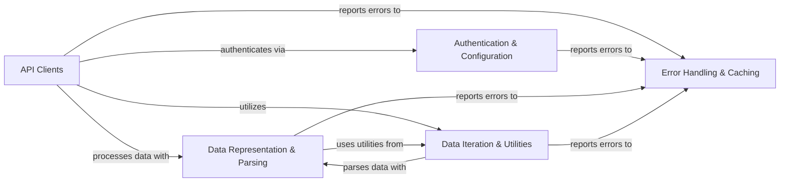

## Component Details

The Tweepy library provides a comprehensive Python interface for interacting with the Twitter API, supporting both v1.1 and v2. It handles authentication, data retrieval, streaming, and parsing of Twitter data into structured Python objects, along with robust error handling and optional caching mechanisms.

### API Clients
Provides interfaces for interacting with Twitter API v1.1 and v2, including synchronous, asynchronous, and streaming capabilities. Handles HTTP requests and responses.

**Related Classes/Methods**:

- `tweepy.tweepy.client.BaseClient` (full file reference)
- `tweepy.tweepy.client.Client` (full file reference)
- `tweepy.tweepy.asynchronous.client.AsyncBaseClient` (full file reference)
- `tweepy.tweepy.asynchronous.client.AsyncClient` (full file reference)
- `tweepy.tweepy.api.API` (full file reference)
- <a href="https://github.com/tweepy/tweepy/blob/master/tweepy/streaming.py#L33-L215" target="_blank" rel="noopener noreferrer">`tweepy.tweepy.streaming.BaseStream` (33:215)</a>
- <a href="https://github.com/tweepy/tweepy/blob/master/tweepy/streaming.py#L218-L654" target="_blank" rel="noopener noreferrer">`tweepy.tweepy.streaming.StreamingClient` (218:654)</a>
- <a href="https://github.com/tweepy/tweepy/blob/master/tweepy/asynchronous/streaming.py#L24-L204" target="_blank" rel="noopener noreferrer">`tweepy.tweepy.asynchronous.streaming.AsyncBaseStream` (24:204)</a>
- <a href="https://github.com/tweepy/tweepy/blob/master/tweepy/asynchronous/streaming.py#L207-L641" target="_blank" rel="noopener noreferrer">`tweepy.tweepy.asynchronous.streaming.AsyncStreamingClient` (207:641)</a>

### Authentication & Configuration
Manages various authentication protocols (OAuth 1.0a, OAuth 2.0) for secure interaction with the Twitter API.

**Related Classes/Methods**:

- <a href="https://github.com/tweepy/tweepy/blob/master/tweepy/auth.py#L21-L108" target="_blank" rel="noopener noreferrer">`tweepy.tweepy.auth.OAuth1UserHandler` (21:108)</a>
- <a href="https://github.com/tweepy/tweepy/blob/master/tweepy/auth.py#L111-L125" target="_blank" rel="noopener noreferrer">`tweepy.tweepy.auth.OAuthHandler` (111:125)</a>
- <a href="https://github.com/tweepy/tweepy/blob/master/tweepy/auth.py#L128-L154" target="_blank" rel="noopener noreferrer">`tweepy.tweepy.auth.OAuth2AppHandler` (128:154)</a>
- <a href="https://github.com/tweepy/tweepy/blob/master/tweepy/auth.py#L157-L169" target="_blank" rel="noopener noreferrer">`tweepy.tweepy.auth.AppAuthHandler` (157:169)</a>

### Data Representation & Parsing
Defines Python classes for Twitter API data structures (Tweets, Users, etc.) and handles the transformation of raw JSON responses into these structured objects.

**Related Classes/Methods**:

- <a href="https://github.com/tweepy/tweepy/blob/master/tweepy/list.py#L22-L90" target="_blank" rel="noopener noreferrer">`tweepy.tweepy.list.List` (22:90)</a>
- <a href="https://github.com/tweepy/tweepy/blob/master/tweepy/models.py#L10-L53" target="_blank" rel="noopener noreferrer">`tweepy.tweepy.models.Model` (10:53)</a>
- <a href="https://github.com/tweepy/tweepy/blob/master/tweepy/models.py#L56-L81" target="_blank" rel="noopener noreferrer">`tweepy.tweepy.models.ResultSet` (56:81)</a>
- <a href="https://github.com/tweepy/tweepy/blob/master/tweepy/tweet.py#L42-L233" target="_blank" rel="noopener noreferrer">`tweepy.tweepy.tweet.Tweet` (42:233)</a>
- <a href="https://github.com/tweepy/tweepy/blob/master/tweepy/user.py#L29-L140" target="_blank" rel="noopener noreferrer">`tweepy.tweepy.user.User` (29:140)</a>
- <a href="https://github.com/tweepy/tweepy/blob/master/tweepy/parsers.py#L31-L53" target="_blank" rel="noopener noreferrer">`tweepy.tweepy.parsers.JSONParser` (31:53)</a>
- <a href="https://github.com/tweepy/tweepy/blob/master/tweepy/parsers.py#L56-L92" target="_blank" rel="noopener noreferrer">`tweepy.tweepy.parsers.ModelParser` (56:92)</a>

### Data Iteration & Utilities
Provides mechanisms for efficient iteration through paginated API responses and general-purpose helper functions for data manipulation (e.g., date parsing, list conversion).

**Related Classes/Methods**:

- <a href="https://github.com/tweepy/tweepy/blob/master/tweepy/pagination.py#L12-L83" target="_blank" rel="noopener noreferrer">`tweepy.tweepy.pagination.Paginator` (12:83)</a>
- <a href="https://github.com/tweepy/tweepy/blob/master/tweepy/cursor.py#L11-L74" target="_blank" rel="noopener noreferrer">`tweepy.tweepy.cursor.Cursor` (11:74)</a>
- <a href="https://github.com/tweepy/tweepy/blob/master/tweepy/utils.py#L13-L16" target="_blank" rel="noopener noreferrer">`tweepy.utils.parse_datetime` (13:16)</a>
- <a href="https://github.com/tweepy/tweepy/blob/master/tweepy/utils.py#L8-L10" target="_blank" rel="noopener noreferrer">`tweepy.utils.list_to_csv` (8:10)</a>

### Error Handling & Caching
Manages custom exception classes for API errors and provides caching strategies to optimize API call performance.

**Related Classes/Methods**:

- <a href="https://github.com/tweepy/tweepy/blob/master/tweepy/errors.py#L8-L13" target="_blank" rel="noopener noreferrer">`tweepy.errors.TweepyException` (8:13)</a>
- <a href="https://github.com/tweepy/tweepy/blob/master/tweepy/errors.py#L95-L102" target="_blank" rel="noopener noreferrer">`tweepy.errors.BadRequest` (95:102)</a>
- <a href="https://github.com/tweepy/tweepy/blob/master/tweepy/cache.py#L59-L125" target="_blank" rel="noopener noreferrer">`tweepy.tweepy.cache.MemoryCache` (59:125)</a>
- <a href="https://github.com/tweepy/tweepy/blob/master/tweepy/cache.py#L128-L263" target="_blank" rel="noopener noreferrer">`tweepy.tweepy.cache.FileCache` (128:263)</a>
- <a href="https://github.com/tweepy/tweepy/blob/master/tweepy/cache.py#L305-L387" target="_blank" rel="noopener noreferrer">`tweepy.tweepy.cache.RedisCache` (305:387)</a>
- <a href="https://github.com/tweepy/tweepy/blob/master/tweepy/cache.py#L390-L427" target="_blank" rel="noopener noreferrer">`tweepy.tweepy.cache.MongodbCache` (390:427)</a>
- <a href="https://github.com/tweepy/tweepy/blob/master/tweepy/cache.py#L23-L56" target="_blank" rel="noopener noreferrer">`tweepy.tweepy.cache.Cache` (23:56)</a>

### [FAQ](https://github.com/CodeBoarding/GeneratedOnBoardings/tree/main?tab=readme-ov-file#faq)