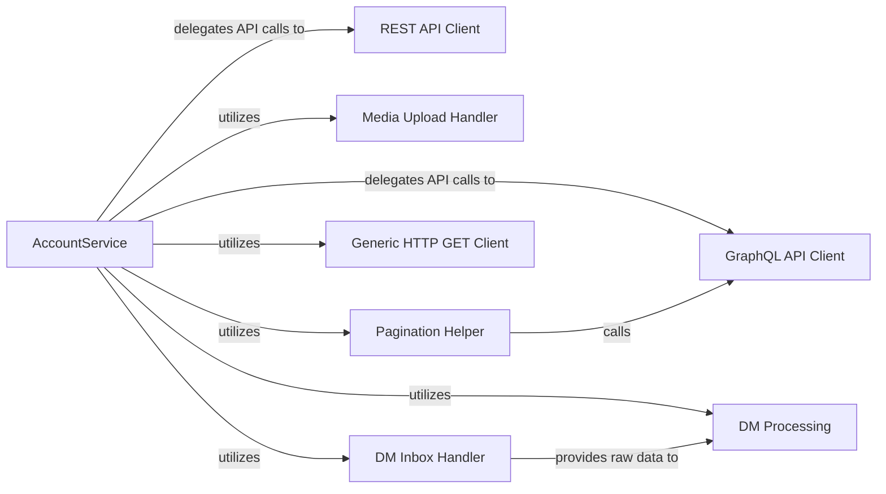

## Details

The `AccountService` subsystem is a critical part of the `twitter-api-client` project, acting as a high-level interface for user-specific interactions with the X/Twitter platform. It embodies the Facade pattern, simplifying complex underlying API operations.

### AccountService [[Expand]](./AccountService.md)
The primary facade component, offering a comprehensive high-level API for user account functionalities. It orchestrates calls to lower-level components to fulfill requests, providing a simplified and unified interface for diverse account-related operations.

**Related Classes/Methods**:

- <a href="https://github.com/trevorhobenshield/twitter-api-client/blob/main/twitter/account.py" target="_blank" rel="noopener noreferrer">`twitter.account.AccountService`</a>

### GraphQL API Client
Core internal component for interacting with the Twitter GraphQL API. It encapsulates the logic for constructing and executing requests to the Twitter GraphQL API and parsing its responses.

**Related Classes/Methods**:

- <a href="https://github.com/trevorhobenshield/twitter-api-client/blob/main/twitter/account.py#L47-L67" target="_blank" rel="noopener noreferrer">`twitter.account.gql`:47-67</a>

### REST API Client
Core internal component for interacting with the Twitter v1.1 REST API. It manages interactions with the Twitter v1.1 REST API, handling requests and responses for functionalities not covered by GraphQL.

**Related Classes/Methods**:

- <a href="https://github.com/trevorhobenshield/twitter-api-client/blob/main/twitter/account.py#L69-L75" target="_blank" rel="noopener noreferrer">`twitter.account.v1`:69-75</a>

### Media Upload Handler
Manages the complex process of uploading various media types to Twitter. It handles the multi-part process of uploading images, videos, and other media, including status checks and finalization.

**Related Classes/Methods**:

- <a href="https://github.com/trevorhobenshield/twitter-api-client/blob/main/twitter/account.py#L485-L594" target="_blank" rel="noopener noreferrer">`twitter.account._upload_media`:485-594</a>

### Pagination Helper
A utility component that abstracts the logic for fetching and iterating over paginated API responses. It provides a reusable mechanism to abstract the complexities of fetching data from paginated API endpoints, ensuring efficient retrieval of large datasets.

**Related Classes/Methods**:

- <a href="https://github.com/trevorhobenshield/twitter-api-client/blob/main/twitter/account.py#L457-L483" target="_blank" rel="noopener noreferrer">`twitter.account._paginate`:457-483</a>

### Generic HTTP GET Client
A lower-level component for executing specific HTTP GET requests. It executes general HTTP GET requests for specific data retrieval operations where a dedicated API client might not be necessary or for ad-hoc data fetching.

**Related Classes/Methods**:

- <a href="https://github.com/trevorhobenshield/twitter-api-client/blob/main/twitter/account.py#L744-L754" target="_blank" rel="noopener noreferrer">`twitter.account.get`:744-754</a>

### DM Inbox Handler
Responsible for retrieving raw direct message inbox data. It focuses on the direct retrieval of raw direct message inbox data from the Twitter API.

**Related Classes/Methods**:

- <a href="https://github.com/trevorhobenshield/twitter-api-client/blob/main/twitter/account.py#L652-L663" target="_blank" rel="noopener noreferrer">`twitter.account.dm_inbox`:652-663</a>

### DM Processing
Handles the parsing and structuring of raw direct message data. It processes and transforms the raw direct message data retrieved by `DM Inbox Handler` into a more structured or usable format for the `AccountService`.

**Related Classes/Methods**:

- <a href="https://github.com/trevorhobenshield/twitter-api-client/blob/main/twitter/account.py#L695-L699" target="_blank" rel="noopener noreferrer">`twitter.account.process`:695-699</a>

### [FAQ](https://github.com/CodeBoarding/GeneratedOnBoardings/tree/main?tab=readme-ov-file#faq)