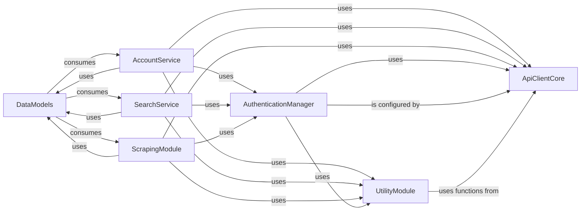

## Details

The `twitter` subsystem is designed to interact with the X/Twitter API, providing functionalities for account management, data searching, and content scraping. Its architecture is modular, with distinct components handling specific aspects of API interaction, authentication, data handling, and utility operations. The core of the subsystem relies on a robust API client for communication, an authentication manager for secure access, and well-defined data models for structured information exchange.

### ApiClientCore [[Expand]](./ApiClientCore.md)
The foundational layer for direct HTTP/HTTPS communication with the X/Twitter API. It handles the mechanics of sending requests and receiving responses, primarily leveraging the `httpx` library.

**Related Classes/Methods**:

- <a href="https://github.com/trevorhobenshield/twitter-api-client/blob/main/twitter/util.py#L17-L28" target="_blank" rel="noopener noreferrer">`init_session`:17-28</a>
- <a href="https://github.com/trevorhobenshield/twitter-api-client/blob/main/twitter/util.py#L120-L142" target="_blank" rel="noopener noreferrer">`get_headers`:120-142</a>
- <a href="https://github.com/trevorhobenshield/twitter-api-client/blob/main/twitter/account.py" target="_blank" rel="noopener noreferrer">`httpx.Client`</a>
- <a href="https://github.com/trevorhobenshield/twitter-api-client/blob/main/twitter/account.py" target="_blank" rel="noopener noreferrer">`httpx.AsyncClient`</a>
- <a href="https://github.com/trevorhobenshield/twitter-api-client/blob/main/twitter/search.py" target="_blank" rel="noopener noreferrer">`httpx.Client`</a>
- <a href="https://github.com/trevorhobenshield/twitter-api-client/blob/main/twitter/search.py" target="_blank" rel="noopener noreferrer">`httpx.AsyncClient`</a>
- <a href="https://github.com/trevorhobenshield/twitter-api-client/blob/main/twitter/scraper.py" target="_blank" rel="noopener noreferrer">`httpx.Client`</a>
- <a href="https://github.com/trevorhobenshield/twitter-api-client/blob/main/twitter/scraper.py" target="_blank" rel="noopener noreferrer">`httpx.AsyncClient`</a>

### AuthenticationManager
Manages user authentication, session handling, and token management for secure access to the Twitter API. It orchestrates the login flow and ensures authenticated sessions are provided to other services.

**Related Classes/Methods**:

- <a href="https://github.com/trevorhobenshield/twitter-api-client/blob/main/twitter/login.py#L149-L170" target="_blank" rel="noopener noreferrer">`login`:149-170</a>
- <a href="https://github.com/trevorhobenshield/twitter-api-client/blob/main/twitter/login.py#L39-L40" target="_blank" rel="noopener noreferrer">`init_guest_token`:39-40</a>
- <a href="https://github.com/trevorhobenshield/twitter-api-client/blob/main/twitter/login.py#L129-L146" target="_blank" rel="noopener noreferrer">`execute_login_flow`:129-146</a>
- <a href="https://github.com/trevorhobenshield/twitter-api-client/blob/main/twitter/search.py#L138-L166" target="_blank" rel="noopener noreferrer">`_validate_session`:138-166</a>
- <a href="https://github.com/trevorhobenshield/twitter-api-client/blob/main/twitter/search.py#L138-L166" target="_blank" rel="noopener noreferrer">`_validate_session`:138-166</a>
- <a href="https://github.com/trevorhobenshield/twitter-api-client/blob/main/twitter/search.py#L138-L166" target="_blank" rel="noopener noreferrer">`_validate_session`:138-166</a>

### DataModels
Defines the data structures (models) for Twitter entities (e.g., Tweets, Users) and handles the serialization/deserialization of data between Python objects and JSON for API communication. It also includes constants for various API operations.

**Related Classes/Methods**:

- <a href="https://github.com/trevorhobenshield/twitter-api-client/blob/main/twitter/constants.py#L99-L409" target="_blank" rel="noopener noreferrer">`Operation`:99-409</a>
- <a href="https://github.com/trevorhobenshield/twitter-api-client/blob/main/twitter/account.py" target="_blank" rel="noopener noreferrer">`orjson`</a>
- <a href="https://github.com/trevorhobenshield/twitter-api-client/blob/main/twitter/search.py" target="_blank" rel="noopener noreferrer">`orjson`</a>
- <a href="https://github.com/trevorhobenshield/twitter-api-client/blob/main/twitter/scraper.py" target="_blank" rel="noopener noreferrer">`orjson`</a>
- <a href="https://github.com/trevorhobenshield/twitter-api-client/blob/main/twitter/util.py" target="_blank" rel="noopener noreferrer">`orjson`</a>

### AccountService [[Expand]](./AccountService.md)
Provides high-level methods for interacting with user account-specific functionalities on Twitter, such as fetching user profiles, managing tweets (posting, replying, quoting, scheduling, deleting), direct messaging, and managing lists.

**Related Classes/Methods**:

- <a href="https://github.com/trevorhobenshield/twitter-api-client/blob/main/twitter/account.py#L35-L837" target="_blank" rel="noopener noreferrer">`Account`:35-837</a>

### SearchService [[Expand]](./SearchService.md)
Offers an interface for performing various search operations on Twitter, abstracting the underlying API calls to retrieve tweets and user data based on specified search criteria.

**Related Classes/Methods**:

- <a href="https://github.com/trevorhobenshield/twitter-api-client/blob/main/twitter/constants.py" target="_blank" rel="noopener noreferrer">`Search`</a>

### ScrapingModule
Encapsulates logic for data scraping operations from Twitter, providing methods to extract diverse information such as user profiles, tweets by ID, user timelines, media, likes, followers, and retweeters.

**Related Classes/Methods**:

- <a href="https://github.com/trevorhobenshield/twitter-api-client/blob/main/examples/simple_example.py" target="_blank" rel="noopener noreferrer">`Scraper`</a>

### UtilityModule
Contains common helper functions, constants, or shared utilities used across various components of the API client library, including data manipulation (e.g., `find_key`, `batch_ids`), logging, and file handling.

**Related Classes/Methods**:

- <a href="https://github.com/trevorhobenshield/twitter-api-client/blob/main/twitter/util.py#L31-L42" target="_blank" rel="noopener noreferrer">`batch_ids`:31-42</a>
- <a href="https://github.com/trevorhobenshield/twitter-api-client/blob/main/twitter/util.py#L45-L46" target="_blank" rel="noopener noreferrer">`build_params`:45-46</a>
- <a href="https://github.com/trevorhobenshield/twitter-api-client/blob/main/twitter/util.py#L145-L176" target="_blank" rel="noopener noreferrer">`find_key`:145-176</a>
- <a href="https://github.com/trevorhobenshield/twitter-api-client/blob/main/twitter/util.py#L77-L98" target="_blank" rel="noopener noreferrer">`get_json`:77-98</a>
- <a href="https://github.com/trevorhobenshield/twitter-api-client/blob/main/twitter/util.py#L120-L142" target="_blank" rel="noopener noreferrer">`get_headers`:120-142</a>
- <a href="https://github.com/trevorhobenshield/twitter-api-client/blob/main/twitter/util.py#L179-L214" target="_blank" rel="noopener noreferrer">`log`:179-214</a>
- <a href="https://github.com/trevorhobenshield/twitter-api-client/blob/main/twitter/util.py#L49-L64" target="_blank" rel="noopener noreferrer">`save_json`:49-64</a>

### [FAQ](https://github.com/CodeBoarding/GeneratedOnBoardings/tree/main?tab=readme-ov-file#faq)