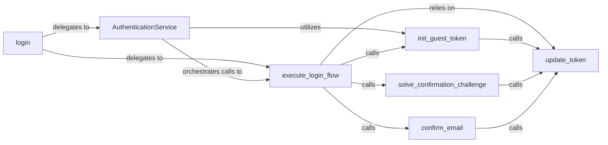

## Details

The AuthenticationService subsystem is a critical part of the twitter-api-client project, specifically designed to manage all aspects of user authentication. It adheres to the project's layered and modular architecture, providing a clear separation of concerns for authentication logic.

### AuthenticationService [[Expand]](./AuthenticationService.md)
Acts as a facade for the entire authentication lifecycle, providing a high-level API for guest token acquisition, login flow execution, and session token updates. It simplifies complex authentication processes for external consumers.

**Related Classes/Methods**:

- <a href="https://github.com/trevorhobenshield/twitter-api-client/blob/main/twitter/login.py" target="_blank" rel="noopener noreferrer">`AuthenticationService`</a>

### login
Serves as the primary public entry point for initiating the user login process. It's the initial interface for users or other parts of the client library to begin authentication.

**Related Classes/Methods**:

- <a href="https://github.com/trevorhobenshield/twitter-api-client/blob/main/twitter/login.py#L149-L170" target="_blank" rel="noopener noreferrer">`login`:149-170</a>

### execute_login_flow
Orchestrates the detailed sequence of steps required for a complete login. It acts as a workflow manager, coordinating various sub-steps like guest token initialization, challenge resolution, and credential submission.

**Related Classes/Methods**:

- <a href="https://github.com/trevorhobenshield/twitter-api-client/blob/main/twitter/login.py#L129-L146" target="_blank" rel="noopener noreferrer">`execute_login_flow`:129-146</a>

### init_guest_token
Handles the initial acquisition of a guest token, which is often a prerequisite for unauthenticated API interactions or the first step in a full login flow.

**Related Classes/Methods**:

- <a href="https://github.com/trevorhobenshield/twitter-api-client/blob/main/twitter/login.py#L39-L40" target="_blank" rel="noopener noreferrer">`init_guest_token`:39-40</a>

### solve_confirmation_challenge
Manages and resolves any challenges (e.g., CAPTCHA, phone verification) that may arise during the login flow, ensuring the process can continue.

**Related Classes/Methods**:

- <a href="https://github.com/trevorhobenshield/twitter-api-client/blob/main/twitter/login.py#L112-L126" target="_blank" rel="noopener noreferrer">`solve_confirmation_challenge`:112-126</a>

### confirm_email
Specifically handles the email confirmation step within the authentication process, which might be required for new accounts or specific login scenarios.

**Related Classes/Methods**:

- <a href="https://github.com/trevorhobenshield/twitter-api-client/blob/main/twitter/login.py#L98-L109" target="_blank" rel="noopener noreferrer">`confirm_email`:98-109</a>

### update_token
A core utility function responsible for updating and managing various session or guest tokens throughout the authentication process, ensuring their currency and validity. It centralizes token management logic.

**Related Classes/Methods**:

- <a href="https://github.com/trevorhobenshield/twitter-api-client/blob/main/twitter/login.py#L9-L36" target="_blank" rel="noopener noreferrer">`update_token`:9-36</a>

### [FAQ](https://github.com/CodeBoarding/GeneratedOnBoardings/tree/main?tab=readme-ov-file#faq)