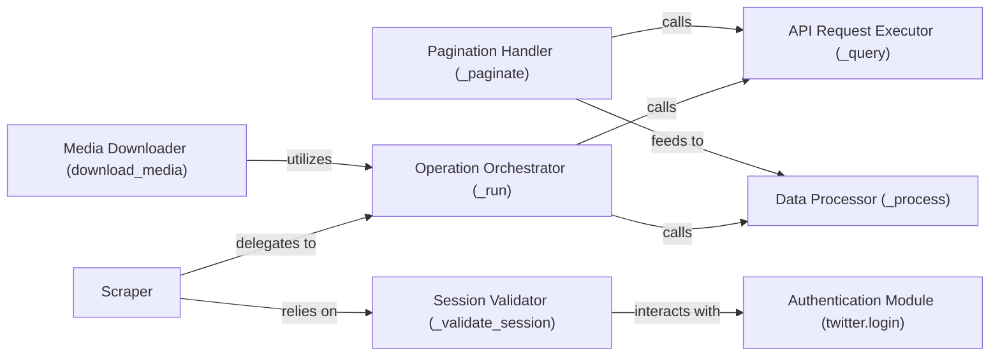

## Details

The `twitter-api-client`'s scraping subsystem, centered around the `twitter.scraper.Scraper` class, provides a structured approach to interacting with the Twitter API. It orchestrates data retrieval through an `Operation Orchestrator`, which in turn leverages an `API Request Executor` for direct communication and a `Data Processor` for response handling. Pagination is managed by a dedicated `Pagination Handler`, ensuring complete data collection. Authentication and session validity are handled by the `Session Validator`, which interfaces with an external `Authentication Module`. This modular design ensures maintainability, scalability, and clear separation of concerns within the scraping process.

### Scraper
The main facade and entry point for all public data scraping operations. It provides a simplified interface for users to access various data types (users, tweets, media) and orchestrates the overall scraping process.

**Related Classes/Methods**:

- <a href="https://github.com/trevorhobenshield/twitter-api-client/blob/main/twitter/scraper.py#L34-L905" target="_blank" rel="noopener noreferrer">`twitter.scraper.Scraper`:34-905</a>

### Operation Orchestrator (_run)
An internal orchestrator that standardizes the initial execution flow for various scraping tasks. Most high-level Scraper methods delegate to this component, passing an Operation type and relevant IDs.

**Related Classes/Methods**:

- <a href="https://github.com/trevorhobenshield/twitter-api-client/blob/main/twitter/scraper.py" target="_blank" rel="noopener noreferrer">`twitter.scraper.Scraper._run`</a>

### API Request Executor (_query)
The fundamental component responsible for executing the actual API requests directly to the Twitter server. This component abstracts the details of HTTP communication and handles the low-level interaction.

**Related Classes/Methods**:

- <a href="https://github.com/trevorhobenshield/twitter-api-client/blob/main/twitter/scraper.py" target="_blank" rel="noopener noreferrer">`twitter.scraper.Scraper._query`</a>

### Data Processor (_process)
Manages intermediate processing of data, typically after initial retrieval from _query and before pagination or final output. This includes parsing raw JSON responses into structured data models.

**Related Classes/Methods**:

- <a href="https://github.com/trevorhobenshield/twitter-api-client/blob/main/twitter/scraper.py" target="_blank" rel="noopener noreferrer">`twitter.scraper.Scraper._process`</a>

### Pagination Handler (_paginate)
Handles the iterative fetching of data across multiple pages or cursors to ensure complete data collection for queries that return paginated results. It manages the continuation tokens and subsequent requests.

**Related Classes/Methods**:

- <a href="https://github.com/trevorhobenshield/twitter-api-client/blob/main/twitter/scraper.py" target="_blank" rel="noopener noreferrer">`twitter.scraper.Scraper._paginate`</a>

### Media Downloader (download_media)
A specific high-level method within Scraper dedicated to downloading media (photos, videos, cards) associated with tweets. It encapsulates its own internal processing and download logic, leveraging other core components.

**Related Classes/Methods**:

- <a href="https://github.com/trevorhobenshield/twitter-api-client/blob/main/twitter/scraper.py" target="_blank" rel="noopener noreferrer">`twitter.scraper.Scraper.download_media`</a>

### Session Validator (_validate_session)
Manages the authentication and session validation with the Twitter API, ensuring that the scraper has the necessary credentials to make requests. It acts as an internal gatekeeper for API access.

**Related Classes/Methods**:

- <a href="https://github.com/trevorhobenshield/twitter-api-client/blob/main/twitter/scraper.py" target="_blank" rel="noopener noreferrer">`twitter.scraper.Scraper._validate_session`</a>

### Authentication Module (twitter.login)
An external module responsible for handling the core authentication and session management mechanisms with the Twitter API. It provides the underlying functionality for _validate_session.

**Related Classes/Methods**:

- <a href="https://github.com/trevorhobenshield/twitter-api-client/blob/main/twitter/login.py" target="_blank" rel="noopener noreferrer">`twitter.login`</a>

### [FAQ](https://github.com/CodeBoarding/GeneratedOnBoardings/tree/main?tab=readme-ov-file#faq)