```mermaid
graph LR
    SearchService["SearchService"]
    twitter_search_run["twitter.search.run"]
    twitter_search_process["twitter.search.process"]
    twitter_search_paginate["twitter.search.paginate"]
    twitter_search_get["twitter.search.get"]
    twitter_search_get_cursor["twitter.search.get_cursor"]
    twitter_search_backoff["twitter.search.backoff"]
    twitter_search__validate_session["twitter.search._validate_session"]
    SearchService -- "validates session using" --> twitter_search__validate_session
    SearchService -- "initiates search process by calling" --> twitter_search_run
    twitter_search_run -- "orchestrates" --> twitter_search_process
    twitter_search_process -- "initiates paginated data retrieval through" --> twitter_search_paginate
    twitter_search_paginate -- "fetches data via" --> twitter_search_get
    twitter_search_paginate -- "handles errors with" --> twitter_search_backoff
    twitter_search_get -- "extracts cursor using" --> twitter_search_get_cursor
    click SearchService href "https://github.com/CodeBoarding/GeneratedOnBoardings/blob/main/twitter-api-client/SearchService.md" "Details"
```

## Details

The `twitter.search` subsystem is designed to efficiently retrieve Twitter search results, abstracting complex API interactions and pagination. The `SearchService` acts as the primary entry point, validating user sessions via `_validate_session` before initiating any search operations. The `run` method orchestrates the overall search execution by delegating to `process`. The `process` component manages the concurrent execution of multiple search queries, initiating paginated data retrieval for each query through the `paginate` component. The `paginate` component is responsible for iteratively fetching search results, utilizing the `get` method for individual API calls and incorporating robust error handling and retry logic via `backoff`. Finally, the `get` method directly interacts with the Twitter API to fetch data, performing initial data structuring, and relies on `get_cursor` to extract pagination tokens for subsequent requests.

### SearchService [[Expand]](./SearchService.md)
Serves as the primary entry point and a high-level facade for all search-related operations. It provides a simplified interface to users, abstracting the complexities of the underlying Twitter Search API, pagination, and error handling.

**Related Classes/Methods**:

- <a href="https://github.com/trevorhobenshield/twitter-api-client/blob/main/twitter/search.py" target="_blank" rel="noopener noreferrer">`SearchService`</a>

### twitter.search.run
Initiates and manages the overall execution flow of a search query, from initial request to result retrieval, orchestrating the various steps involved by delegating to the `process` component.

**Related Classes/Methods**:

- <a href="https://github.com/trevorhobenshield/twitter-api-client/blob/main/twitter/search.py#L45-L48" target="_blank" rel="noopener noreferrer">`twitter.search.run`:45-48</a>

### twitter.search.process
Orchestrates the concurrent execution of multiple search queries, initiating pagination for each and gathering the structured results. It acts as an aggregator for the paginated data.

**Related Classes/Methods**:

- <a href="https://github.com/trevorhobenshield/twitter-api-client/blob/main/twitter/search.py#L50-L52" target="_blank" rel="noopener noreferrer">`twitter.search.process`:50-52</a>

### twitter.search.paginate
Manages the iterative retrieval of search results for a single query, handling pagination tokens (cursors) and utilizing the `get` method to fetch data. It also incorporates retry logic via `backoff`.

**Related Classes/Methods**:

- <a href="https://github.com/trevorhobenshield/twitter-api-client/blob/main/twitter/search.py#L54-L82" target="_blank" rel="noopener noreferrer">`twitter.search.paginate`:54-82</a>

### twitter.search.get
A lower-level method directly responsible for fetching a specific segment (page/chunk) of search data from the Twitter API. It also performs initial deserialization and structuring of the raw API response into usable entries.

**Related Classes/Methods**:

- <a href="https://github.com/trevorhobenshield/twitter-api-client/blob/main/twitter/search.py#L84-L93" target="_blank" rel="noopener noreferrer">`twitter.search.get`:84-93</a>

### twitter.search.get_cursor
Extracts the necessary cursor (continuation token) from the raw API response, enabling `paginate` to fetch subsequent sets of data.

**Related Classes/Methods**:

- <a href="https://github.com/trevorhobenshield/twitter-api-client/blob/main/twitter/search.py#L95-L98" target="_blank" rel="noopener noreferrer">`twitter.search.get_cursor`:95-98</a>

### twitter.search.backoff
Implements robust retry logic with exponential backoff for API calls that encounter transient errors or rate limits, significantly enhancing the reliability and fault tolerance of the client.

**Related Classes/Methods**:

- <a href="https://github.com/trevorhobenshield/twitter-api-client/blob/main/twitter/search.py#L100-L121" target="_blank" rel="noopener noreferrer">`twitter.search.backoff`:100-121</a>

### twitter.search._validate_session
Verifies the validity and authenticity of the current user session or API credentials before allowing any search operations to proceed, ensuring secure and authorized interactions.

**Related Classes/Methods**:

- <a href="https://github.com/trevorhobenshield/twitter-api-client/blob/main/twitter/search.py#L138-L166" target="_blank" rel="noopener noreferrer">`twitter.search._validate_session`:138-166</a>

### [FAQ](https://github.com/CodeBoarding/GeneratedOnBoardings/tree/main?tab=readme-ov-file#faq)