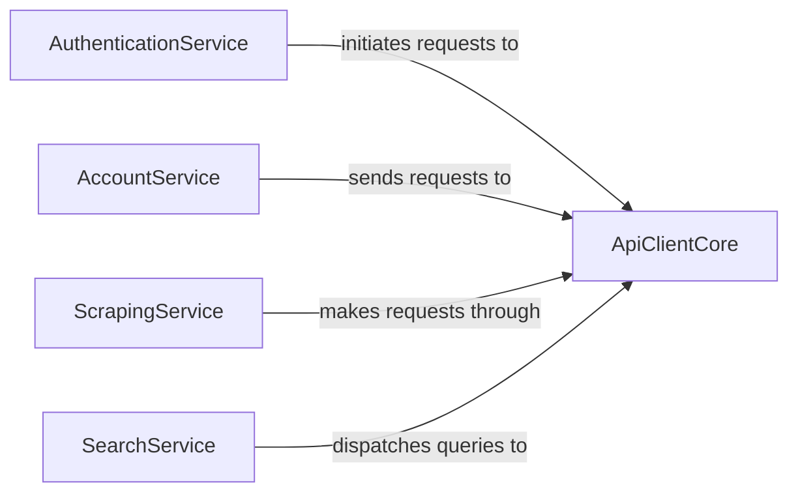

## Details

The twitter-api-client project is structured around a set of specialized service components that interact with a foundational API client core. At its heart, the ApiClientCore acts as the central communication layer, handling all direct HTTP/HTTPS interactions with the X/Twitter API endpoints (both GraphQL and V1). This core component is responsible for the low-level mechanics of sending requests and receiving responses. Building upon this core, several distinct service components manage specific functionalities: AuthenticationService: Orchestrates the entire user authentication process, from acquiring guest tokens to executing login flows and managing session token updates. It initiates requests through the ApiClientCore to handle authentication-related API calls. AccountService: Provides a high-level interface for interacting with user-specific functionalities on X/Twitter, such as fetching profile information, managing tweets, and handling media uploads. It sends its requests to the ApiClientCore for execution. ScrapingService: Focuses on extracting public data from X/Twitter, managing the logic for querying, paginating, and processing responses. It makes its data retrieval requests through the ApiClientCore. SearchService: Specializes in executing and processing search queries across the X/Twitter platform, managing parameters and result retrieval. It dispatches its queries to the ApiClientCore for API interaction. This architecture promotes clear separation of concerns, with each service component focusing on a specific domain, while ApiClientCore provides a unified and robust communication backbone.

### AuthenticationService [[Expand]](./AuthenticationService.md)
Manages the entire user authentication lifecycle, including guest token acquisition, login flow execution, and session token updates.

**Related Classes/Methods**:

- <a href="https://github.com/trevorhobenshield/twitter-api-client/blob/main/twitter/login.py" target="_blank" rel="noopener noreferrer">`AuthenticationService`</a>

### AccountService [[Expand]](./AccountService.md)
Provides a high-level interface for interacting with user-specific functionalities on X/Twitter, such as fetching profile information, managing tweets, and handling media uploads.

**Related Classes/Methods**:

- <a href="https://github.com/trevorhobenshield/twitter-api-client/blob/main/twitter/account.py" target="_blank" rel="noopener noreferrer">`AccountService`</a>

### ScrapingService [[Expand]](./ScrapingService.md)
Dedicated to extracting various types of public data from X/Twitter, handling the logic for querying, paginating, and processing responses.

**Related Classes/Methods**:

- <a href="https://github.com/trevorhobenshield/twitter-api-client/blob/main/twitter/scraper.py" target="_blank" rel="noopener noreferrer">`ScrapingService`</a>

### SearchService [[Expand]](./SearchService.md)
Specializes in executing and processing search queries across the X/Twitter platform, managing parameters and result retrieval.

**Related Classes/Methods**:

- <a href="https://github.com/trevorhobenshield/twitter-api-client/blob/main/twitter/search.py" target="_blank" rel="noopener noreferrer">`SearchService`</a>

### ApiClientCore [[Expand]](./ApiClientCore.md)
The foundational, low-level layer responsible for direct HTTP/HTTPS communication with the X/Twitter API endpoints (GraphQL and V1), handling request/response mechanics. This component is utilized by all service-specific components for API interaction.

**Related Classes/Methods**:

- <a href="https://github.com/trevorhobenshield/twitter-api-client/blob/main/twitter/api_client_core.py" target="_blank" rel="noopener noreferrer">`ApiClientCore`</a>

### [FAQ](https://github.com/CodeBoarding/GeneratedOnBoardings/tree/main?tab=readme-ov-file#faq)