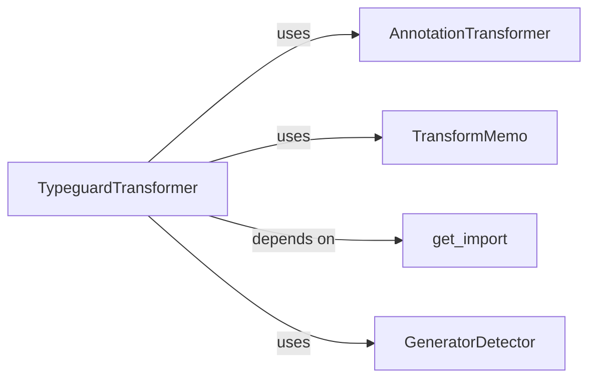

## Details

AST Transformation & Code Injection subsystem, primarily encapsulated within `src/typeguard/_transformer.py`.

### TypeguardTransformer
This is the central orchestrator of the AST transformation process. It inherits from `ast.NodeTransformer` and traverses the AST, identifying functions, async functions, and classes to inject type validation logic. It delegates annotation processing and manages import injection.

**Related Classes/Methods**:

- <a href="https://github.com/agronholm/typeguard/blob/master/src/typeguard/_transformer.py#L485-L1228" target="_blank" rel="noopener noreferrer">`TypeguardTransformer`:485-1228</a>

### AnnotationTransformer
A specialized AST transformer responsible for processing and converting type annotations found in the AST into a format suitable for the type validation engine. It ensures annotations are correctly represented for runtime checks.

**Related Classes/Methods**:

- <a href="https://github.com/agronholm/typeguard/blob/master/src/typeguard/_transformer.py#L335-L482" target="_blank" rel="noopener noreferrer">`AnnotationTransformer`:335-482</a>

### TransformMemo
A utility class designed to store and retrieve memoized results of transformations. This component optimizes performance by avoiding redundant computations during the AST transformation process, especially for frequently encountered types or structures.

**Related Classes/Methods**:

- <a href="https://github.com/agronholm/typeguard/blob/master/src/typeguard/_transformer.py#L114-L279" target="_blank" rel="noopener noreferrer">`TransformMemo`:114-279</a>

### get_import
This component manages the dynamic injection of necessary import statements into the transformed AST. It ensures that `typeguard`'s internal modules and functions required for runtime type validation are correctly imported into the user's code.

**Related Classes/Methods**:

- <a href="https://github.com/agronholm/typeguard/blob/master/src/typeguard/_transformer.py#L209-L220" target="_blank" rel="noopener noreferrer">`get_import`:209-220</a>

### GeneratorDetector
A specialized AST visitor whose sole responsibility is to detect if a given function definition contains `yield` expressions. This detection is crucial for `TypeguardTransformer` to correctly handle generator functions, as their type validation might require different instrumentation.

**Related Classes/Methods**:

- <a href="https://github.com/agronholm/typeguard/blob/master/src/typeguard/_transformer.py#L310-L332" target="_blank" rel="noopener noreferrer">`GeneratorDetector`:310-332</a>

### [FAQ](https://github.com/CodeBoarding/GeneratedOnBoardings/tree/main?tab=readme-ov-file#faq)