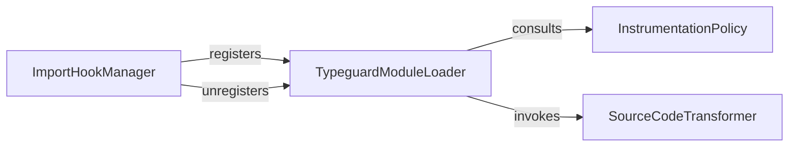

## Details

The Import Hook & Module Loader subsystem is primarily encapsulated within the src/typeguard/_importhook.py file. This file contains the core logic for managing Python's import system hooks, intercepting module loading, and transforming source code before execution. The Import Hook & Module Loader subsystem exhibits a clear flow of control and data: 1. The ImportHookManager acts as the orchestrator, enabling or disabling the entire process by registering/unregistering the TypeguardModuleLoader. 2. Once registered, the TypeguardModuleLoader becomes active in Python's import system. When a module is imported, the TypeguardModuleLoader first consults the InstrumentationPolicy to determine if the module is a candidate for instrumentation. 3. If instrumentation is required, the TypeguardModuleLoader then passes the module's source code to the SourceCodeTransformer for modification. 4. After transformation, the TypeguardModuleLoader proceeds with the compilation and execution of the modified code.

### ImportHookManager
Orchestrates the lifecycle of the custom import hook. It is responsible for registering and unregistering the TypeguardModuleLoader (or a finder that uses it) with Python's sys.meta_path, acting as the central control for activating and deactivating runtime type checking via the import system.

**Related Classes/Methods**:

- <a href="https://github.com/agronholm/typeguard/blob/master/src/typeguard/_importhook.py#L148-L172" target="_blank" rel="noopener noreferrer">`ImportHookManager`:148-172</a>
- <a href="https://github.com/agronholm/typeguard/blob/master/src/typeguard/_importhook.py#L175-L213" target="_blank" rel="noopener noreferrer">`install_import_hook`:175-213</a>
- <a href="https://github.com/agronholm/typeguard/blob/master/src/typeguard/_importhook.py#L167-L172" target="_blank" rel="noopener noreferrer">`uninstall`:167-172</a>

### TypeguardModuleLoader
Implements Python's MetaPathFinder and Loader protocols. Its primary role is to intercept module imports, determine if a module should be instrumented, and then handle the loading, transformation, compilation, and execution of the module's source code.

**Related Classes/Methods**:

- <a href="https://github.com/agronholm/typeguard/blob/master/src/typeguard/_importhook.py#L54-L98" target="_blank" rel="noopener noreferrer">`TypeguardLoader`:54-98</a>
- <a href="https://github.com/agronholm/typeguard/blob/master/src/typeguard/_importhook.py" target="_blank" rel="noopener noreferrer">`TypeguardLoader:find_spec`</a>

### SourceCodeTransformer
Focuses on the core transformation logic. It takes the raw source code of a module and applies typeguard-specific instrumentation (e.g., injecting runtime type checks) by modifying the Python Abstract Syntax Tree (AST) before the code is compiled and executed.

**Related Classes/Methods**:

- <a href="https://github.com/agronholm/typeguard/blob/master/src/typeguard/_importhook.py#L55-L89" target="_blank" rel="noopener noreferrer">`source_to_code`:55-89</a>

### InstrumentationPolicy
Encapsulates the decision-making logic for whether a given module should be processed and instrumented by typeguard. This typically involves checking module names, paths, and other configuration parameters to apply instrumentation selectively.

**Related Classes/Methods**:

- <a href="https://github.com/agronholm/typeguard/blob/master/src/typeguard/_importhook.py#L130-L145" target="_blank" rel="noopener noreferrer">`should_instrument`:130-145</a>

### [FAQ](https://github.com/CodeBoarding/GeneratedOnBoardings/tree/main?tab=readme-ov-file#faq)