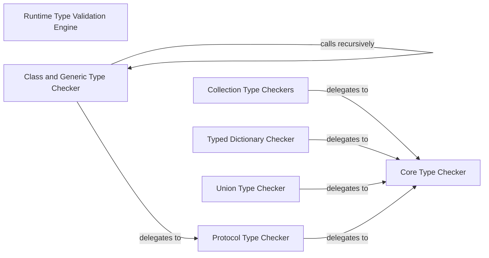

## Details

The `Runtime Type Validation Engine` subsystem is a core part of the `typeguard` library, responsible for enforcing type hints at runtime. It is clearly bounded by the `src/typeguard/_checkers.py` file and follows the "Library/Runtime Tool" architectural pattern.

### Runtime Type Validation Engine [[Expand]](./Runtime_Type_Validation_Engine.md)
The overarching subsystem that orchestrates and contains the core logic for performing runtime type checks based on injected calls and type hints, raising errors on mismatches. It acts as the central entry point for the validation process.

**Related Classes/Methods**:

- <a href="https://github.com/agronholm/typeguard/blob/master/src/typeguard/_checkers.py#L898-L972" target="_blank" rel="noopener noreferrer">`check_type_internal`:898-972</a>
- <a href="https://github.com/agronholm/typeguard/blob/master/src/typeguard/_checkers.py#L205-L237" target="_blank" rel="noopener noreferrer">`check_mapping`:205-237</a>
- <a href="https://github.com/agronholm/typeguard/blob/master/src/typeguard/_checkers.py#L288-L304" target="_blank" rel="noopener noreferrer">`check_list`:288-304</a>
- <a href="https://github.com/agronholm/typeguard/blob/master/src/typeguard/_checkers.py#L326-L345" target="_blank" rel="noopener noreferrer">`check_set`:326-345</a>
- <a href="https://github.com/agronholm/typeguard/blob/master/src/typeguard/_checkers.py#L348-L403" target="_blank" rel="noopener noreferrer">`check_tuple`:348-403</a>
- <a href="https://github.com/agronholm/typeguard/blob/master/src/typeguard/_checkers.py#L240-L285" target="_blank" rel="noopener noreferrer">`check_typed_dict`:240-285</a>
- <a href="https://github.com/agronholm/typeguard/blob/master/src/typeguard/_checkers.py#L406-L427" target="_blank" rel="noopener noreferrer">`check_union`:406-427</a>
- <a href="https://github.com/agronholm/typeguard/blob/master/src/typeguard/_checkers.py#L457-L513" target="_blank" rel="noopener noreferrer">`check_class`:457-513</a>
- <a href="https://github.com/agronholm/typeguard/blob/master/src/typeguard/_checkers.py#L808-L856" target="_blank" rel="noopener noreferrer">`check_protocol`:808-856</a>

### Core Type Checker
This is the fundamental primitive responsible for the atomic comparison and validation of a single value against a given type. It serves as the lowest-level validation unit, to which all other specialized checkers delegate their basic type-checking tasks.

**Related Classes/Methods**:

- <a href="https://github.com/agronholm/typeguard/blob/master/src/typeguard/_checkers.py#L898-L972" target="_blank" rel="noopener noreferrer">`check_type_internal`:898-972</a>

### Collection Type Checkers
A group of specialized components responsible for validating various collection types (e.g., dictionaries, lists, sets, tuples). They iterate through the collection's elements or keys/values and delegate the atomic validation of each item to the `Core Type Checker`.

**Related Classes/Methods**:

- <a href="https://github.com/agronholm/typeguard/blob/master/src/typeguard/_checkers.py#L205-L237" target="_blank" rel="noopener noreferrer">`check_mapping`:205-237</a>
- <a href="https://github.com/agronholm/typeguard/blob/master/src/typeguard/_checkers.py#L288-L304" target="_blank" rel="noopener noreferrer">`check_list`:288-304</a>
- <a href="https://github.com/agronholm/typeguard/blob/master/src/typeguard/_checkers.py#L326-L345" target="_blank" rel="noopener noreferrer">`check_set`:326-345</a>
- <a href="https://github.com/agronholm/typeguard/blob/master/src/typeguard/_checkers.py#L348-L403" target="_blank" rel="noopener noreferrer">`check_tuple`:348-403</a>

### Typed Dictionary Checker
Specifically handles the validation of values against `TypedDict` definitions. It ensures that all required keys are present and that their corresponding values adhere to the specified types, delegating individual field validations to the `Core Type Checker`.

**Related Classes/Methods**:

- <a href="https://github.com/agronholm/typeguard/blob/master/src/typeguard/_checkers.py#L240-L285" target="_blank" rel="noopener noreferrer">`check_typed_dict`:240-285</a>

### Union Type Checker
Manages the validation of values against `Union` types. It attempts to validate the value against each type within the union, succeeding if the value matches any one of them. It delegates individual type checks to the `Core Type Checker`.

**Related Classes/Methods**:

- <a href="https://github.com/agronholm/typeguard/blob/master/src/typeguard/_checkers.py#L406-L427" target="_blank" rel="noopener noreferrer">`check_union`:406-427</a>

### Class and Generic Type Checker
Handles complex class-based validations, including generic types, inheritance hierarchies, and recursive type structures. It can recursively call itself for nested class types and delegates to the `Protocol Type Checker` for structural conformance checks.

**Related Classes/Methods**:

- <a href="https://github.com/agronholm/typeguard/blob/master/src/typeguard/_checkers.py#L457-L513" target="_blank" rel="noopener noreferrer">`check_class`:457-513</a>

### Protocol Type Checker
Validates objects against `Protocol` definitions, ensuring structural compatibility. It checks if an object possesses the required methods and attributes with the correct signatures and types, delegating basic type checks for these members to the `Core Type Checker`.

**Related Classes/Methods**:

- <a href="https://github.com/agronholm/typeguard/blob/master/src/typeguard/_checkers.py#L808-L856" target="_blank" rel="noopener noreferrer">`check_protocol`:808-856</a>

### [FAQ](https://github.com/CodeBoarding/GeneratedOnBoardings/tree/main?tab=readme-ov-file#faq)