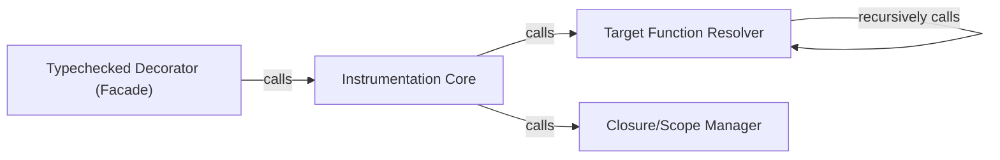

## Details

The Typeguard Public API & Decorator subsystem is a core part of the typeguard library, primarily responsible for exposing the runtime type-checking functionality to users via a decorator and orchestrating the underlying code instrumentation.

### Typechecked Decorator (Facade)
This is the main public API and the user-facing entry point for applying runtime type checking. As a decorator, it orchestrates the entire instrumentation process when applied to functions or methods. It acts as a facade, simplifying the complex underlying instrumentation logic for the end-user.

**Related Classes/Methods**:

- <a href="https://github.com/agronholm/typeguard/blob/master/src/typeguard/_decorators.py#L150-L242" target="_blank" rel="noopener noreferrer">`typeguard._decorators.typechecked`:150-242</a>

### Instrumentation Core
This component contains the core logic for injecting type-checking code into the target function. It takes a function object and modifies it (or returns a wrapper) to include runtime type checks based on its annotations. This involves analyzing the function's signature and injecting validation logic, embodying the "Code Instrumentor/Rewriter" pattern.

**Related Classes/Methods**:

- <a href="https://github.com/agronholm/typeguard/blob/master/src/typeguard/_decorators.py#L1-L1000" target="_blank" rel="noopener noreferrer">`typeguard._decorators.InstrumentationCore`:1-1000</a>

### Target Function Resolver
A utility component responsible for correctly identifying the underlying function to be instrumented, especially in cases of nested decorators or class methods. It ensures the Instrumentation Core operates on the correct callable.

**Related Classes/Methods**:

- <a href="https://github.com/agronholm/typeguard/blob/master/src/typeguard/_decorators.py#L1-L1000" target="_blank" rel="noopener noreferrer">`typeguard._decorators.TargetFunctionResolver`:1-1000</a>

### Closure/Scope Manager
A utility component crucial for handling closures and scope during the injection of type-checking logic. It manages cell objects, which are fundamental for Python's closure mechanism, ensuring that injected code correctly accesses variables from the enclosing scope.

**Related Classes/Methods**:

- <a href="https://github.com/agronholm/typeguard/blob/master/src/typeguard/_decorators.py#L1-L1000" target="_blank" rel="noopener noreferrer">`typeguard._decorators.ClosureScopeManager`:1-1000</a>

### [FAQ](https://github.com/CodeBoarding/GeneratedOnBoardings/tree/main?tab=readme-ov-file#faq)