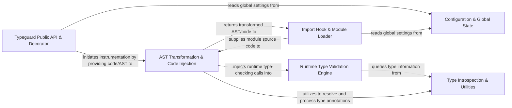

## Details

The `typeguard` library implements a dynamic runtime type-checking mechanism by strategically intercepting Python's module loading process. At its core, the **Import Hook & Module Loader** provides module source to the **AST Transformation & Code Injection** component, which then modifies the code's Abstract Syntax Tree to embed calls to the **Runtime Type Validation Engine**. This instrumentation is typically initiated via the **Typeguard Public API & Decorator** (`@typechecked`). During execution, the injected calls trigger the **Runtime Type Validation Engine**, which, with assistance from the **Type Introspection & Utilities** for type resolution, performs the actual type validation. The entire system's behavior is governed by settings managed in the **Configuration & Global State**, ensuring a flexible and robust approach to enforcing type safety at runtime. This architecture allows for a clear flow graph representation, highlighting the transformation and validation pipeline.

### Typeguard Public API & Decorator [[Expand]](./Typeguard_Public_API_Decorator.md)
The user-facing entry point, primarily through the `@typechecked` decorator, which orchestrates the runtime instrumentation process.

**Related Classes/Methods**:

- <a href="https://github.com/agronholm/typeguard/blob/master/src/typeguard/_decorators.py" target="_blank" rel="noopener noreferrer">`src/typeguard/_decorators.py`</a>

### Import Hook & Module Loader [[Expand]](./Import_Hook_Module_Loader.md)
Manages Python's import system hooks, intercepting module loading to allow for source code transformation before execution.

**Related Classes/Methods**:

- <a href="https://github.com/agronholm/typeguard/blob/master/src/typeguard/_importhook.py" target="_blank" rel="noopener noreferrer">`src/typeguard/_importhook.py`</a>

### AST Transformation & Code Injection [[Expand]](./AST_Transformation_Code_Injection.md)
Parses Python source into an Abstract Syntax Tree (AST), modifies it to inject calls to the type validation engine, and handles annotation processing.

**Related Classes/Methods**:

- <a href="https://github.com/agronholm/typeguard/blob/master/src/typeguard/_transformer.py" target="_blank" rel="noopener noreferrer">`src/typeguard/_transformer.py`</a>

### Runtime Type Validation Engine [[Expand]](./Runtime_Type_Validation_Engine.md)
Contains the core logic for performing actual runtime type checks based on injected calls and type hints, raising errors on mismatches.

**Related Classes/Methods**:

- <a href="https://github.com/agronholm/typeguard/blob/master/src/typeguard/_checkers.py" target="_blank" rel="noopener noreferrer">`src/typeguard/_checkers.py`</a>

### Type Introspection & Utilities
Provides helper functions for introspecting, resolving, and manipulating Python type objects, used by other components for type understanding.

**Related Classes/Methods**:

- <a href="https://github.com/agronholm/typeguard/blob/master/src/typeguard/_utils.py" target="_blank" rel="noopener noreferrer">`src/typeguard/_utils.py`</a>

### Configuration & Global State
Manages global configuration settings and runtime state that influence `typeguard`'s behavior across the system.

**Related Classes/Methods**:

- <a href="https://github.com/agronholm/typeguard/blob/master/src/typeguard/_config.py" target="_blank" rel="noopener noreferrer">`src/typeguard/_config.py`</a>

### [FAQ](https://github.com/CodeBoarding/GeneratedOnBoardings/tree/main?tab=readme-ov-file#faq)