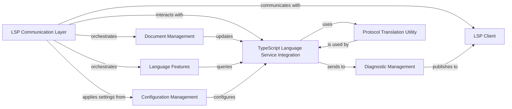

## Details

Abstract Components Overview

### LSP Communication Layer
Manages all incoming LSP requests and outgoing responses/notifications, acting as the server's primary interface.

**Related Classes/Methods**:

- <a href="https://github.com/typescript-language-server/typescript-language-server/blob/master/src/lsp-server.ts#L1-L1" target="_blank" rel="noopener noreferrer">`lsp-server.ts` (1:1)</a>

### LSP Client
Represents the integrated development environment (IDE) or editor, receiving notifications and responses from the language server.

**Related Classes/Methods**:

- <a href="https://github.com/typescript-language-server/typescript-language-server/blob/master/src/lsp-client.ts#L1-L1" target="_blank" rel="noopener noreferrer">`lsp-client.ts` (1:1)</a>

### Document Management
Responsible for maintaining the state and content of all open text documents, tracking changes and versions.

**Related Classes/Methods**:

- <a href="https://github.com/typescript-language-server/typescript-language-server/blob/master/src/document.ts#L1-L1" target="_blank" rel="noopener noreferrer">`document.ts` (1:1)</a>

### TypeScript Language Service Integration
Serves as the adapter and communication layer for the external TypeScript Language Service (`tsserver`) process, handling protocol translation.

**Related Classes/Methods**:

- `typescript-service.ts` (1:1)

### Language Features
A collection of modules implementing specific LSP functionalities such as code completion, hover information, and refactoring.

**Related Classes/Methods**:

- <a href="https://github.com/typescript-language-server/typescript-language-server/blob/master/src/commands.ts#L1-L1" target="_blank" rel="noopener noreferrer">`commands.ts` (1:1)</a>

### Configuration Management
Handles workspace and file-specific configuration options, ensuring `tsserver` operates with correct settings.

**Related Classes/Methods**:

- <a href="https://github.com/typescript-language-server/typescript-language-server/blob/master/src/features/fileConfigurationManager.ts#L1-L1" target="_blank" rel="noopener noreferrer">`fileConfigurationManager.ts` (1:1)</a>

### Diagnostic Management
Processes, filters, and publishes diagnostics received from `tsserver` to the LSP client.

**Related Classes/Methods**:

- <a href="https://github.com/typescript-language-server/typescript-language-server/blob/master/src/diagnostic-queue.ts#L1-L1" target="_blank" rel="noopener noreferrer">`diagnostic-queue.ts` (1:1)</a>

### Protocol Translation Utility
A utility component dedicated to converting data structures between the Language Server Protocol (LSP) and TypeScript Server Protocol (TSServer) formats.

**Related Classes/Methods**:

- <a href="https://github.com/typescript-language-server/typescript-language-server/blob/master/src/commands/tsserverRequests.ts#L1-L1" target="_blank" rel="noopener noreferrer">`tsserverRequests.ts` (1:1)</a>

### [FAQ](https://github.com/CodeBoarding/GeneratedOnBoardings/tree/main?tab=readme-ov-file#faq)