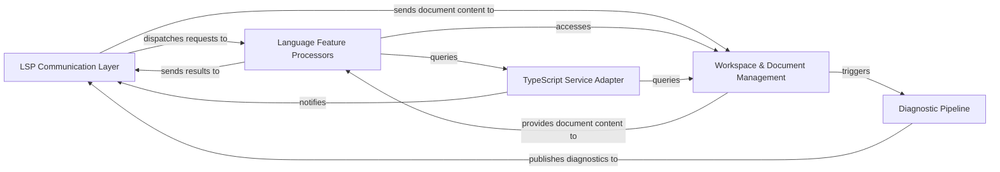

## Details

Updated architectural analysis with verifiable code references and corrected component relationships.

### LSP Communication Layer
Handles all interactions with the LSP client, including receiving requests, dispatching them, and sending responses and notifications.

**Related Classes/Methods**:

- `src/server.ts` (1:1)
- `src/connection.ts` (1:1)
- `src/protocol.ts` (1:1)

### TypeScript Service Adapter
Manages the lifecycle and communication with the external `tsserver` process, including protocol translation between LSP and `tsserver` formats.

**Related Classes/Methods**:

- `src/tsServer.ts` (1:1)
- <a href="https://github.com/typescript-language-server/typescript-language-server/blob/master/src/typescriptService.ts#L1-L1" target="_blank" rel="noopener noreferrer">`src/typescriptService.ts` (1:1)</a>
- `src/protocol.ts` (1:1)

### Workspace & Document Management
Maintains the in-memory representation of open text documents, handles document synchronization, and manages server and workspace-specific configurations.

**Related Classes/Methods**:

- `src/languageFeatures.ts` (1:1)
- `src/configuration.ts` (1:1)
- `src/documents.ts` (1:1)

### Language Feature Processors
Implements the various language features (e.g., completion, hover, refactoring) by orchestrating requests to the `TypeScript Service Adapter` and utilizing data from `Workspace & Document Management`.

**Related Classes/Methods**:

- `src/features/completion.ts` (1:1)
- `src/features/hover.ts` (1:1)
- `src/features/documentSymbol.ts` (1:1)
- `src/features/refactor.ts` (1:1)
- `src/features/codeLens.ts` (1:1)
- `src/features/inlayHints.ts` (1:1)

### Diagnostic Pipeline
Responsible for processing, filtering, and publishing diagnostic information received from the `tsserver` to the LSP client.

**Related Classes/Methods**:

- `src/diagnostics.ts` (1:1)

### [FAQ](https://github.com/CodeBoarding/GeneratedOnBoardings/tree/main?tab=readme-ov-file#faq)