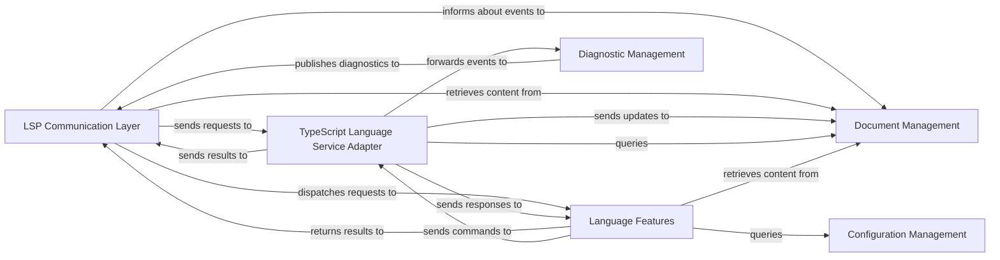

## Details

One paragraph explaining the functionality which is represented by this graph. What the main flow is and what is its purpose.

### LSP Communication Layer
Primary interface, receives LSP requests and dispatches them to internal components.

**Related Classes/Methods**: _None_

### TypeScript Language Service Adapter
Translates LSP requests into tsserver commands, manages tsserver process, and converts tsserver responses.

**Related Classes/Methods**: _None_

### Document Management
Maintains in-memory state of open files, provides content.

**Related Classes/Methods**: _None_

### Language Features
Processes LSP requests and interacts with the TypeScript Language Service Adapter.

**Related Classes/Methods**: _None_

### Diagnostic Management
Handles flow of errors and warnings from tsserver to LSP client.

**Related Classes/Methods**: _None_

### Configuration Management
Ensures language service operates with correct settings.

**Related Classes/Methods**: _None_

### [FAQ](https://github.com/CodeBoarding/GeneratedOnBoardings/tree/main?tab=readme-ov-file#faq)