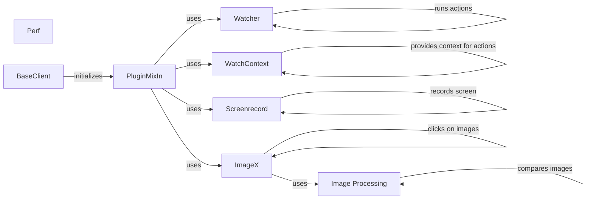

## Component Details

The Automation Enhancement Tools component provides a suite of features to improve the robustness, informativeness, and adaptability of automation scripts. It includes functionalities for handling unexpected events through watchers, recording screen activity, recognizing images, and monitoring performance metrics. These tools enable developers to create more reliable and insightful automation workflows.

### Watcher
The Watcher component defines and runs watchers that automatically trigger actions when specific conditions are met on the device screen. It monitors UI elements and reacts to changes, enabling automated handling of unexpected events or UI updates. Watchers are configured with conditions and corresponding actions to be executed when those conditions are satisfied.
- **Related Classes/Methods**: `uiautomator2.uiautomator2.watcher.Watcher`

### WatchContext
The WatchContext component provides the context in which watcher actions are executed. It allows actions, such as clicking on elements, to be performed within the scope of a watcher. This context ensures that actions are executed correctly and efficiently in response to the watcher's trigger conditions.
- **Related Classes/Methods**: `uiautomator2.uiautomator2.watcher.WatchContext`

### Screenrecord
The Screenrecord component enables recording the device screen, capturing screen activity for debugging, demonstration, or documentation purposes. It provides a way to visually track the execution of automation scripts and identify potential issues or areas for improvement. The recorded screen activity can be saved as a video file for later analysis.
- **Related Classes/Methods**: `uiautomator2.uiautomator2.screenrecord.Screenrecord`

### ImageX
The ImageX component offers image processing functionalities, including image matching and clicking on matched images. It allows automating tasks based on image recognition, enabling the automation of UI elements that are not easily accessible through traditional UI automation methods. ImageX can identify and interact with specific images on the screen, providing a powerful tool for automating complex tasks.
- **Related Classes/Methods**: `uiautomator2.uiautomator2.image.ImageX`

### Image Processing
The Image Processing component provides basic image processing functions like reading and comparing images. It serves as the foundation for the ImageX component, providing the necessary tools for image analysis and manipulation. This component enables the comparison of images based on similarity metrics, allowing for the identification of specific images on the screen.
- **Related Classes/Methods**: `uiautomator2.uiautomator2.image`

### Perf
The Perf component offers performance monitoring capabilities, such as CPU usage, memory consumption, network statistics, and FPS. It helps in analyzing the performance of the automated tasks, allowing developers to identify performance bottlenecks and optimize their automation scripts. The performance metrics provided by this component can be used to ensure that automation scripts are running efficiently and effectively.
- **Related Classes/Methods**: `uiautomator2.uiautomator2.ext.perf.Perf`

### PluginMixIn
The _PluginMixIn class is a mixin that provides access to the watcher, image, screenrecord, and swipe_ext functionalities. It acts as a central point for accessing these extensions, simplifying the integration of these features into other components. This mixin promotes code reuse and reduces redundancy by providing a common interface for accessing these automation enhancement tools.
- **Related Classes/Methods**: `uiautomator2.uiautomator2._PluginMixIn`

### BaseClient
The _BaseClient class initializes the _PluginMixIn, making the extended functionalities available to the client. It serves as the base class for the client implementation, providing access to the watcher, image, screenrecord, and swipe_ext functionalities. This class ensures that the client has access to the necessary tools for automating tasks and enhancing the automation process.
- **Related Classes/Methods**: `uiautomator2.uiautomator2._BaseClient`
