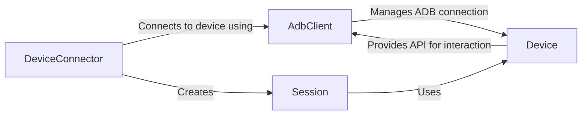

## Component Details

The Device Connection & Session Management subsystem is responsible for establishing and maintaining connections with Android devices, either via USB or network. It encompasses device discovery, connection setup, and session management, ensuring that all subsequent interactions are properly routed and that sessions are correctly initialized, restarted, and closed. The core flow involves the `DeviceConnector` establishing a connection using `AdbClient`, which then initializes a `Session` object for interacting with the device. The `Device` object provides a high-level API for utilizing these components.

### DeviceConnector
The DeviceConnector component is responsible for establishing a connection to an Android device, either via USB or network. It utilizes the AdbClient to communicate with the device and initializes the Session object, which is essential for subsequent interactions.
- **Related Classes/Methods**: `uiautomator2.uiautomator2.connect`, `uiautomator2.uiautomator2.connect_usb`, `uiautomator2.Device`

### AdbClient
The AdbClient component serves as a base client that manages the ADB (Android Debug Bridge) connection to the device. It provides methods for executing shell commands, pushing and pulling files, and waiting for the device to be ready for interaction. It abstracts the underlying ADB communication.
- **Related Classes/Methods**: `uiautomator2.uiautomator2._BaseClient:__init__`, `uiautomator2.uiautomator2._BaseClient:_wait_for_device`

### Session
The Session component represents a UI automation session on the connected device. It provides methods for interacting with the device's UI, such as clicking, typing, and swiping. It also manages the lifecycle of the UI automation service on the device, including initialization, restarting, and closing the session.
- **Related Classes/Methods**: `uiautomator2.uiautomator2.Session:__init__`, `uiautomator2.uiautomator2.Session:restart`, `uiautomator2.uiautomator2.Session:close`

### Device
The Device component represents the Android device and provides a high-level API for interacting with it. It leverages the Session object to perform UI automation tasks and offers a user-friendly interface for controlling the device.
- **Related Classes/Methods**: `uiautomator2.Device`
